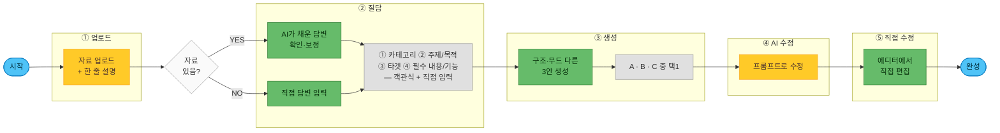

# AI 유저 플로우 (제품 설계도)

> **이 문서 = 최종 제품에서 비디자이너 유저가 AI로 페이지를 만드는 흐름.**
> [[1-1. 워크플로우]](내부 제작자용 6단계)와 다름 — 그건 "우리가 템플릿을 만드는 법", 이건 "유저가 자기 페이지를 만드는 법".
>
> **한 줄 요약**: 적게 묻고 · (자료 있으면) 자동 채우고 · 확인 → 진짜 다른 **3안(A·B·C)** → 대화로 다듬고 → **에디터에서 직접 마무리**.
> **핵심 불변식(파이프라인 공통)**: 담을 **정보(WHAT)와 CdBd 규칙은 고정**, **색·폰트·카드 배치·무드(HOW)는 개방.** → 유저는 정보만 만지고, 짜임새·느낌은 AI가 설계.
>
> 📐 **정본 도식(가로형)**: [Figma 보드 (node 19-1381)](https://www.figma.com/board/dA9nFFGnHhwjNuQYNVGR2B/AI-%ED%85%9C%ED%94%8C%EB%A6%BF-%EC%9B%8C%ED%81%AC%ED%94%8C%EB%A1%9C%EC%9A%B0?node-id=19-1381) — 이 문서의 플로우차트·표는 그 보드를 그대로 옮긴 것. 보드가 바뀌면 이 문서도 함께 갱신. (옛 도식 node 2-981 = 4구간·3문항 개편 전 버전.)

---

## 🎯 이게 뭐고, 왜 필요한가

CdBd 자동화의 **최종 목표** = 서비스에 AI 에이전트를 붙여 **비디자이너가 스스로** 모바일 비즈니스 페이지를 만들게 하는 것. 그 첫 설계로 **유저에게 무엇을·어떤 순서로 물을지**를 확정한다.

이 플로우는 이후 **프리셋(재사용 섹션 조각) 제작·분류 기준**을 세우는 근거가 된다. 왜냐하면 **유저에게 묻는 각 항목이 곧 "프리셋을 어떻게 나눠야 하는지"를 규정**하기 때문 (아래 [[#🧩 프리셋 기준으로의 다리 (다음 단계)]] 섹션 참조).

---

## 🧭 핵심 원칙 5

1. **적게 묻는다** — 질문을 다 받고서야 결과를 보여주면 비디자이너는 지쳐 이탈. **딱 3개**(카테고리·타겟·필수 내용/기능)만 묻고 빠르게 시안을 보여준다. (원래 '주제/목적'까지 4개였으나, **카테고리 옵션을 목적까지 담을 만큼 세분화**해서 주제/목적 질문을 생략 — 2026-07-09.)
2. **자료로 자동 채운다 (자료는 선택)** — 유저 자료(포스터·글·사진)엔 카테고리·기능·**브랜드 느낌(무드)**이 이미 들어 있음 → 있으면 자동 추출해 답을 채움. 단 **자료 업로드는 "맨 앞 강제"가 아니라 질답 옆 상시 선택 옵션** — 비전문가가 빈 화면에서 막히지 않게 **질문으로 바로 시작**하고, 자료는 원할 때 올려 답을 자동으로 채운다. 없으면 3개 질문에 직접 답변.
3. **정보는 유저, 짜임새·느낌은 AI** — 유저는 "담을 내용"만 정하고, 어떤 카드로·어떤 순서로·**어떤 무드로** 만들지는 AI가 판단(자유도·품질 보존). → **무드는 따로 묻지 않는다**(내용으로 추론).
4. **3안은 진짜 다르게 — 구조뿐 아니라 무드까지** — 색만 다른 쌍둥이 ❌. 3안(A·B·C)은 **구조가 실제로 다르고, 무드(느낌)도 서로 다르게** 탐색 → **묻지 않고 보여줘서 고르게** 한다. 차별화 = 핵심 셀링포인트.
5. **진짜 가치는 수정 — 두 갈래** — 3안 제시로 끝나면 안 됨. **① AI 수정(대화로 다듬기)** + **② 직접 수정(에디터에서 손보기)**. 이 다듬는 과정이 제품의 본체.

> 🟡 **선택 / 🟢 필수 개념** (보드 색 규칙): **건너뛰는 유저가 꽤 있으면** 🟡선택, **거의 모든 유저가 거치면** 🟢필수 — *엄밀한 강제가 아니라 **실질 발생 빈도** 기준.*
> · 🟡 선택 = **자료 업로드**(없으면 직접 답변) · **AI 수정**(3안이 만족스러우면 건너뜀)
> · 🟢 필수 = **답변 입력**(3개 질문) · **3안 생성** · **에디터 직접 편집**(엄밀히는 안 해도 완성되지만, **거의 모든 유저가 최소 텍스트 1곳은 고치므로** 사실상 필수)

---

## 🗺 4구간 플로우

| # | 구간 | 유저가 하는 일 | 뒤에서 AI가 하는 일 | 선택/필수 |
|---|---|---|---|---|
| — | (시작) | 진입 | — | 🟦 |
| **1** | **질답** | **3문항** 답변(객관식+직접입력). **자료 있으면** 옆 "자료 업로드"로 답 자동 채움 → 확인·보정 | 정보 확정 → 섹션·순서·**무드 추론** | 🟢 필수 · 자료 업로드 🟡 선택 |
| **2** | **생성** | **3안(A·B·C)** 비교 → 1개 선택(섞기 가능) | **구조 + 무드가 서로 다른 3개** 생성 · **답변①(카테고리)로 원/멀티 비중 결정** · *재생성=과금* | 🟢 필수 |
| **3** | **AI 수정** | **프롬프트(대화)로 수정** — "이 섹션 바꿔 / 좀 더 고급스럽게" | 대화로 다듬어 반영 · *수정=과금* | 🟡 선택 |
| **4** | **직접 수정** | **에디터에서 직접 편집** — 글·이미지·카드 순서·간격 | 편집 결과 저장·반영 | 🟢 필수 |
| — | (완성) | — | CdBd 페이지 확정 | 🟦 |

> **자료 업로드는 별도 구간이 아니라 질답 옆 선택 옵션**(🟡) — "질문으로 바로 시작"하되, 자료를 올리면 3문항 답이 자동으로 채워진다. (2026-07-09 개편 — 옛 5구간의 '업로드' 독립 구간을 없애고 질답에 흡수.)

### 1구간의 3문항 (객관식 + 직접 입력)

각 문항 **객관식 + 직접 입력** 병행. **무드는 질문에 없음**(내용으로 추론). ③번은 **복수선택**.

**① 카테고리** — "어떤 페이지?" → **카드 구성**을 정하고 **원/멀티 비중**을 결정.

| 카테고리 옵션 | 원 : 멀티 (3안 구성비) |
|---|---|
| 상품 카탈로그 | 원1 : 멀티2 |
| 패션 룩북 | 원1 : 멀티2 |
| 매장 메뉴 안내 | 원1 : 멀티2 |
| 소식·매거진 | 원1 : 멀티2 |
| 행사 초대 | 원2 : 멀티1 |
| 예약·방문 신청 받기 | 원2 : 멀티1 |
| 회사 명함 | 원2 : 멀티1 |
| 개인 포트폴리오 | 원2 : 멀티1 |
| 강의·멤버 모집 | 원2 : 멀티1 |
| 매장·브랜드 소개 | 원2 : 멀티1 |
| (직접 입력) | — |

> **원/멀티는 유저에게 안 묻는다.** 카테고리별 가중치가 **3안(A·B·C)의 원/멀티 구성비**(합=3)를 정함 — 카탈로그·룩북·메뉴·매거진은 멀티 쪽(원1:멀티2), 나머지는 원페이지 쪽(원2:멀티1)으로 무겁게. 유저는 **결과를 보고** 고른다. (멀티 = 원페이지 조립 + 페이지 분할 + 내비게이션.)

**② 타겟** — "누구에게 보여줄 페이지?" → **내용·디자인(무드·톤)** 채우기.
행사 초대 손님 · 거래처·비즈니스 파트너 · 신규 고객 · 단골 고객 · 수강생 · 팔로워·구독자 · 10대 · 20~30대 · 40~50대 이상 · (직접 입력)

**③ 필수 내용/기능** (복수선택) — "꼭 들어가야 할 건?" → **내용·기능 카드** 채택.
예약하기 · 상담신청 폼 · 문의 연락처 · 상품 구매 링크 · 쿠폰·프로모션 · 사진·영상 · 타임테이블·커리큘럼 · 위치 안내 · 고객 리뷰 · 자주 묻는 질문 · SNS·채널 링크 · (직접 입력)

**기존 내부 파이프라인 매핑** — 1구간 = 기획 문서(Part B) 자동 초안·확정([[1-2. 기획 문서 템플릿]]) · 2구간 = claude.ai/design 3안([[1-1. 워크플로우]] 2단계) · 3구간 = Figma 반입·혼합·수정(3단계) · 4구간 = CdBd 에디터([[1-6-1. CdBd 에디터]], 4단계).

---

## 🔷 플로우차트 (한눈에)

**색 = 선택/필수** — 🟦 시작·완성 · 🟡 선택 단계(자료 업로드 · AI 수정) · 🟢 필수 단계(답변·3안·에디터) · ⬜ 갈림길·세부(자료 있음? · 질문 4개 · A/B/C).
**갈림길**: 자료 있으면 **YES**(AI가 채워줌 → 확인·보정) · 없으면 **NO**(직접 답변) — 둘 다 **같은 4개 질문**으로 모인다.
**AI 수정(4) ↔ 직접 수정(5)은 오갈 수 있음** — 에디터에서 만지다 다시 "AI야 이 섹션 바꿔줘"로 돌아가도 됨.

---

## 📍 구간별 상세

### 1. 업로드 — 자료·의도 입력 (🟡 선택)
- 빈 화면 대신 **"한 줄로 적거나, 가진 자료를 올려주세요."**
- **자료·한 줄 설명은 선택사항.**
  - **있으면(YES)** → 카테고리·기능·브랜드 느낌·본문이 이미 들어 있어 **자동 추출 소스**가 됨 → 다음 구간이 "확인만"으로 짧아짐.
  - **없으면(NO)** → 다음 구간에서 **4개 질문에 직접 답변**.
- 자료가 없을 때 도움으로 **예시 칩**("채용설명회 초대", "베이킹 클래스 모집" 등) 제시.
- AI 산출(자료 있을 때): 카테고리 후보(5개 중) · 목적 한 줄 · 타겟 후보 · 담을 내용 초안 · 필요 기능 후보 · **무드(느낌) 후보** — 무드는 따로 묻지 않고 여기서 추론.

### 2. 질답 — 확인·보정 또는 직접 답변 (🟢 필수)
- **자료를 냈으면** → 자동으로 채운 답을 카드로 보여주고 **"맞아요? 고칠래요?"** (확인·보정).
- **자료가 없으면** → 같은 **4개 문항을 직접 답변.** ← 유저 초안의 질문들이 실제로 쓰이는 지점.
- **두 경로 모두 같은 4개 질문으로 모인다** (① 카테고리 ② 주제/목적 ③ 타겟 ④ 필수 내용/기능, 각 **객관식 + 직접 입력**).
- 🔑 **유저는 정보(WHAT)만 만진다.** 카드 종류·순서·레이아웃·**무드는 묻지 않음**(AI 몫). 특정 느낌을 원하면 한 줄로 적으면 됨("고급스럽게").
- 🔑 **기능은 '카드 이름'이 아니라 '결과'로 묻는다**(4번 문항 안): *"사람들이 여기서 뭘 하면 좋겠어요? 신청 / 문의 / 구경 / 구매 / 공유"* → AI가 알아서 기능 카드(예약·위치안내·Q&A·유튜브·SNS)로 변환. (비디자이너는 "예약 카드"가 뭔지 몰라도 됨.)

### 3. 생성 — 구조도 무드도 서로 다른 3안 (🟢 필수)
- 확정된 정보로 AI가 **3안(A·B·C)** 생성. 유저는 썸네일로 비교 → 1개 선택하거나 **"A의 히어로 + B의 본문"처럼 섞기**.
- ✅ **무드는 여기서 "보고 고른다"** — 3안이 **서로 다른 무드(느낌)까지 탐색** → 유저는 마음에 드는 느낌을 고름(묻지 않고 보여줌). 내용에 강한 무드 신호가 있으면 그 방향으로 좁히고, **정보가 적을수록 3안의 느낌을 일부러 더 벌려** 선택지를 준다.
- ✅ **필수 규칙**: 3안은 **변주 축(① 도입/히어로 ② 정보 밀도 ③ 이미지 비중 ④ 카드 타입 ⑤ 섹션 순서) 중 최소 3개에서 실제로 다름.** 색·폰트만 다른 쌍둥이는 금지 → 무드 차이는 이 **구조 차이에 더해서**(대체 ❌). [[1-2. 기획 문서 템플릿]] Part A · [[1-8. 섹션 프리셋 라이브러리]]와 동일 규칙.
- ✅ 3안 모두 **CdBd-legal**(평면 카드 스택 · 15카드 · 카드 고정 스펙).

### 4. AI 수정 — 대화로 다듬기 (🟡 선택)
- 선택한 안을 놓고 대화로 다듬음 (**3안이 이미 만족스러우면 건너뛰어도 됨 → 선택**):
  - **"이 섹션 바꿔줘"** → **섹션 프리셋 교체**로 구현 (프리셋이 빛나는 지점 — [[1-8. 섹션 프리셋 라이브러리]]).
  - **"좀 더 고급스럽게 / 느낌 바꿔줘"** → 무드(색·폰트·디테일) 조정.
  - **"이 부분만 다시"** → 부분 재생성.
  - **"색/폰트 전체 바꿔"** → **테마 한 번 적용 → 전 섹션 반영**(프리셋이 색·폰트 무관이라 거의 공짜).
  - **"글 고쳐"** → 텍스트 직접 편집.

### 5. 직접 수정 — 에디터에서 마무리 (🟢 필수)
- 마지막엔 **CdBd 에디터로 들어와 직접 손본다** — 글자 고치기, 이미지 교체, 카드 순서·간격 조정 등.
- 🟢 **왜 '필수(초록)'인가**: 엄밀히는 안 거쳐도 완성은 되지만, **실제로는 거의 모든 유저가 텍스트 하나라도 고치게 됨**(UX 관점) → 사실상 필수 단계로 분류. (강제 게이트가 아니라 "대부분 거친다"는 의미의 필수.)
- 즉 **AI가 대부분을 만들고, 마지막 디테일은 유저가 직접.** 에디터는 이미 존재·동작 → [[1-6-1. CdBd 에디터]].
- **AI 수정(4) ↔ 직접 수정(5)은 오갈 수 있음** — 에디터에서 만지다 다시 "AI야 이 섹션 바꿔줘"로 돌아가도 됨.
- 완성 → CdBd 페이지로 확정.

---

## 🔗 왜 이 순서인가 (유저 초안 → 개선)

초안은 `카테고리 → 목적 → 필수 기능 → 무드 → 자료 첨부` 질문 후 3안. 물어보는 **정보 자체는 정확**하나(우리 기획서 항목과 1:1), 순서·방식을 아래처럼 바꿨다.

| 초안의 문제 | 왜 문제 | 이 설계의 처방 |
|---|---|---|
| 질문 여러 개 먼저 | 결과를 늦게 봐 이탈(설문 피로) | 질문을 **3개로 압축** · (자료 있으면) 자동 채움 → **확인만** |
| 자료 업로드가 진입 허들 | "자료부터 올리세요"는 빈 화면만큼 막막 | **질문으로 바로 시작** · 자료는 **질답 옆 선택 옵션**(올리면 답 자동 채움) |
| 주제/목적을 따로 물음 | 카테고리와 겹쳐 질문만 늘어남 | **카테고리 옵션을 목적까지 세분화** → 주제/목적 질문 삭제(4→3) |
| 무드를 따로 물음 | 질문↑ + 3안이 한 무드에 갇힘 | **안 물음** — 내용으로 추론, 3안이 무드까지 다르게 |
| '필수 기능'을 유저가 선택 | 열어둔 카드 배치 자유도를 막음(품질↓) | **결과로 묻고**(③번 문항) AI가 카드로 변환 |
| 원/멀티를 유저가 결정 | 비전문가는 판단 어려움 | **안 물음** — 답변①(카테고리)로 3안 원/멀티 비중 자동 결정 |
| '3안 제시'에서 끝 | 진짜 가치인 수정이 빠짐 | **AI 수정(대화) + 직접 수정(에디터)** 두 갈래 추가 |

---

## ⚠️ 현실 제약 (알고 갈 것)

- 지금은 시안 **생성 쪽(질답·생성·AI 수정)이 브라우저(claude.ai)에서 사람이 눌러야** 돌아감 — 코드가 자동 트리거 불가([[1-1. 워크플로우]] 2단계 한계).
- 반대로 **직접 수정(4구간, 에디터)은 이미 지금도 되는 부분** — CdBd 에디터가 이미 존재·동작([[1-6-1. CdBd 에디터]]).
- 따라서 이 플로우는 **최종 제품의 "목표 설계도"**이고, 당분간 내부는 **사람이 구간마다 실행**하는 형태로 운영. (자동 연결 도구가 생기면 그대로 제품 UX가 됨.)

---

## 🧩 프리셋 기준으로의 다리 (다음 단계)

> 이번 범위는 플로우 설계까지. 프리셋 제작·분류 기준 도출은 다음 단계이며, 그 **밑그림**만 여기 남긴다.

이 플로우의 각 항목이 곧 **프리셋을 나누거나 조립·채택하는 역할**을 규정한다 (정본 도식 = [Figma node 9-113](https://www.figma.com/board/dA9nFFGnHhwjNuQYNVGR2B/AI-%ED%85%9C%ED%94%8C%EB%A6%BF-%EC%9B%8C%ED%81%AC%ED%94%8C%EB%A1%9C%EC%9A%B0?node-id=9-113)):

| 유저 신호 | 역할 | 분류 서랍? |
|---|---|---|
| **① 카테고리** | **조립 레시피** 큰 틀 + **원/멀티 비중** (+ 태그) | ❌ 태그 |
| **② 타겟** | 내용·디자인 **채우기**(무드·톤·문구) | ❌ 채우기 |
| **③ 필수 내용/기능** | **기능형 섹션 채택**(예약·폼·문의·위치·구매·SNS…) | ❌ 채택 |
| **무드(느낌)** | 안 물음(내용 추론) · 색·폰트는 **마지막 테마 한 번** → *프리셋은 색·폰트 없이 제작* | ❌ 디자인 |
| **자료** | 프리셋 **빈칸을 채움** | ❌ 채움 |

**결론**: 유저 신호 어느 것도 "분류 서랍"이 아니다 → 프리셋은 **섹션 "목적" 13칸으로 분류**(히어로·소개·핵심정보·스토리·안내사항·나열·자료·예약·폼·구매·프로모션·위치안내·문의), **카테고리는 조립 레시피**, **색·폰트 무관**. → [[1-8. 섹션 프리셋 라이브러리]]에서 확정(2026-07-09).
