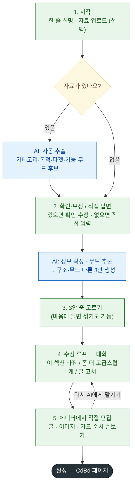

# AI 유저 플로우 (제품 설계도)

> **이 문서 = 최종 제품에서 비디자이너 유저가 AI로 페이지를 만드는 흐름.**
> [[1-1. 워크플로우]](내부 제작자용 6단계)와 다름 — 그건 "우리가 템플릿을 만드는 법", 이건 "유저가 자기 페이지를 만드는 법".
>
> **한 줄 요약**: 적게 묻고 · (자료 있으면) 자동 채우고 · 확인 → 진짜 다른 3안 → 대화로 다듬기 → **에디터에서 직접 마무리**.
> **핵심 불변식(파이프라인 공통)**: 담을 **정보(WHAT)와 CdBd 규칙은 고정**, **색·폰트·카드 배치·무드(HOW)는 개방.** → 유저는 정보만 만지고, 짜임새·느낌은 AI가 설계.

---

## 🎯 이게 뭐고, 왜 필요한가

CdBd 자동화의 **최종 목표** = 서비스에 AI 에이전트를 붙여 **비디자이너가 스스로** 모바일 비즈니스 페이지를 만들게 하는 것. 그 첫 설계로 **유저에게 무엇을·어떤 순서로 물을지**를 확정한다.

이 플로우는 이후 **프리셋(재사용 섹션 조각) 제작·분류 기준**을 세우는 근거가 된다. 왜냐하면 **유저에게 묻는 각 항목이 곧 "프리셋을 어떻게 나눠야 하는지"를 규정**하기 때문 (아래 [[#🧩 프리셋 기준으로의 다리 (다음 단계)]] 섹션 참조).

---

## 🧭 핵심 원칙 5

1. **적게 묻는다** — 질문을 다 받고서야 결과를 보여주면 비디자이너는 지쳐 이탈. 최소만 묻고 빠르게 시안을 보여준다.
2. **자료로 자동 채운다 (자료는 선택)** — 유저 자료(포스터·글·사진)엔 카테고리·목적·기능·**브랜드 느낌(무드)**이 이미 들어 있음 → 있으면 **맨 먼저** 받아 자동 추출. **없으면 질문에 직접 답변**(강제 아님).
3. **정보는 유저, 짜임새·느낌은 AI** — 유저는 "담을 내용"만 정하고, 어떤 카드로·어떤 순서로·**어떤 무드로** 만들지는 AI가 판단(자유도·품질 보존). → **무드는 따로 묻지 않는다**(내용으로 추론).
4. **3안은 진짜 다르게 — 구조뿐 아니라 무드까지** — 색만 다른 쌍둥이 ❌. 3안은 **구조가 실제로 다르고, 무드(느낌)도 서로 다르게** 탐색 → **묻지 않고 보여줘서 고르게** 한다. 차별화 = 핵심 셀링포인트.
5. **진짜 가치는 수정 루프 + 직접 편집** — 3안 제시로 끝나면 안 됨. **대화로 다듬고**, 마지막엔 **에디터에서 직접 손보는 길**을 항상 연다. 이 다듬는 과정이 제품의 본체.

---

## 🗺 5단계 플로우

| 단계 | 유저가 하는 일 | 뒤에서 AI가 하는 일 | 기존 파이프라인 매핑 |
|---|---|---|---|
| **1. 시작** | 한 줄 설명 **또는 자료 업로드**(포스터·글·사진) — **선택** | (자료 있으면) 카테고리·목적·타겟·담을 정보·기능·무드 **후보 자동 추출** | [[1-2. 기획 문서 템플릿]] Part B **자동 초안** |
| **2. 확인·보정 / 직접 답변** | 자료 있으면 "맞아요? 고칠래요?" · **없으면 각 질문에 직접 답변** | 정보 확정 → 섹션·순서·무드 판단 | Part B 확정 (기획 피드백) |
| **3. 3안** | 썸네일로 3안 비교 → 1개 선택(또는 섞기) | **구조 + 무드가 서로 다른 3개** 생성 | 2단계 claude.ai/design 생성 (시안 선택) |
| **4. 수정 루프 (대화)** | "이 섹션 바꿔 / 좀 더 고급스럽게 / 색 전체 바꿔 / 글 고쳐" | 대화로 다듬어 완성 | 3단계 Figma 반입·수정 |
| **5. 에디터 직접 편집** | **CdBd 에디터로 들어와 직접 수정** (글·이미지·카드 순서·간격) | 편집 결과 저장·반영 | 4단계 CdBd 에디터 구현 |

> 💡 **무드를 별도 질문으로 두지 않는다** — 내용(자료·답변)으로 AI가 추론하고, 3안에서 서로 다른 느낌으로 보여줘 유저가 고르게. 질문이 줄고, 3안이 한 무드에 갇히지 않아 더 다양해짐.

---

## 🔷 플로우차트 (한눈에)

**색 = 누가 하는 일** — 🟩 초록 = 유저 · 🟦 파랑 = AI · 🟨 노랑 = 갈림길 · ⬛ = 완성.
**점선(5 → 4)** = 에디터에서 손보다 다시 AI 대화로 돌아갈 수 있음. **갈림길**: 자료 있으면 자동 채움→확인, 없으면 직접 답변.

---

## 📍 단계별 상세

### 1. 시작 — 자료·의도 입력 (자료는 선택)
- 빈 화면 대신 **"한 줄로 적거나, 가진 자료를 올려주세요."**
- **자료·한 줄 설명은 선택사항.**
  - **있으면** → 카테고리·기능·브랜드 느낌·본문이 이미 들어 있어 **자동 추출 소스**가 됨 → 다음 단계가 "확인만"으로 짧아짐.
  - **없으면** → 다음 단계에서 **각 질문에 직접 답변**.
- 자료가 없을 때 도움으로 **예시 칩**("채용설명회 초대", "베이킹 클래스 모집" 등) 제시.
- AI 산출(자료 있을 때): 카테고리 후보(5개 중) · 목적 한 줄 · 타겟 후보 · 담을 정보 초안 · 필요 기능 후보 · **무드(느낌) 후보** — 무드는 따로 묻지 않고 여기서 추론.

### 2. 확인·보정 / 직접 답변 — 한 화면
- **자료를 냈으면** → 자동으로 채운 내용을 카드로 보여주고 **"맞아요? 고칠래요?"** (확인·수정).
- **자료가 없으면** → 같은 항목(카테고리 · 목적 · 타겟 · 담을 정보 · 기능)을 **직접 답변.** ← 유저 초안의 질문들이 실제로 쓰이는 지점.
- 🔑 **유저는 정보(WHAT)만 만진다.** 카드 종류·순서·레이아웃·**무드는 묻지 않음**(AI 몫). 특정 느낌을 원하면 한 줄로 적으면 됨("고급스럽게").
- 🔑 **기능은 '카드 이름'이 아니라 '결과'로 묻는다**: *"사람들이 여기서 뭘 하면 좋겠어요? 신청 / 문의 / 구경 / 구매 / 공유"* → AI가 알아서 기능 카드(예약·위치안내·Q&A·유튜브·SNS)로 변환. (비디자이너는 "예약 카드"가 뭔지 몰라도 됨.)

### 3. 3안 — 구조도 무드도 서로 다른 3개
- 확정된 정보로 AI가 3안 생성. 유저는 썸네일로 비교 → 1개 선택하거나 **"A의 히어로 + B의 본문"처럼 섞기**.
- ✅ **무드는 여기서 "보고 고른다"** — 3안이 **서로 다른 무드(느낌)까지 탐색** → 유저는 마음에 드는 느낌을 고름(묻지 않고 보여줌). 내용에 강한 무드 신호가 있으면 그 방향으로 좁히고, **정보가 적을수록 3안의 느낌을 일부러 더 벌려** 선택지를 준다.
- ✅ **필수 규칙**: 3안은 **변주 축(① 도입/히어로 ② 정보 밀도 ③ 이미지 비중 ④ 카드 타입 ⑤ 섹션 순서) 중 최소 3개에서 실제로 다름.** 색·폰트만 다른 쌍둥이는 금지 → 무드 차이는 이 **구조 차이에 더해서**(대체 ❌). [[1-2. 기획 문서 템플릿]] Part A · [[1-8. 섹션 프리셋 라이브러리]]와 동일 규칙.
- ✅ 3안 모두 **CdBd-legal**(평면 카드 스택 · 15카드 · 카드 고정 스펙).

### 4. 수정 루프 (대화) — 말로 다듬기
- 선택한 안을 놓고 대화로 다듬음:
  - **"이 섹션 바꿔줘"** → **섹션 프리셋 교체**로 구현 (프리셋이 빛나는 지점 — [[1-8. 섹션 프리셋 라이브러리]]).
  - **"좀 더 고급스럽게 / 느낌 바꿔줘"** → 무드(색·폰트·디테일) 조정.
  - **"이 부분만 다시"** → 부분 재생성.
  - **"색/폰트 전체 바꿔"** → **테마 한 번 적용 → 전 섹션 반영**(프리셋이 색·폰트 무관이라 거의 공짜).
  - **"글 고쳐"** → 텍스트 직접 편집.

### 5. 에디터에서 직접 편집 — 손으로 마무리
- 대화로 다듬은 뒤에도, 유저는 **CdBd 에디터로 들어와 직접 손볼 수 있다** — 글자 고치기, 이미지 교체, 카드 순서·간격 조정 등.
- 즉 **AI가 대부분을 만들고, 마지막 디테일은 유저가 직접.** 에디터는 이미 존재·동작 → [[1-6-1. CdBd 에디터]].
- **4단계(대화) ↔ 5단계(에디터)는 오갈 수 있음** — 에디터에서 만지다 다시 "AI야 이 섹션 바꿔줘"로 돌아가도 됨.
- 완성 → CdBd 페이지로 확정.

---

## 🔗 왜 이 순서인가 (유저 초안 → 개선)

초안은 `카테고리 → 목적 → 필수 기능 → 무드 → 자료 첨부` 질문 후 3안. 물어보는 **정보 자체는 정확**하나(우리 기획서 항목과 1:1), 순서·방식을 아래처럼 바꿨다.

| 초안의 문제 | 왜 문제 | 이 설계의 처방 |
|---|---|---|
| 질문 여러 개 먼저 | 결과를 늦게 봐 이탈(설문 피로) | (자료 있으면) 자동 채움 → **확인만** |
| 자료가 맨 뒤 | 제일 정보 많은 걸 늦게 씀 | 자료를 **맨 앞(1단계)**으로 — 단, **선택**(없으면 직접 답변) |
| 무드를 따로 물음 | 질문↑ + 3안이 한 무드에 갇힘 | **안 물음** — 내용으로 추론, 3안이 무드까지 다르게 |
| '필수 기능'을 유저가 선택 | 열어둔 카드 배치 자유도를 막음(품질↓) | **결과로 묻고** AI가 카드로 변환 |
| '3안 제시'에서 끝 | 진짜 가치인 수정이 빠짐 | **대화 수정 + 에디터 직접 편집** 추가 |

---

## ⚠️ 현실 제약 (알고 갈 것)

- 지금은 시안 **생성(1~4단계)이 브라우저(claude.ai)에서 사람이 눌러야** 돌아감 — 코드가 자동 트리거 불가([[1-1. 워크플로우]] 2단계 한계).
- 반대로 **5단계(에디터 직접 편집)는 이미 지금도 되는 부분** — CdBd 에디터가 이미 존재·동작([[1-6-1. CdBd 에디터]]).
- 따라서 이 플로우는 **최종 제품의 "목표 설계도"**이고, 당분간 내부는 **사람이 단계마다 실행**하는 형태로 운영. (자동 연결 도구가 생기면 그대로 제품 UX가 됨.)

---

## 🧩 프리셋 기준으로의 다리 (다음 단계)

> 이번 범위는 플로우 설계까지. 프리셋 제작·분류 기준 도출은 다음 단계이며, 그 **밑그림**만 여기 남긴다.

이 플로우의 각 항목이 곧 **프리셋을 나누는 축**을 규정한다:

- **카테고리** → 그 카테고리용 **섹션 프리셋 세트**를 고름
- **목적·타겟** → 어떤 **섹션을 몇 개·어떤 순서로**
- **기능(결과)** → **기능 카드 프리셋**(예약·위치·폼…)
- **무드(느낌)** → 유저에게 안 물음(내용에서 추론) · 색·폰트는 **마지막에 테마 한 번**으로 → *그래서 프리셋은 색·폰트 없이 제작*
- **자료** → 프리셋 **빈칸을 채움**

**결론 방향**: 프리셋 = **(카테고리 × 섹션 역할 × 배리에이션), 색·폰트 무관** — [[1-8. 섹션 프리셋 라이브러리]] 현 방향과 일치. 다음 세션에서 이 축으로 프리셋 분류 기준을 확정한다.
