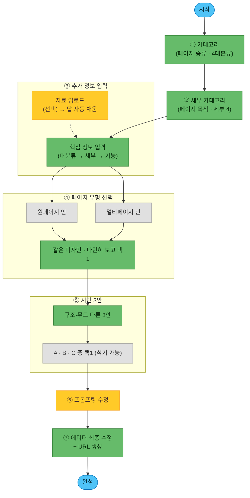

# AI 유저 플로우 (제품 설계도)

> **이 문서 = 최종 제품에서 비디자이너 유저가 AI로 페이지를 만드는 흐름.**
> [[1-1. 워크플로우]](내부 제작자용 6단계)와 다름 — 그건 "우리가 템플릿을 만드는 법", 이건 "유저가 자기 페이지를 만드는 법".
>
> **한 줄 요약**: 카테고리 2번 고르고 · 내용 채우고 → **원/멀티 골라보고** → 진짜 다른 **3안(A·B·C)** → 대화로 다듬고 → **에디터에서 직접 마무리 + URL 생성**.
> **핵심 불변식(파이프라인 공통)**: 담을 **정보(WHAT)와 CdBd 규칙은 고정**, **색·폰트·카드 배치·무드(HOW)는 개방.** → 유저는 정보만 만지고, 짜임새·느낌은 AI가 설계.
>
> 📐 **정본 도식(가로형)**: [Figma 보드 (node 32-3515)](https://www.figma.com/board/dA9nFFGnHhwjNuQYNVGR2B/AI-%ED%85%9C%ED%94%8C%EB%A6%BF-%EC%9B%8C%ED%81%AC%ED%94%8C%EB%A1%9C%EC%9A%B0?node-id=32-3515) — **7단계 확정판(2026-07-10)**. 이 문서의 플로우차트·표는 그 보드를 그대로 옮긴 것. 보드가 바뀌면 이 문서도 함께 갱신.
> 🗄 **옛 도식(히스토리, 수정 ❌)**: node 19-1381 = 4구간·3문항+원/멀티 가중치 · node 2-981 = 4구간 개편 전. 보드에 남아 있으나 **폐기본** — 참조 금지.

---

## 🎯 이게 뭐고, 왜 필요한가

CdBd 자동화의 **최종 목표** = 서비스에 AI 에이전트를 붙여 **비디자이너가 스스로** 모바일 비즈니스 페이지를 만들게 하는 것. 그 첫 설계로 **유저에게 무엇을·어떤 순서로 물을지**를 확정한다.

이 플로우는 이후 **프리셋(재사용 섹션 조각) 제작·분류 기준**을 세우는 근거가 된다. 왜냐하면 **유저에게 묻는 각 항목이 곧 "프리셋을 어떻게 나눠야 하는지"를 규정**하기 때문 (아래 [[#🧩 프리셋 기준으로의 다리 (다음 단계)]] 섹션 참조).

---

## 🧭 핵심 원칙 6

1. **적게 묻는다** — 질문을 다 받고서야 결과를 보여주면 비디자이너는 지쳐 이탈. **카테고리 2번 + 내용 채우기**만 받고 빠르게 시안을 보여준다. (옛 '주제/목적'은 **카테고리 세분화로 흡수**(2026-07-09), 옛 '타겟·필수 기능'은 **③ 추가 정보 입력 답변으로 추론**(2026-07-10) → 별도 문항 삭제.)
2. **자료로 자동 채운다 (자료는 선택)** — 유저 자료(포스터·글·사진)엔 카테고리·기능·**브랜드 느낌(무드)**이 이미 들어 있음 → 있으면 자동 추출해 답을 채움. 단 **자료 업로드는 "맨 앞 강제"가 아니라 상시 선택 옵션** — 비전문가가 빈 화면에서 막히지 않게 **질문으로 바로 시작**하고, 자료는 원할 때 올려 답을 자동으로 채운다.
3. **정보는 유저, 짜임새·느낌은 AI** — 유저는 "담을 내용"만 정하고, 어떤 카드로·어떤 순서로·**어떤 무드로** 만들지는 AI가 판단(자유도·품질 보존). → **무드·타겟·필수기능은 따로 묻지 않는다**(내용으로 추론).
4. **판단이 어려운 건 묻지 말고 보여준다** — 비디자이너는 "원페이지가 나을까 멀티가 나을까"를 말로 못 고른다. **④단계에서 같은 디자인의 원페이지 안·멀티페이지 안을 1개씩 만들어 나란히 보여주고 고르게** 한다. 무드도 같은 원리로 **⑤ 3안**에서 보여주고 고른다. (묻기 ❌ → 보여주기 ⭕)
5. **3안은 진짜 다르게 — 구조뿐 아니라 무드까지** — 색만 다른 쌍둥이 ❌. 3안(A·B·C)은 **구조가 실제로 다르고, 무드(느낌)도 서로 다르게** 탐색. 차별화 = 핵심 셀링포인트.
6. **진짜 가치는 수정 — 두 갈래** — 3안 제시로 끝나면 안 됨. **① AI 수정(프롬프팅)** + **② 직접 수정(에디터)**. 이 다듬는 과정이 제품의 본체.

> 🟡 **선택 / 🟢 필수 개념** (보드 색 규칙): **건너뛰는 유저가 꽤 있으면** 🟡선택, **거의 모든 유저가 거치면** 🟢필수 — *엄밀한 강제가 아니라 **실질 발생 빈도** 기준.*
> · 🟡 선택 = **자료 업로드**(없으면 직접 답변) · **추가 정보 입력 문항**(전부 건너뛰기 가능) · **프롬프팅 수정**(3안이 만족스러우면 건너뜀)
> · 🟢 필수 = **카테고리·세부 카테고리** · **페이지 유형 선택** · **3안 선택** · **에디터 최종 수정 + URL 생성**

> 🔓 **③ 추가 정보에 "입력하지 않으면 못 넘어가는 칸"은 없다 (2026-07-10 확정).**
> 유저는 **쓸 수 있는 것만 쓰고, 전부 건너뛰어도 된다.** 빈칸은 AI가 예시 문구·기본값으로 채우고, 유저는 ⑥⑦에서 **고치기만** 하면 된다.
> → 그래서 아래 문항표의 🟢/🟡는 **강제 여부가 아니라 "이걸 채우면 결과가 확 좋아지는 정도"**(중요도)다. 진행을 막는 문항은 **하나도 없다.**

---

## 🗺 7단계 플로우 (2026-07-10 확정)

| # | 단계 | 유저가 하는 일 | 뒤에서 AI가 하는 일 | 선택/필수 |
|---|---|---|---|---|
| — | (시작) | 진입 | — | 🟦 |
| **1** | **카테고리** (페이지 종류) | 4 대분류 중 1개 선택 | 조립 레시피 큰 틀 결정 | 🟢 필수 |
| **2** | **세부 카테고리** (페이지 목적) | 세부 4개 중 1개 선택 | 섹션 순서·핵심 섹션 확정 | 🟢 필수 |
| **3** | **추가 정보 입력** | **쓸 수 있는 것만** 입력 (전부 건너뛰기 가능). **자료 있으면** "자료 업로드"로 답 자동 채움 → 확인·보정 | 빈칸은 **예시·기본값으로 채움** → 타겟·기능·무드 추론 | 🟡 **전 문항 선택** |
| **4** | **페이지 유형 (원/멀티)** | **같은 디자인의 원페이지 안 · 멀티페이지 안을 나란히 보고** 1개 선택 | 두 유형 시안 1개씩 생성 | 🟢 필수 |
| **5** | **시안 3안** | **A·B·C** 비교 → 1개 선택(섞기 가능) | **구조 + 무드가 서로 다른 3개** 생성 · *재생성=과금* | 🟢 필수 |
| **6** | **프롬프팅 수정** | **대화로 수정** — "이 섹션 바꿔 / 좀 더 고급스럽게" | 대화로 다듬어 반영 · *수정=과금* | 🟡 선택 |
| **7** | **에디터 최종 수정 + URL 생성** | 에디터에서 직접 편집 → **발행(URL 생성)** | 편집 저장·반영 · URL·OG 발행 | 🟢 필수 |
| — | (완성) | — | CdBd 페이지 확정 | 🟦 |

> **자료 업로드는 별도 단계가 아니라 ③ 옆 선택 옵션**(🟡) — "질문으로 바로 시작"하되, 자료를 올리면 ①②③ 답이 자동으로 채워진다.
>
> 🔀 **④ 페이지 유형이 ⑤ 3안보다 앞이다.** 원/멀티는 **구조의 뼈대**라, 유형을 먼저 확정해야 3안이 그 유형 안에서 의미 있게 갈린다. (유형이 섞인 3안은 "구조가 다르다"가 아니라 "다른 물건 3개"가 되어 비교가 안 됨.)

### ①② 카테고리 · 세부 카테고리

**4 대분류 × 세부 4** — 세부는 업종 명사가 아니라 **목적 수식어가 붙은 문장형**(2026-07-09 확정 · 옛 flat 10-옵션 대체). 각 단계 **객관식 + 직접 입력**.

| ① 대분류 | ② 세부 카테고리 (목적 문장형) |
|---|---|
| **초대·예약** | ① 행사를 알리기 위한 초대장 · ② 사전 정보를 수집하기 위한 초대장 · ③ 개인 맞춤 메세지를 담은 초대장 · ④ 방문 일정을 예약받기 위한 페이지 |
| **프로필·명함** | ① 연락처·채널을 연결하기 위한 프로필 페이지 · ② 상담·문의를 이끌어내기 위한 영업용 명함 · ③ 작업물·이력을 보여주기 위한 포트폴리오 · ④ 매장·브랜드를 소개하기 위한 홈페이지 |
| **룩북·카탈로그** | ① 상품을 자세히 소개하기 위한 상세 페이지 · ② 컬렉션을 화보처럼 보여주기 위한 룩북 · ③ 상품을 바로 구매하게 하기 위한 판매 페이지 · ④ 메뉴·품목을 한눈에 보여주기 위한 메뉴판 |
| **소식·매거진** | ① 새 소식을 빠르게 알리기 위한 공지 페이지 · ② 여러 글·기사를 모아 보여주기 위한 매거진 · ③ 전시 작품을 기록·소개하는 도록 · ④ 이용 안내를 위한 가이드북 |
| (직접 입력) | — |

> 🔑 **핵심 원리 — 목적 = 페이지 구조(카드 구성), 업종·주제 = 자유입력.** 세부 카테고리를 업종 명사(패션 룩북·회사 명함)가 아닌 **"무엇을 하기 위한"** 목적 문장으로 둔 이유: **같은 목적이면 업종이 달라도 카드 구성이 같기** 때문. 업종·주제(무슨 행사·무슨 상품?)는 **③ 추가 정보 입력(자유입력)**으로 따로 받는다. (⚠️ 대분류를 A·B·C·D로 부를 수 있으나, 이 문서의 **3안(A·B·C)**과 헷갈리지 않게 여기선 **이름**으로 표기.)

> 🗑 **폐기된 문항 2개 (2026-07-10)** — 옛 3문항 중 **② 타겟**·**③ 필수 내용/기능**은 **③ 추가 정보 입력 답변으로 충분히 추론 가능**하다고 판단해 삭제. 관문을 늘리지 않는다.
>
> | 폐기 문항 | 이제 어떻게 얻나 |
> |---|---|
> | **타겟** (누구에게?) | 세부 카테고리 + 입력한 내용(문구·업종·아이템)에서 **추론** → 무드·톤·문구에 반영 |
> | **필수 내용/기능** (예약·폼·위치…) | 세부 카테고리의 **레시피 기본 기능** + 추가 정보 입력에서 **값을 채운 항목**으로 판정 (예: 예약 날짜를 적었으면 예약 섹션 채택) |
>
> ℹ️ **원/멀티 가중치(원2:멀티1 등)도 함께 폐기.** 카테고리로 비중을 정해 3안에 섞어 보여주던 방식 → **④단계에서 두 유형을 직접 보여주고 고르게 하는 방식**으로 대체.

---

## 📝 ③ 추가 정보 입력 — 콘텐츠(핵심 정보) 수집 질문 (2026-07-10 · 옛 1-10 흡수)

> ①② 카테고리는 "**어떤 페이지인가**"만 정한다. 그 페이지를 실제로 채우려면 **핵심 정보**(초대장=행사명·일시·장소 / 명함=이름·직책·연락처 / 카탈로그=아이템 목록 / 매거진=발행정보·글 목록)를 더 받아야 한다. 이 절이 그 질문 설계의 **정본**.
>
> ✅ **핵심 정보 항목 확정 (2026-07-10 · 보드 [node 32-3515](https://www.figma.com/board/dA9nFFGnHhwjNuQYNVGR2B/AI-%ED%85%9C%ED%94%8C%EB%A6%BF-%EC%9B%8C%ED%81%AC%ED%94%8C%EB%A1%9C%EC%9A%B0?node-id=32-3515) 반영)** — 아래 항목과 반복 아이템 필드는 보드에서 확정. 문구·중요도 미세조정은 남아 있음.
>
> 🔓 **전 문항 선택 — 강제 입력 없음.** 쓸 수 있는 것만 쓰고 건너뛴다. 빈칸은 AI가 채우고 유저는 고친다.
>
> **한 줄 요약**: 대분류 8~11 → 세부 1~3 → 값을 채운 기능만큼. 평균 11~15문항, **막는 문항 0개**.
>
> 🖼 **예약·유튜브 카드는 "빈 카드"로 나간다 (보드 확정)** — 시안 단계에선 **가상의 이미지**로 채워 보여주지만, 실제 에디터에는 **내용 없는 빈 카드**로 제공된다. 유저가 자기 일정·영상으로 직접 채워야 하는 카드이기 때문. → 시안의 예약 슬롯·유튜브 썸네일을 "실제 데이터"로 착각하지 말 것.

### 🎯 설계 원칙 3

1. **묻는 건 "내용"뿐, "디자인"은 안 묻는다** — 위 핵심 불변식(정보=고정 / 색·폰트·배치=개방). 색·폰트·레이아웃 질문을 여기에 넣지 말 것.
2. **빈칸이면 AI가 채운다 — 그래서 필수 칸이 없다** — 어느 문항도 진행을 막지 않는다. 비워두면 예시 문구·기본값으로 채우고 유저는 ⑥⑦에서 **고치기만** 한다. (백지 공포 차단 · 이탈 방지)
3. **자료를 올렸으면 대부분 이미 차 있다** — 자료 업로드(선택 옵션)를 거친 유저에게 이 화면은 **"확인·보정"** 화면이지 입력 화면이 아니다.

> 🧭 **질문 = 섹션 슬롯.** 모든 질문은 [[1-8. 섹션 프리셋 라이브러리]] 「콘텐츠 목적 13칸」 중 하나를 채운다. 어느 칸도 안 채우는 질문은 **삭제 대상**(= 안 물어도 되는 질문).

### 🏛 3층 구조

| 층 | 무엇 | 언제 물음 | 채우는 곳 |
|---|---|---|---|
| **① 대분류별** | **핵심 정보** + 헤더·히어로·푸터·문의 | 대분류 4개 중 하나 | 헤더 · 히어로 · 핵심정보 · 소개 · 구매 · 나열 · 문의 · 푸터 |
| **② 세부별** | 그 세부의 **"← 핵심" 섹션** | 세부 16개 중 하나 | 레시피의 핵심 칸 |
| **③ 기능 애드온** | 예약·폼·구매·프로모션… | **세부 카테고리가 요구하거나, 유저가 값을 채운 기능만** | 기능형 섹션 5칸 |

> 🚫 **"모든 카테고리 공통 질문" 층은 두지 않는다 (2026-07-10 개편).** 옛 설계는 `페이지 이름 / 첫 문장 / 로고 / 대표 사진 / 연락 / SNS` 6개를 **모든 카테고리 공통**으로 앞에 뒀는데, 대분류 질문과 **줄줄이 겹쳤다** — 명함에서 "페이지 이름"은 곧 **이름**이고, "대표 사진"은 곧 **프로필 사진**이며, "연락받을 방법"은 곧 **연락처**다. 같은 걸 두 번 묻는 셈.
> → 공통 6개를 **대분류 안으로 흡수**하고, 겹치는 항목은 **그 카테고리의 말로 한 번만** 묻는다. (유저는 "페이지 이름"이 아니라 "행사명"으로 답할 때 덜 헷갈린다 — 원칙 1 「적게 묻는다」.)

**중복 제거 규칙**: ①②③에서 같은 항목이 겹치면 **한 번만** 묻는다 (예: 메뉴판의 주소 = ③ 위치 안내의 주소).

### 1층 — 대분류별 질문 (핵심 정보 + 페이지 뼈대)

각 대분류의 **모든 세부가 공유하는** 섹션을 한 번에 채운다. (옛 공통 6문항 흡수)

> 🟢 = **채우면 결과가 크게 좋아지는 핵심 항목** · 🟡 = 있으면 좋은 항목. **둘 다 건너뛸 수 있다** — 강제 아님.

**A. 초대·예약** → `헤더` · `히어로` · `핵심정보` · `위치 안내` · `푸터`

| #      | 질문                                   | 채우는 섹션       | 중요  |
| ------ | ------------------------------------ | ------------ | --- |
| **A1** | **행사명** *(④ 예약 페이지는 `행사명·브랜드명`)*         | 헤더 · 페이지 제목  | 🟢  |
| **A2** | **첫 화면에 크게 넣을 한 문장** (초대 헤드라인)       | 히어로          | 🟢  |
| **A3** | **일시** (날짜 + 시작 시각)                  | 핵심정보         | 🟢  |
| **A4** | **장소명 + 주소** (지도 검색으로 선택)            | 핵심정보 · 위치 안내 | 🟢  |
| **A5** | **주최자**                               | 헤더 · 문의      | 🟢  |
| **A6** | **프로필 · 로고 이미지**                      | 헤더 · 히어로 · 푸터 | 🟢  |
| **A7** | **문의 연락처** (전화 / 카톡 / 이메일 / 폼) — 복수  | 문의 · 푸터      | 🟢  |
| A8     | 초대장 대표 사진                            | 히어로          | 🟡  |
| A9     | 초대 인사말 (본문)                          | 스토리          | 🟡  |
| A10    | 드레스코드·주차·동반자 등 안내사항                  | 안내 사항        | 🟡  |
| A11    | SNS 주소                               | 푸터           | 🟡  |

> ⚠️ **A4 주소는 반드시 검색 드롭다운에서 선택**해야 지도 버튼이 동작한다. 직접 타이핑만 하면 좌표(`lat`/`lng`)가 안 생겨 "지도 안 열림". → [[../CLAUDE.md]] 위치 안내 카드 ④
> ℹ️ **A2(히어로 한 문장) ≠ A9(초대 인사말).** A2는 첫 화면에 크게 박히는 제목, A9는 그 아래 읽는 본문. 둘을 합치면 히어로가 문단이 되어 버린다.
> ℹ️ **A1은 세부에 따라 라벨이 바뀐다** — ①②③ 초대장은 「행사명」, ④ 예약 페이지는 행사가 아닐 수 있어 「행사명·브랜드명」으로 물어야 한다(보드 확정).

**B. 프로필·명함** → `소개(프로필)` · `나열(연락처)` · `문의` · `푸터`

| # | 질문 | 채우는 섹션 | 중요 |
|---|---|---|---|
| **B1** | **이름 · 브랜드명** | 헤더 · 소개 · 페이지 제목 | 🟢 |
| **B2** | **소속 · 직책** *(④ 홈페이지는 제외)* | 소개 | 🟢 |
| **B3** | **프로필 · 로고 이미지** | 소개 · 히어로 · 헤더 | 🟢 |
| **B4** | **연락처** — 휴대폰번호 / 유선번호 / 이메일 (**1개 이상 권장**) | 나열 · 문의 · 푸터 | 🟢 |
| **B5** | **첫 화면에 크게 넣을 한 줄 소개** | 히어로 · 소개 | 🟢 |
| B6 | **추가 채널** — 홈페이지 · 유튜브 · 인스타 · 카톡 · 틱톡 · X | 푸터 · 문의 | 🟡 |
| B7 | 회사 로고 *(B3과 별도로 둘 때)* | 헤더 · 푸터 | 🟡 |
| B8 | 한 줄 소개 아래 붙일 소개 본문 | 스토리 | 🟡 |

> 🔗 **흡수된 공통 질문**: 페이지 이름 → **B1** · 첫 문장 → **B5** · 대표 사진/로고 → **B3** · 연락 → **B4** · SNS → **B6**.
> ⚠️ **B2는 ④ 매장·브랜드 홈페이지에선 묻지 않는다** (보드 확정 — 개인의 직책이 아니라 매장 자체를 소개하는 페이지라서).
> ℹ️ **B4는 셋 다 비어도 진행된다.** 다만 연락처가 하나도 없으면 문의·푸터 섹션이 빈 껍데기가 되므로 **AI가 자리표시 문구로 채우고 ⑦ 에디터에서 채우도록 안내**한다. (보드의 "1개 이상 필수"는 *권장*으로 해석)
> 프로필 카드는 텍스트 **2개만**(이름 + 소개글) 들어간다. 직책·소속은 소개글 한 줄로 합치거나 별도 텍스트 카드로 분리. → [[../CLAUDE.md]] 프로필 고정 스펙

**C. 룩북·카탈로그** → `헤더` · `히어로` · `구매` / `자료` (반복 아이템)

| # | 질문 | 채우는 섹션 | 중요 |
|---|---|---|---|
| **C1** | **브랜드·매장명** | 헤더 · 페이지 제목 | 🟢 |
| **C2** | **상품 카테고리** (아이템을 묶는 그룹 — 예: 음료·디저트 / 상의·하의) | 히어로 · (멀티 분할) | 🟢 |
| **C3** | **판매 형태** — `온라인(채널)` / `오프라인(매장 위치·연락처)` / `온라인+오프라인` | 문의 · 위치 안내 · 구매 | 🟢 |
| **C4** | **상품 정보** — 아이템당 `이미지 / 상품명 / 가격 / (구매 링크)` (반복)<br>**직접 입력 + 엑셀 업로드** 둘 다 지원 | 구매 · 자료 · 핵심정보 | 🟢 |
| **C5** | **첫 화면에 크게 넣을 한 문장** (컬렉션 카피) | 히어로 | 🟢 |
| C6 | 첫 화면 대표컷 | 히어로 | 🟡 |
| C7 | 로고 이미지 | 헤더 · 푸터 | 🟡 |
| C8 | 브랜드 스토리 | 스토리 | 🟡 |
| C9 | SNS 주소 | 푸터 | 🟡 |
| C10 | 프로모션·쿠폰 | 프로모션 | 🟡 |

> 🔑 **C3 판매 형태가 섹션을 가른다** — `온라인`이면 위치 안내를 안 붙이고 채널 버튼만, `오프라인`이면 위치 안내 + 전화, `둘 다`면 양쪽. (3층 기능 애드온이 자동 판정하는 대표 사례)
> 📊 **C4는 엑셀 업로드 경로가 정본** — 상품이 10개를 넘으면 폼 입력이 지옥이 된다. 보드 확정: **직접 입력 + 엑셀 업로드 병행.**
> 🔑 **C4의 반복 개수 + C2의 그룹 수 = 원/멀티 분기의 실질 재료.** 그룹이 2개 이상이면 멀티페이지 **반복 내지**가 그룹 수만큼 복제된다. → [[1-8. 섹션 프리셋 라이브러리]] 조립 레시피

**D. 소식·매거진** → `헤더(발행정보)` · `히어로` · `나열` / `스토리`

| # | 질문 | 채우는 섹션 | 중요 |
|---|---|---|---|
| **D1** | **제목** (첫 화면에 크게 넣을 대표 제목·헤드라인) | 히어로 · 페이지 제목 | 🟢 |
| **D2** | **발행처** | 헤더 | 🟢 |
| **D3** | **로고 이미지** | 헤더 · 푸터 | 🟢 |
| **D4** | **문의 연락처·채널** | 문의 · 푸터 | 🟢 |
| **D5** | **본문 아이템** — 세부 카테고리별로 필드가 다름 (아래 2층 참조) | 나열 · 스토리 | 🟢 |
| D6 | 메인 이미지·키비주얼 | 히어로 | 🟡 |
| D7 | 발행일 / 호수 | 헤더 | 🟡 |
| D8 | SNS 주소 | 푸터 | 🟡 |

> 🔗 **흡수된 공통 질문**: 페이지 이름 → **D2 발행처** · 첫 문장 → **D1 제목** · 대표 사진 → **D6 키비주얼** · 로고 → **D3**.
> ⚠️ **D5의 필드는 세부마다 다르다** — 공지 / 기사 / 작품 / 가이드가 각각 다른 항목을 요구한다(2층에서 확정). 공통으로 뭉뚱그려 묻지 말 것.

### 2층 — 세부 16개별 추가 질문

각 세부의 **"← 핵심" 섹션**(→ [[1-8. 섹션 프리셋 라이브러리]] 조립 레시피)만 추가로 묻는다.
번호는 **`대분류+세부번호-순번`** (예: `A②-1`) — 1층 번호(A1·B1…)와 섞이지 않게.

**A. 초대·예약**

| 세부 카테고리 | 추가 질문 |
|---|---|
| **① 행사를 알리기 위한 초대장** | `A①-1` **프로그램·순서** (시각 + 내용 반복) |
| **② 사전 정보를 수집하기 위한 초대장** | `A②-1` **수집할 정보** — `참석 여부` · `이름` · `연락처` · `동반인 정보` (**객관식 + 직접 추가**) |
| **③ 개인 맞춤 메세지를 담은 초대장** | `A③-1` **추가할 개인화 정보** — `이름` · `소속` · `직급` · `연락처` (**객관식 + 직접 추가**)<br>`A③-2` 개인에게 전할 메시지 본문<br>📊 `A③-3` **답변을 바탕으로 엑셀 양식을 제공** → 유저가 수신자 명단을 채워 올리면 링크가 사람 수만큼 생성 |
| **④ 방문 일정을 예약받기 위한 페이지** | `A④-1` **예약 일시 옵션**<br>`A④-2` **회차당 정원**<br>`A④-3` **예약 유의사항** (취소·환불) |

> 📊 **A②·A③은 "객관식 + 직접 추가" 패턴** — 보기를 미리 깔아두고, 없으면 유저가 항목을 덧붙인다. 백지 공포를 막는 장치(설계 원칙 2).
> 📄 **A③의 엑셀 양식이 개인화 초대장의 핵심 기능** — "받는 사람 이름을 링크마다 다르게"를 한 명씩 손으로 넣게 하면 안 된다. 유저가 고른 개인화 항목이 그대로 **엑셀 열(column)** 이 된다.

**B. 프로필·명함**

| 세부 카테고리 | 추가 질문 |
|---|---|
| **① 연락처·채널을 연결하기 위한 프로필 페이지** | `B①-1` **추가 링크 목록** (링크 + 버튼에 쓸 이름 반복) |
| **② 상담·문의를 이끌어내기 위한 영업용 명함** | `B②-1` **서비스·제품 요약 설명**<br>`B②-2` **상담신청 시 수집할 정보** — `이름` · `연락처` · `문의 내용` (**객관식 + 직접 추가**) |
| **③ 작업물·이력을 보여주기 위한 포트폴리오** | `B③-1` **작업물 내용 × N** — `이미지` · `제목` · **`작업 시기`** · `설명` (반복)<br>`B③-2` **경력·이력** |
| **④ 매장·브랜드를 소개하기 위한 홈페이지** | `B④-1` **오프라인 위치 / 온라인 URL** (둘 중 해당하는 쪽)<br>`B④-2` **CS·매장 영업 시간**<br>`B④-3` **매장·제품 사진** |

> ⚠️ **B④-1은 "매장 주소"가 아니다** — 온라인 전용 브랜드도 이 세부를 고른다. `오프라인 위치` 또는 `온라인 URL` 중 해당하는 쪽만 받고, 그에 따라 위치 안내 섹션 채택 여부가 갈린다(보드 확정).
> ℹ️ **B③-1에 「작업 시기」가 들어간다** — 포트폴리오는 최신순 정렬·연도 그룹이 필요해 날짜가 필수 필드(보드 확정).

**C. 룩북·카탈로그**

| 세부 카테고리 | 추가 질문 |
|---|---|
| **① 상품을 자세히 소개하기 위한 상세 페이지** | `C①-1` **상품 상세 스펙** (소재·사이즈·구성 등 `항목명 + 값` 반복)<br>`C①-2` 배송·교환·환불 안내 |
| **② 컬렉션을 화보처럼 보여주기 위한 룩북** | `C②-1` **컬렉션·시즌명**<br>`C②-2` **룩 사진** (룩당 여러 장, 그룹 반복)<br>`C②-3` 컬렉션 컨셉 설명 |
| **③ 상품을 바로 구매하게 하기 위한 판매 페이지** | `C③-1` **구매 링크** (상품별 URL — C4의 `(구매 링크)` 필드가 여기선 필수로 승격)<br>`C③-2` 할인·쿠폰이 있나요? |
| **④ 메뉴·품목을 한눈에 보여주기 위한 메뉴판** | `C④-1` **메뉴 그룹별 항목** (이름 + 가격 반복)<br>`C④-2` **매장 주소·영업시간** |

> `C①-1`(상세 스펙) · `C④-1`(메뉴 항목) = `2단 카드` 양끝정렬 행(좌 라벨 / 우 값). 행 1개 = 카드 1장. → [[../CLAUDE.md]] 양끝정렬 행
> ℹ️ **「컬렉션·시즌명」은 룩북(②) 전용** (보드 확정) — 메뉴판·상세 페이지엔 시즌 개념이 없다. 공통 층에서 묻지 말 것.

**D. 소식·매거진**

| 세부 카테고리 | 추가 질문 |
|---|---|
| **① 새 소식을 빠르게 알리기 위한 공지 페이지** | `D①-1` **공지 내용 × N** — `이미지` · `제목` · `내용` · **`적용 일시`** |
| **② 여러 글·기사를 모아 보여주기 위한 매거진** | `D②-1` **글·기사 내용 × N** — `이미지` · `제목` · `내용` · **`발행 일시`**<br>`D②-2` **메인 이미지·키비주얼** |
| **③ 전시 작품을 기록·소개하는 도록** | `D③-1` **작품 내용 × N** — `이미지` · `제목` · **`작가`** · **`캡션(재료·사이즈)`** · `설명`<br>`D③-2` **전시 위치·기간** |
| **④ 이용 안내를 위한 가이드북** | `D④-1` **가이드 내용 × N** — `이미지` · `제목` · `내용`<br>`D④-2` **자주 묻는 질문** |

> 🔑 **네 세부가 모두 「내용 × N」 반복 구조**지만 **필드가 다르다** (보드 확정). 공지=`적용 일시` / 기사=`발행 일시` / 작품=`작가·캡션` / 가이드=날짜 없음.
> ℹ️ **날짜 필드의 의미가 다르다** — 공지의 「적용 일시」는 *앞으로 언제부터*, 기사의 「발행 일시」는 *언제 썼는지*. 정렬 방향이 반대라 한 필드로 합칠 수 없다.

### 3층 — 기능 애드온 (조건부로 붙음)

옛 설계는 "필수 내용/기능" 문항에서 **유저가 고른 것만** 물었으나, 그 문항이 폐기(2026-07-10)되어 **두 경로로 자동 판정**한다. [[1-8. 섹션 프리셋 라이브러리]]의 **기능형 섹션**(예약·폼·구매·위치안내·문의)이 채택되는 지점.

1. **세부 카테고리의 레시피 기본 기능** — 예: `방문 일정을 예약받기 위한 페이지` → 예약 섹션은 **무조건** 붙음 → 날짜·정원 질문이 뜬다.
2. **유저가 값을 채운 항목** — 1·2층에서 주소를 적었으면 위치 안내, 구매 링크를 적었으면 구매 섹션이 켜진다. **안 적으면 안 붙는다.**

그 외 기능은 화면 하단 **"더 넣을 것 있나요?"** 목록에서 켜면 해당 질문이 펼쳐진다(전부 선택).

| 기능 | 붙는 질문 | 채우는 섹션 |
|---|---|---|
| 예약하기 | 날짜·시간대 / 정원 / 본인 인증 여부 | 예약 |
| 상담신청 폼 | 받을 항목 목록 (객관식 문항이면 보기까지) | 폼 |
| 문의 연락처 | 전화번호 / 이메일 / 카톡 링크 | 문의 |
| 상품 구매 링크 | 상품별 URL | 구매 |
| 쿠폰·프로모션 | 혜택 내용 / 기간 / 코드 | 프로모션 |
| 사진·영상 | 사진 파일 / 유튜브 주소 | 자료 |
| 타임테이블·커리큘럼 | 시각 + 내용 반복 | 나열 |
| 위치 안내 | 주소 (**검색 선택 필수**) | 위치 안내 |
| 고객 리뷰 | 리뷰 문구 + 작성자 | 자료 |
| 자주 묻는 질문 | 질문 + 답변 반복 | 폼(Q&A) |
| SNS·채널 링크 | 채널별 주소 | 푸터 |

> 🔎 **타겟·무드는 여기서 추론된다** — 입력한 문구·업종·아이템·톤에서 AI가 타겟(누구에게)과 무드(느낌)를 읽어낸다. 유저는 원하면 한 줄로 적으면 됨("고급스럽게", "2030 여성 대상").

> ⚠️ **예약 카드는 크레딧 소모** — 예약 완료 1건당 1크레딧(방문체크 옵션 ON이면 7크레딧). 잔액 0이면 카드 추가 자체가 막힌다. → [[../CLAUDE.md]] 예약 카드 제작 실무 함정
>
> 🖼 **예약·유튜브는 시안에선 가상 이미지, 에디터에선 빈 카드** (보드 확정) — 이 둘은 유저의 실제 일정·영상이 있어야 채워지므로 AI가 미리 못 채운다. 시안에선 **자리를 보여주기 위한 가짜 이미지**를 넣고, 실제 에디터에는 **빈 카드**로 넘긴다.

### 📊 전체 분량 감각

```
대분류 8~11 (필수 5~6)
  + 세부 1~3
  + 기능 애드온 (고른 만큼)
─────────────────────────
= 평균 11~15문항 · 필수 6~9개
```

| 대분류 | 1층 문항 (필수) | 2층 문항 |
|---|---:|---:|
| A. 초대·예약 | 11 (7) | 1~3 |
| B. 프로필·명함 | 8 (5) | 1~3 |
| C. 룩북·카탈로그 | 10 (5) | 2~3 |
| D. 소식·매거진 | 8 (5) | 1~2 |

공통 층을 흡수하면서 **문항 수가 1~2개 줄고 중복 질문이 사라졌다** (옛 구조: 공통 6 + 대분류 6 = 12 고정).
자료를 올린 유저는 이 중 절반 이상이 미리 채워져 **확인·보정만** 하면 된다.
(원칙 1 "적게 묻는다"는 **필수 문항 수**에 적용 — 선택 문항은 비워두면 AI가 채운다.)

### 🔗 답변이 흘러가는 곳

| 산출 | 흘러가는 곳 |
|---|---|
| 1층(대분류) 답변 | **헤더·히어로·핵심정보·문의·푸터** 슬롯 채우기 |
| 2층(세부) 답변 | 조립 레시피의 **"← 핵심" 섹션** 채우기 |
| 3층(기능 애드온) 답변 | **기능형 섹션 채택** + 설정값 |
| C4 반복 개수 · C2 그룹 수 | **④ 멀티페이지 안**의 반복 내지 복제 수 |
| C3 판매 형태 (온라인/오프라인/둘 다) | **위치 안내·구매 섹션 채택 여부** |
| (안 물음 — 내용으로 추론) | **타겟** · **디자인 무드 9종** → 색·폰트 |
| (안 물음 — ④에서 보여주고 고름) | **페이지 유형** (원 / 멀티) |
| (안 물음 — ⑤ 3안으로 벌림) | **레이아웃 스타일 3종** (미니멀·에디토리얼·볼드) |

---

**기존 내부 파이프라인 매핑** — ①②③ = 기획 문서(Part B) 자동 초안·확정([[1-2. 기획 문서 템플릿]]) · ④⑤ = claude.ai/design 원/멀티 안 + 3안([[1-1. 워크플로우]] 2단계) · ⑥ = Figma 반입·혼합·수정(3단계) · ⑦ = CdBd 에디터([[1-6-1. CdBd 에디터]], 4단계).

---

## 🔷 플로우차트 (한눈에)



**색 = 선택/필수** — 🟦 시작·완성 · 🟡 선택(자료 업로드 · 프롬프팅 수정) · 🟢 필수(①②③④⑤⑦) · ⬜ 세부(원/멀티 안, A/B/C).
**자료 업로드**는 ③ 옆 **선택 입력**(점선) — 올리면 ①②③ 답을 자동으로 채워줌.
**원/멀티는 묻지 않고 ④에서 보여준다** — 같은 디자인으로 원페이지 안·멀티페이지 안을 1개씩 만들어 나란히 제시.
**⑥ 프롬프팅 수정 ↔ ⑦ 에디터는 오갈 수 있음** · **재생성·프롬프팅 수정은 과금**.

---

## 📍 단계별 상세

### 1. 카테고리 — 페이지 종류 (🟢 필수)
- 4 대분류(초대·예약 / 프로필·명함 / 룩북·카탈로그 / 소식·매거진) 중 1개. **객관식 + 직접 입력.**
- 이 답이 **조립 레시피의 큰 틀**을 정한다 → [[1-8. 섹션 프리셋 라이브러리]].

### 2. 세부 카테고리 — 페이지 목적 (🟢 필수)
- 대분류별 세부 4개 중 1개. **업종 명사가 아니라 "무엇을 하기 위한" 목적 문장.**
- 이 답이 **섹션 순서 + "← 핵심" 섹션 + 기능형 섹션 기본값**을 확정한다.
- 🔑 **주제/목적을 따로 묻지 않는 이유** — 세부 카테고리가 목적을 이미 품음. 업종·주제(무슨 행사·무슨 상품)는 ③에서 자유입력.

### 3. 추가 정보 입력 — 핵심 정보 (🟢 필수 · 자료 🟡 선택)
- 빈 화면·자료 강요 대신 **질문으로 바로 시작** — 비전문가에게 "자료부터 올리세요"는 허들.
- **자료 업로드는 상시 선택 옵션.** 포스터·글·사진을 올리면 카테고리·기능·**브랜드 느낌(무드)**·본문을 **자동 추출해 답을 채움** → 유저는 "확인·보정"만.
- 문항 설계 = 위 「📝 ③ 추가 정보 입력」 3층 (대분류 → 세부 → 기능 애드온). **핵심 항목은 보드에서 확정(2026-07-10)**, 선택 문항·문구는 조정 여지.
- 📊 **반복 아이템이 많으면 엑셀** — 상품 정보(C4)는 직접 입력 + **엑셀 업로드**, 개인화 초대장(A③)은 답변을 바탕으로 **엑셀 양식을 내려준다**.
- 🔑 **유저는 정보(WHAT)만 만진다.** 카드 종류·순서·레이아웃·**무드는 묻지 않음**(AI 몫).
- 🔑 **기능은 '카드 이름'이 아니라 '결과'로** — "예약 카드"가 뭔지 몰라도 날짜·정원을 적으면 예약 섹션이 붙는다.
- 🔑 **타겟·필수기능은 여기서 추론** — 별도 문항 폐기(2026-07-10).

### 4. 페이지 유형 — 원 / 멀티 (🟢 필수)
- ①②③ 답변으로 **동일한 디자인의 원페이지 안 1개 · 멀티페이지 안 1개**를 만들어 **나란히 보여준다.**
- 유저는 **결과를 보고** 유형을 고른다. **"원페이지가 나을까요?"라고 묻지 않는다** — 비디자이너는 말로 판단 못 한다.
- ✅ **디자인은 동일, 구조만 다르게** — 유형 비교에 집중시키기 위해 색·폰트·무드는 두 안이 같아야 한다. (무드 비교는 ⑤에서 따로.)
- ✅ **모든 세부 카테고리가 두 유형을 제시한다** — "이 유형은 원페이지 전용" 같은 예외는 두지 않는다(2026-07-10 확정). 짧은 페이지도 멀티 안을 만들어 보여주고, 선택은 유저가 한다.
- **멀티 = 원페이지 조립 + 페이지 분할 + 내비게이션**(표지 목차 + 서브페이지 복귀 헤더). 분할 방식은 [[1-8. 섹션 프리셋 라이브러리]] 각 레시피의 `▸ 멀티페이지` 블록.

### 5. 시안 3안 — 구조도 무드도 서로 다르게 (🟢 필수)
- **선택된 페이지 유형 안에서** AI가 3안(A·B·C) 생성. 썸네일 비교 → 1개 선택하거나 **"A의 히어로 + B의 본문"처럼 섞기**.
- ✅ **무드도 여기서 "보고 고른다"** — 3안이 **서로 다른 무드(느낌)까지 탐색**. 정보가 적을수록 3안의 느낌을 더 벌린다.
- ✅ **필수 규칙**: 3안은 **변주 축(① 도입/히어로 ② 정보 밀도 ③ 이미지 비중 ④ 카드 타입 ⑤ 섹션 순서) 중 최소 3개에서 실제로 다름.** 색·폰트만 다른 쌍둥이 금지. [[1-2. 기획 문서 템플릿]] Part A · [[1-8. 섹션 프리셋 라이브러리]]와 동일 규칙.
- ✅ 3안 모두 **CdBd-legal**(평면 카드 스택 · 15카드 · 카드 고정 스펙).
- 💳 **재생성은 과금**.

### 6. 프롬프팅 수정 — 대화로 다듬기 (🟡 선택 · 과금)
- 선택한 안을 놓고 대화로 다듬음 (**3안이 이미 만족스러우면 건너뛰어도 됨**):
  - **"이 섹션 바꿔줘"** → **섹션 프리셋 교체**로 구현 (프리셋이 빛나는 지점 — [[1-8. 섹션 프리셋 라이브러리]]).
  - **"좀 더 고급스럽게 / 느낌 바꿔줘"** → 무드(색·폰트·디테일) 조정.
  - **"이 부분만 다시"** → 부분 재생성.
  - **"색/폰트 전체 바꿔"** → **테마 한 번 적용 → 전 섹션 반영**(프리셋이 색·폰트 무관이라 거의 공짜).
  - **"글 고쳐"** → 텍스트 직접 편집.
- 💳 **수정은 과금**.

### 7. 에디터 최종 수정 + URL 생성 (🟢 필수)
- **CdBd 에디터로 들어와 직접 손본다** — 글자 고치기, 이미지 교체, 카드 순서·간격 조정.
- 마지막에 **발행 → URL 생성**. (발행 시 OG 이미지·페이지 제목 확정, 크레딧 확인 모달)
- 🟢 **왜 '필수'인가**: 엄밀히는 편집을 안 거쳐도 완성은 되지만 **URL 생성은 반드시 거친다**. 또 실제로는 거의 모든 유저가 텍스트 하나라도 고친다.
- **⑥ 프롬프팅 수정 ↔ ⑦ 에디터는 오갈 수 있음** — 에디터에서 만지다 다시 "AI야 이 섹션 바꿔줘"로 돌아가도 됨.
- 에디터는 이미 존재·동작 → [[1-6-1. CdBd 에디터]].

---

## 🔗 왜 이 순서인가 (유저 초안 → 개선)

초안은 `카테고리 → 목적 → 필수 기능 → 무드 → 자료 첨부` 질문 후 3안. 물어보는 **정보 자체는 정확**하나(우리 기획서 항목과 1:1), 순서·방식을 아래처럼 바꿨다.

| 초안의 문제 | 왜 문제 | 이 설계의 처방 |
|---|---|---|
| 질문 여러 개 먼저 | 결과를 늦게 봐 이탈(설문 피로) | **카테고리 2번 + 내용 채우기**로 압축 · (자료 있으면) 자동 채움 → **확인만** |
| 자료 업로드가 진입 허들 | "자료부터 올리세요"는 빈 화면만큼 막막 | **질문으로 바로 시작** · 자료는 **③ 옆 선택 옵션**(올리면 답 자동 채움) |
| 주제/목적을 따로 물음 | 카테고리와 겹쳐 질문만 늘어남 | **카테고리를 목적까지 세분화** → 주제/목적 질문 삭제 |
| 무드를 따로 물음 | 질문↑ + 3안이 한 무드에 갇힘 | **안 물음** — 내용으로 추론, ⑤ 3안이 무드까지 다르게 |
| 타겟을 따로 물음 | 입력 내용에서 이미 드러남 | **안 물음** — ③ 답변에서 추론 *(2026-07-10 문항 폐기)* |
| '필수 기능'을 유저가 선택 | 열어둔 카드 배치 자유도를 막음(품질↓) | **안 물음** — 세부 카테고리 기본값 + ③에서 값 채운 항목으로 자동 판정 *(2026-07-10 문항 폐기)* |
| 원/멀티를 유저가 결정 | 비전문가는 말로 판단 어려움 | **묻지 말고 보여준다** — ④에서 같은 디자인의 원/멀티 안을 나란히 제시하고 고르게 *(2026-07-10 · 옛 '카테고리 가중치 자동 결정' 폐기)* |
| '3안 제시'에서 끝 | 진짜 가치인 수정이 빠짐 | **프롬프팅 수정 + 에디터 직접 수정** 두 갈래 추가 |

---

## ⚠️ 현실 제약 (알고 갈 것)

- 지금은 시안 **생성 쪽(①~⑥)이 브라우저(claude.ai)에서 사람이 눌러야** 돌아감 — 코드가 자동 트리거 불가([[1-1. 워크플로우]] 2단계 한계).
- 반대로 **⑦ 에디터 최종 수정·URL 생성은 이미 지금도 되는 부분** — CdBd 에디터가 이미 존재·동작([[1-6-1. CdBd 에디터]]).
- **④ 페이지 유형 선택은 시안을 2개 만들어야 해서 생성 비용이 늘어난다** — 원/멀티 안 각 1개 + 3안 = 최소 5회 생성. 내부 파이프라인에서 비용·시간 예산 재산정 필요.
- 따라서 이 플로우는 **최종 제품의 "목표 설계도"**이고, 당분간 내부는 **사람이 단계마다 실행**하는 형태로 운영.

---

## 🧩 프리셋 기준으로의 다리 (다음 단계)

> 이번 범위는 플로우 설계까지. 프리셋 제작·분류 기준 도출은 다음 단계이며, 그 **밑그림**만 여기 남긴다.

이 플로우의 각 항목이 곧 **프리셋을 나누거나 조립·채택하는 역할**을 규정한다 (정본 도식 = [Figma node 9-113](https://www.figma.com/board/dA9nFFGnHhwjNuQYNVGR2B/AI-%ED%85%9C%ED%94%8C%EB%A6%BF-%EC%9B%8C%ED%81%AC%ED%94%8C%EB%A1%9C%EC%9A%B0?node-id=9-113)):

| 유저 신호 | 역할 | 분류 서랍? |
|---|---|---|
| **① 카테고리** | **조립 레시피** 큰 틀 (+ 태그) | ❌ 태그 |
| **② 세부 카테고리** | 조립 세부 — 섹션 순서·핵심 섹션·**기능형 기본값** | ❌ 조립 |
| **③ 추가 정보 입력** | 프리셋 **빈칸을 채움** + **기능형 섹션 채택**(값을 채운 것만) | ❌ 채우기·채택 |
| **④ 페이지 유형** | 원페이지 스택 vs **페이지 분할 + 내비게이션** | ❌ 조립 |
| **타겟 · 무드(느낌)** | 안 물음(③ 내용에서 추론) · 색·폰트는 **마지막 테마 한 번** → *프리셋은 색·폰트 없이 제작* | ❌ 디자인 |
| **자료** | ③ 답을 자동으로 채움 | ❌ 채움 |

**결론**: 유저 신호 어느 것도 "분류 서랍"이 아니다 → 프리셋은 **섹션 "목적" 13칸으로 분류**(히어로·소개·핵심정보·스토리·안내사항·나열·자료·예약·폼·구매·프로모션·위치안내·문의), **카테고리는 조립 레시피**, **색·폰트 무관**. → [[1-8. 섹션 프리셋 라이브러리]]에서 확정(2026-07-09).
