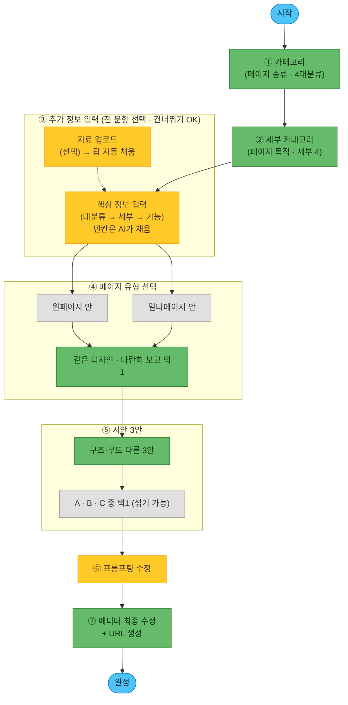

# AI 유저 플로우 (제품 설계도)

> **이 문서 = 최종 제품에서 비디자이너 유저가 AI로 페이지를 만드는 흐름.**
> [[1-1. 워크플로우]](내부 제작자용 6단계)와 다름 — 그건 "우리가 템플릿을 만드는 법", 이건 "유저가 자기 페이지를 만드는 법".
>
> **한 줄 요약**: 카테고리 2번 고르고 · 내용 채우고 → **원/멀티 골라보고** → 진짜 다른 **3안(A·B·C)** → 대화로 다듬고 → **에디터에서 직접 마무리 + URL 생성**.
> **핵심 불변식(파이프라인 공통)**: 담을 **정보(WHAT)와 CdBd 규칙은 고정**, **색·폰트·카드 배치·무드(HOW)는 개방.** → 유저는 정보만 만지고, 짜임새·느낌은 AI가 설계.
>
> 📐 **정본 도식(가로형)**: [Figma 보드 (node 32-3515)](https://www.figma.com/board/dA9nFFGnHhwjNuQYNVGR2B/AI-%ED%85%9C%ED%94%8C%EB%A6%BF-%EC%9B%8C%ED%81%AC%ED%94%8C%EB%A1%9C%EC%9A%B0?node-id=32-3515) — **7단계 흐름 확정판(2026-07-14 갱신 반영)**. 7단계 구조·4대분류·세부 16은 **보드가 정본**.
> 🔑 **단 ③ 추가 정보 필드는 이 문서(1-9)가 정본** (2026-07-14) — 16시나리오 검증([[3-2. 16 시나리오 테스트]])으로 세분화한 항목은 보드보다 앞선다. **보드가 아직 안 따라온 5건 = 보드를 이 문서에 맞춘다**(문서 되돌리기 ❌): ① 「일시·장소」→ 일시/장소 분리 · ② 「프로필·로고 이미지」→ 로고/사진 분리 · ③ B② `대표 실적`·`경력·자격·수상` · ④ B②-1 서비스 = `× N(제목+설명)` · ⑤ C3 상품 카테고리 = `대분류 > 소분류`. (여는/닫는 글은 반대로 **보드대로 매거진 채택**.)
> 🗄 **옛 도식(히스토리, 수정 ❌)**: node 19-1381 = 4구간·3문항+원/멀티 가중치 · node 2-981 = 4구간 개편 전. 보드에 남아 있으나 **폐기본** — 참조 금지.

---

## 🎯 이게 뭐고, 왜 필요한가

CdBd 자동화의 **최종 목표** = 서비스에 AI 에이전트를 붙여 **비디자이너가 스스로** 모바일 비즈니스 페이지를 만들게 하는 것. 그 첫 설계로 **유저에게 무엇을·어떤 순서로 물을지**를 확정한다.

이 플로우는 이후 **프리셋(재사용 섹션 조각) 제작·분류 기준**을 세우는 근거가 된다. 왜냐하면 **유저에게 묻는 각 항목이 곧 "프리셋을 어떻게 나눠야 하는지"를 규정**하기 때문 (아래 [[#🧩 프리셋 기준으로의 다리 (다음 단계)]] 섹션 참조).

---

## 🧭 핵심 원칙 6

1. **적게 묻는다** — 질문을 다 받고서야 결과를 보여주면 비디자이너는 지쳐 이탈. **카테고리 2번 + 내용 채우기**만 받고 빠르게 시안을 보여준다. (옛 '주제/목적'은 **카테고리 세분화로 흡수**(2026-07-09), 옛 '타겟·필수 기능'은 **③ 추가 정보 입력 답변으로 추론**(2026-07-10) → 별도 문항 삭제.)
2. **자료로 자동 채운다 (자료는 선택)** — 유저 자료(포스터·글·사진)엔 카테고리·기능·**브랜드 느낌(무드)**이 이미 들어 있음 → 있으면 자동 추출해 답을 채움. 단 **자료 업로드는 "맨 앞 강제"가 아니라 상시 선택 옵션** — 비전문가가 빈 화면에서 막히지 않게 **질문으로 바로 시작**하고, 자료는 원할 때 올려 답을 자동으로 채운다.
3. **정보는 유저, 짜임새·느낌은 AI** — 유저는 "담을 내용"만 정하고, 어떤 카드로·어떤 순서로·**어떤 무드로** 만들지는 AI가 판단(자유도·품질 보존). → **무드·타겟·필수기능은 따로 묻지 않는다**(내용으로 추론).
4. **판단이 어려운 건 묻지 말고 보여준다** — 비디자이너는 "원페이지가 나을까 멀티가 나을까"를 말로 못 고른다. **④단계에서 같은 디자인의 원페이지 안·멀티페이지 안을 1개씩 만들어 나란히 보여주고 고르게** 한다. 무드도 같은 원리로 **⑤ 3안**에서 보여주고 고른다. (묻기 ❌ → 보여주기 ⭕)
5. **3안은 진짜 다르게 — 구조뿐 아니라 무드까지** — 색만 다른 쌍둥이 ❌. 3안(A·B·C)은 **구조가 실제로 다르고, 무드(느낌)도 서로 다르게** 탐색. 차별화 = 핵심 셀링포인트.
6. **진짜 가치는 수정 — 두 갈래** — 3안 제시로 끝나면 안 됨. **① AI 수정(프롬프팅)** + **② 직접 수정(에디터)**. 이 다듬는 과정이 제품의 본체.

> 🟡 **선택 / 🟢 필수 개념** (보드 색 규칙): **건너뛰는 유저가 꽤 있으면** 🟡선택, **거의 모든 유저가 거치면** 🟢필수 — *엄밀한 강제가 아니라 **실질 발생 빈도** 기준.*
> · 🟡 선택 = **자료 업로드**(없으면 직접 답변) · **추가 정보 입력 문항**(전부 건너뛰기 가능) · **프롬프팅 수정**(3안이 만족스러우면 건너뜀)
> · 🟢 필수 = **카테고리·세부 카테고리** · **페이지 유형 선택** · **3안 선택** · **에디터 최종 수정 + URL 생성**

> 🔓 **③ 추가 정보에 "입력하지 않으면 못 넘어가는 칸"은 없다 (2026-07-10 확정).**
> 유저는 **쓸 수 있는 것만 쓰고, 전부 건너뛰어도 된다.** 빈칸은 AI가 예시 문구·기본값으로 채우고, 유저는 ⑥⑦에서 **고치기만** 하면 된다.
> → 그래서 아래 문항표의 🟢/🟡는 **강제 여부가 아니라 "이걸 채우면 결과가 확 좋아지는 정도"**(중요도)다. 진행을 막는 문항은 **하나도 없다.**
> 📐 **정본 등급표 = 아래 [[#🎚 필수 / 선택 등급 — 보드 32-3515 「파란색 = 필수」 (2026-07-21 확정)]]** (보드 32-3515의 파란 박스 = 필수 · 회색 = 선택).

---

## 🗺 7단계 플로우 (2026-07-10 확정)

| # | 단계 | 유저가 하는 일 | 뒤에서 AI가 하는 일 | 선택/필수 |
|---|---|---|---|---|
| — | (시작) | 진입 | — | 🟦 |
| **1** | **카테고리** (페이지 종류) | 4 대분류 중 1개 선택 | 조립 레시피 큰 틀 결정 | 🟢 필수 |
| **2** | **세부 카테고리** (페이지 목적) | 세부 4개 중 1개 선택 | 섹션 순서·핵심 섹션 확정 | 🟢 필수 |
| **3** | **추가 정보 입력** | **쓸 수 있는 것만** 입력 (전부 건너뛰기 가능). **자료 있으면** "자료 업로드"로 답 자동 채움 → 확인·보정 | 빈칸은 **예시·기본값으로 채움** → 타겟·기능·무드 추론 | 🟡 **전 문항 선택** |
| **4** | **페이지 유형 (원/멀티)** | **같은 디자인의 원페이지 안 · 멀티페이지 안을 나란히 보고** 1개 선택 | 두 유형 시안 1개씩 생성 | 🟢 필수 |
| **5** | **시안 3안** | **A·B·C** 비교 → 1개 선택(섞기 가능) | **구조 + 무드가 서로 다른 3개** 생성 · *재생성=과금* | 🟢 필수 |
| **6** | **프롬프팅 수정** | **대화로 수정** — "이 섹션 바꿔 / 좀 더 고급스럽게" | 대화로 다듬어 반영 · *수정=과금* | 🟡 선택 |
| **7** | **에디터 최종 수정 + URL 생성** | 에디터에서 직접 편집 → **발행(URL 생성)** | 편집 저장·반영 · URL·OG 발행 | 🟢 필수 |
| — | (완성) | — | CdBd 페이지 확정 | 🟦 |

> **자료 업로드는 별도 단계가 아니라 ③ 옆 선택 옵션**(🟡) — "질문으로 바로 시작"하되, 자료를 올리면 ①②③ 답이 자동으로 채워진다.
>
> 🔀 **④ 페이지 유형이 ⑤ 3안보다 앞이다.** 원/멀티는 **구조의 뼈대**라, 유형을 먼저 확정해야 3안이 그 유형 안에서 의미 있게 갈린다. (유형이 섞인 3안은 "구조가 다르다"가 아니라 "다른 물건 3개"가 되어 비교가 안 됨.)

### ①② 카테고리 · 세부 카테고리

**4 대분류 × 세부 4** — 세부는 업종 명사가 아니라 **목적 수식어가 붙은 문장형**(2026-07-09 확정 · 옛 flat 10-옵션 대체). 각 단계 **객관식 + 직접 입력**.

| ① 대분류 | ② 세부 카테고리 (목적 문장형) |
|---|---|
| **초대·예약** | ① 행사를 알리기 위한 정보 전달형 초대장 · ② 사전 정보를 수집하기 위한 설문형 초대장 · ③ 개인 맞춤 메세지를 담은 개인화 초대장 · ④ 방문 일정을 예약받기 위한 예약 페이지 |
| **프로필·명함** | ① 연락처·채널을 연결하기 위한 프로필 페이지 · ② 상담·문의를 이끌어내기 위한 영업용 명함 · ③ 작업물·이력을 보여주기 위한 포트폴리오 · ④ 매장·브랜드를 소개하기 위한 홈페이지 |
| **룩북·카탈로그** | ① 상품을 자세히 소개하기 위한 상세 페이지 · ② 컬렉션을 화보처럼 보여주기 위한 룩북 · ③ 상품을 바로 구매하게 하기 위한 판매 페이지 · ④ 메뉴·품목을 한눈에 보여주기 위한 메뉴판 |
| **소식·매거진** | ① 새 소식을 빠르게 알리기 위한 공지 페이지 · ② 여러 글·기사를 모아 보여주기 위한 매거진 · ③ 전시 작품을 기록·소개하는 도록 · ④ 이용 안내를 위한 가이드북 |
| (직접 입력) | — |

> 🔑 **핵심 원리 — 목적 = 페이지 구조(카드 구성), 업종·주제 = 자유입력.** 세부 카테고리를 업종 명사(패션 룩북·회사 명함)가 아닌 **"무엇을 하기 위한"** 목적 문장으로 둔 이유: **같은 목적이면 업종이 달라도 카드 구성이 같기** 때문. 업종·주제(무슨 행사·무슨 상품?)는 **③ 추가 정보 입력(자유입력)**으로 따로 받는다. (⚠️ 대분류를 A·B·C·D로 부를 수 있으나, 이 문서의 **3안(A·B·C)**과 헷갈리지 않게 여기선 **이름**으로 표기.)

> 🗑 **폐기된 문항 2개 (2026-07-10)** — 옛 3문항 중 **② 타겟**·**③ 필수 내용/기능**은 **③ 추가 정보 입력 답변으로 충분히 추론 가능**하다고 판단해 삭제. 관문을 늘리지 않는다.
>
> | 폐기 문항 | 이제 어떻게 얻나 |
> |---|---|
> | **타겟** (누구에게?) | 세부 카테고리 + 입력한 내용(문구·업종·아이템)에서 **추론** → 무드·톤·문구에 반영 |
> | **필수 내용/기능** (예약·폼·위치…) | 세부 카테고리의 **레시피 기본 기능** + 추가 정보 입력에서 **값을 채운 항목**으로 판정 (예: 예약 날짜를 적었으면 예약 섹션 채택) |
>
> ℹ️ **원/멀티 가중치(원2:멀티1 등)도 함께 폐기.** 카테고리로 비중을 정해 3안에 섞어 보여주던 방식 → **④단계에서 두 유형을 직접 보여주고 고르게 하는 방식**으로 대체.

---

## 📝 ③ 추가 정보 입력 — 콘텐츠(핵심 정보) 수집 질문 (2026-07-10 · 옛 1-10 흡수)

> ①② 카테고리는 "**어떤 페이지인가**"만 정한다. 그 페이지를 실제로 채우려면 **핵심 정보**(초대장=행사명·일시·장소 / 명함=이름·직책·연락처 / 카탈로그=아이템 목록 / 매거진=발행정보·글 목록)를 더 받아야 한다. 이 절이 그 질문 설계의 **정본**.
>
> ✅ **핵심 정보 항목 확정 (2026-07-10 · 보드 [node 32-3515](https://www.figma.com/board/dA9nFFGnHhwjNuQYNVGR2B/AI-%ED%85%9C%ED%94%8C%EB%A6%BF-%EC%9B%8C%ED%81%AC%ED%94%8C%EB%A1%9C%EC%9A%B0?node-id=32-3515) 반영)** — 아래 항목과 반복 아이템 필드는 보드에서 확정. 문구·중요도 미세조정은 남아 있음.
>
> 🔓 **전 문항 선택 — 강제 입력 없음.** 쓸 수 있는 것만 쓰고 건너뛴다. 빈칸은 AI가 채우고 유저는 고친다.
>
> **한 줄 요약**: 대분류 8~11 → 세부 1~3 → 값을 채운 기능만큼. 평균 11~15문항, **막는 문항 0개**.
>
> 🖼 **예약·유튜브 카드는 "빈 카드"로 나간다 (보드 확정)** — 시안 단계에선 **가상의 이미지**로 채워 보여주지만, 실제 에디터에는 **내용 없는 빈 카드**로 제공된다. 유저가 자기 일정·영상으로 직접 채워야 하는 카드이기 때문. → 시안의 예약 슬롯·유튜브 썸네일을 "실제 데이터"로 착각하지 말 것.

### 🎯 설계 원칙 5

1. **묻는 건 "내용"뿐, "디자인"은 안 묻는다** — 위 핵심 불변식(정보=고정 / 색·폰트·배치=개방). 색·폰트·레이아웃 질문을 여기에 넣지 말 것.
2. **빈칸이면 AI가 채운다 — 그래서 필수 칸이 없다** — 어느 문항도 진행을 막지 않는다. 비워두면 예시 문구·기본값으로 채우고 유저는 ⑥⑦에서 **고치기만** 한다. (백지 공포 차단 · 이탈 방지)
3. **자료를 올렸으면 대부분 이미 차 있다** — 자료 업로드(선택 옵션)를 거친 유저에게 이 화면은 **"확인·보정"** 화면이지 입력 화면이 아니다.
4. **✍️ 사실은 유저가, 카피는 AI가 (2026-07-10 확정)** — 유저에게는 **사실 정보(fact)** 만 묻는다. **읽는 글(copy)** 은 AI가 쓴다.
5. **🧩 반복 섹션은 2단 입력 (2026-07-10 확정)** — `카테고리` → `카테고리별 아이템`. 아이템을 평평한 목록으로 받지 않는다.

#### 4. ✍️ 사실은 유저가, 카피는 AI가

| | 누가 | 예 |
|---|---|---|
| **사실 (fact)** | **유저가 입력** | 행사명 · 일시·장소 · 가격 · 연락처 · 작품 캡션 · 영업시간 |
| **카피 (copy)** | **AI가 작성** | 히어로 한 문장 · 초대 인사말 · 브랜드 스토리 · 한 줄 소개 · 안내 문구 |

**그래서 질문에 「첫 화면에 크게 넣을 한 문장」·「인사말」·「브랜드 스토리」가 없다 — 누락이 아니라 설계다.**
AI는 카테고리 + 세부 카테고리 + 입력된 사실에서 **톤과 문구를 지어내고**, 유저는 ⑥ 프롬프팅·⑦ 에디터에서 고친다.
- ⭕ 「행사명: 『밤의 문장들』 출간 기념 북토크」 → AI가 히어로 카피 「작가와 함께, 문장 사이를 걷는 밤」 생성
- ❌ 유저에게 "히어로에 넣을 감성적인 한 문장을 적어주세요" 라고 묻기 — **비디자이너가 가장 막히는 칸**
- ⚠️ 예외: **개인 맞춤 초대장(A③)의 메시지**도 AI가 쓴다. 유저는 `{이름}·{소속}·{직급}` 같은 **치환 데이터**만 준다.

#### 5. 🧩 반복 섹션 = 2단 입력 (카테고리 → 아이템)

메뉴·상품·작업물·기사·작품처럼 **여러 개가 반복되는 섹션**은 **평평한 목록으로 받지 않는다.**

```
① 카테고리 입력       예) 안주 · 사케 · 하이볼
② 카테고리별 아이템 입력  예) [안주] 연어 사시미 18,000 / 닭꼬치 14,000 …
                          [사케] 쿠보타 센쥬 9,000 …
```

- **왜**: 아이템에 그룹이 없으면 **섹션을 나눌 수 없고**, 멀티페이지 **반복 내지**를 몇 장 만들지도 못 정한다.
- **카테고리가 1개면** 그룹 헤딩 없이 평탄하게 렌더한다(유저는 그대로 두면 됨).
- **카테고리 수 = 멀티페이지 반복 내지 수** → [[1-8. 섹션 프리셋 라이브러리]] 조립 레시피
- 적용 대상: `C 상품 정보` · `B③ 작업물` · `D①②③④ 내용×N` 등 **모든 `× N` 문항**.
- 📊 **엑셀 업로드도 2단** — 첫 열이 `카테고리`, 나머지가 아이템 필드.

> 🧭 **질문 = 섹션 슬롯.** 모든 질문은 [[1-8. 섹션 프리셋 라이브러리]] 「콘텐츠 목적 13칸」 중 하나를 채운다. 어느 칸도 안 채우는 질문은 **삭제 대상**(= 안 물어도 되는 질문).

### 🎚 필수 / 선택 등급 — 보드 32-3515 「파란색 = 필수」 (2026-07-21 확정)

> 🔑 **두 축을 구분한다.** ①「전 문항 선택(강제 입력 0개)」은 **진행을 막지 않는다는 UX 원칙**(백지공포 차단·이탈 방지)이고, ②아래 **필수/선택 등급**은 **"결과 완성도를 위해 꼭 받아야 하는 질문"**을 가린 것이다. 둘은 공존한다 — 필수 질문도 비우면 AI가 채우지만, **비면 그 유형의 페이지가 성립하지 않거나 빈 껍데기**가 되므로 UI에서 강조해 꼭 받도록 유도한다.
>
> 📐 **판정 정본 = 보드 [node 32-3515](https://www.figma.com/board/dA9nFFGnHhwjNuQYNVGR2B/AI-%ED%85%9C%ED%94%8C%EB%A6%BF-%EC%9B%8C%ED%81%AC%ED%94%8C%EB%A1%9C%EC%9A%B0?node-id=32-3515)의 박스 색.** **파란 박스 = 🟢 필수 · 회색 박스 = 🟡 선택** (2026-07-21 사용자 확정 · 플러그인으로 각 박스 fill 색 직접 판독). 아래 필드 번호는 이 문서(1-9)의 것.
>
> 🧭 **필수 판정 원리** = ① 그 목적의 **뼈대** + ② **AI가 못 지어내는 사실**(일시·장소·가격·연락처·상품·작가…). 카피(히어로 문장·인사말·스토리)는 AI가 쓰므로 필수 아님.

**공통 등급 (대분류의 모든 세부가 공유)**

| 대분류 | 🟢 필수 | 🟡 선택 |
|---|---|---|
| **A. 초대·예약** | 행사명(A1) · 일시(A2) · 장소·주소(A3) · 주최자(A4) · 메인 이미지(A6) · 문의 연락처(A7) | 로고(A5) · SNS 채널(A7의 SNS 부분) · 프로그램·순서×N(A8) |
| **B. 프로필·명함** | 이름·브랜드명(B1) · 연락처(B4) | 추가 채널(B5) |
| **C. 룩북·카탈로그** | 브랜드·매장명(C1) · 상품 카테고리(C3) · 상품 정보×N(C4) · 로고(C5 — ①②③만) | 판매형태+연락처(C2) · 할인·프로모션(C6) · 로고(C5 — ④ 메뉴판) |
| **D. 소식·매거진** | 제목(D1) · 발행처(D2) · 문의 연락처·채널(D4) | 로고(D3) |

**세부 16개별 등급 (공통에 더해지는 세부 질문만)**

| 세부 카테고리 | 🟢 세부 필수 | 🟡 세부 선택 |
|---|---|---|
| **A① 정보 전달형 초대장** | — *(공통만)* | — |
| **A② 설문형 초대장** | 수집할 정보(A②-1) | — |
| **A③ 개인화 초대장** | 개인화 정보(A③-1) · 엑셀 양식 제공(A③-2) | 참석 여부 수집(A③-3) |
| **A④ 예약 페이지** | 예약 일시(A④-1) · 회차당 정원(A④-2) | 회차별 설명 · 예약 유의사항(A④-3) · 현장 사진(A④-4) |
| **B① 프로필** | 프로필·로고 이미지 · 추가 링크 목록(B①-1) | 소속·직책(B3) |
| **B② 영업 명함** | 프로필+로고 이미지 · 소속·직책(B3) · 서비스·제품×N(B②-1) · 상담신청 수집 정보(B②-2) | 대표 실적(B②-3)† · 경력·자격·수상(B②-4)† |
| **B③ 포트폴리오** | 작업물×N(B③-0·1) · 경력·이력(B③-2) | 프로필 사진 · 자료·문서 다운로드(B③-3) |
| **B④ 매장·브랜드 홈** | 로고 이미지 · 매장·제품 사진(B④-3) · 취급 제품·서비스×N(B④-4) | 오프라인 위치/온라인 URL(B④-1) · CS·영업시간(B④-2) · 브랜드 비전(B④-5) |
| **C① 상세 페이지** | 상품 정보×N(상세 스펙·이미지×N)(C4) | 브랜드·제품 스토리(C①-1) · 고객 후기(C8) |
| **C② 룩북** | 화보/누끼 이미지×N(C4) | 컬렉션·시즌명(C②-1) · 컬렉션 설명(C②-2) · 메인 이미지(C7) · 고객 후기(C8) |
| **C③ 판매 페이지** | 상품 정보×N(구매 링크)(C4) | 고객 후기(C8) |
| **C④ 메뉴판** | — *(공통: 상품 카테고리·상품 정보)* | 매장 위치 · 고객 후기 · 로고 |
| **D① 공지** | 공지 내용×N(D①-1) | — |
| **D② 매거진** | 글·기사×N(본문 전문)(D②-1) · 메인 이미지·키비주얼(D②-2) | 여는 글(D②-3) · 닫는 글(D②-4) |
| **D③ 도록** | 작품×N(D③-1) · 메인 이미지·포스터(D③-3) · 전시 위치·기간(D③-2) · 전시 설명(D③-6) · 참여 작가×N(D③-4) | 주최·후원(D③-5) · 전시장 맵(D③-7) |
| **D④ 가이드북** | 이용 방법×N·Step(D④-1) | FAQ(D④-2) · 유의사항(D④-3) · 준비물(D④-4) · 위치·찾아오는 길(D④-5) |

> † **B②-3·B②-4는 보드에 아직 박스가 없다**(문서에만 있는 「보드 미반영 5건」 중 일부). 보드 색이 없어 **잠정 🟡 선택** — 보드에 추가되면 색으로 확정한다. (필드 존재 자체는 이 문서가 정본)
>
> ⚠️ **보드 색이 앞선 초안 논의와 다른 4곳 — 보드를 따랐다**: ① **C 판매형태+연락처(C2) = 선택**(연락처를 필수로 봤으나 보드는 회색) · ② **B④ 오프라인 위치/온라인 URL = 선택** · ③ **C② 컬렉션·시즌명 = 선택** · ④ **D③ 주최·후원 = 선택**. 되돌리려면 보드에서 해당 박스를 파랑으로 바꾸면 이 표도 맞춰 갱신.
>
> 🧩 **공통 원칙 요약**: 어느 유형이든 **① 그 유형의 핵심 콘텐츠(사실) · ② 문의 연락처(A·B·D) · ③ 대표 이미지 1장**이 필수 뼈대. SNS·유의사항·프로모션·후기·비전·추가 채널 등 "없을 수도 있는" 정보는 선택.

### 🏛 3층 구조

| 층 | 무엇 | 언제 물음 | 채우는 곳 |
|---|---|---|---|
| **① 대분류별** | **핵심 정보** + 헤더·히어로·푸터·문의 | 대분류 4개 중 하나 | 헤더 · 히어로 · 핵심정보 · 소개 · 구매 · 나열 · 문의 · 푸터 |
| **② 세부별** | 그 세부의 **"← 핵심" 섹션** | 세부 16개 중 하나 | 레시피의 핵심 칸 |
| **③ 기능 애드온** | 예약·폼·구매·프로모션… | **세부 카테고리가 요구하거나, 유저가 값을 채운 기능만** | 예약·폼·구매·위치 안내·문의 칸 |

> 🚫 **"모든 카테고리 공통 질문" 층은 두지 않는다 (2026-07-10 개편).** 옛 설계는 `페이지 이름 / 첫 문장 / 로고 / 대표 사진 / 연락 / SNS` 6개를 **모든 카테고리 공통**으로 앞에 뒀는데, 대분류 질문과 **줄줄이 겹쳤다** — 명함에서 "페이지 이름"은 곧 **이름**이고, "대표 사진"은 곧 **프로필 사진**이며, "연락받을 방법"은 곧 **연락처**다. 같은 걸 두 번 묻는 셈.
> → 공통 6개를 **대분류 안으로 흡수**하고, 겹치는 항목은 **그 카테고리의 말로 한 번만** 묻는다. (유저는 "페이지 이름"이 아니라 "행사명"으로 답할 때 덜 헷갈린다 — 원칙 1 「적게 묻는다」.)

**중복 제거 규칙**: ①②③에서 같은 항목이 겹치면 **한 번만** 묻는다 (예: 메뉴판의 주소 = ③ 위치 안내의 주소).

### 1층 — 대분류별 질문 (핵심 정보 + 페이지 뼈대)

각 대분류의 **모든 세부가 공유하는** 섹션을 한 번에 채운다.

> 🔓 **전 문항 선택.** 아래는 보드 [node 32-3515](https://www.figma.com/board/dA9nFFGnHhwjNuQYNVGR2B/AI-%ED%85%9C%ED%94%8C%EB%A6%BF-%EC%9B%8C%ED%81%AC%ED%94%8C%EB%A1%9C%EC%9A%B0?node-id=32-3515) **2026-07-14 갱신 반영본**. **필드 정본 = 이 문서** (2026-07-14 확정) — 16시나리오 검증으로 세분화한 항목(일시/장소·로고/사진 분리, B② 실적·경력 등)은 보드보다 앞서 있고, **보드를 여기에 맞춘다**(문서를 보드 단순형으로 되돌리기 ❌).

**A. 초대·예약** → `헤더` · `히어로` · `핵심정보` · `위치 안내` · `문의`

| # | 질문 | 적용 세부 | 채우는 섹션 |
|---|---|---|---|
| **A1** | **행사명** | ①②③ | 헤더 · 히어로 · 페이지 제목 |
| **A1'** | **행사명·브랜드명** | ④ | 헤더 · 히어로 · 페이지 제목 |
| **A2** | **일시** (날짜 + 시각) | 공통 | 핵심정보 |
| **A3** | **장소명 + 주소** (지도 검색으로 선택) | 공통 | 핵심정보 · 위치 안내 |
| **A4** | **주최자** | 공통 | 헤더 · 문의 |
| **A5** | **로고 이미지** | 공통 | 헤더 · 푸터 |
| **A6** 🆕 | **메인 이미지** — 히어로에 깔리는 대표 비주얼 | 공통 | 히어로 |
| **A7** | **문의 연락처·SNS 채널** — 전화·이메일·카톡·인스타 등 **여러 개 가능** | 공통 | 문의 · 푸터 |
| **A8** 🆕 | **프로그램·순서 × N** — `시간` · `제목` · `설명` 반복 | 공통 | 핵심정보 |

> ⚠️ **A3 주소는 반드시 검색 드롭다운에서 선택**해야 지도 버튼이 동작한다. 타이핑만 하면 좌표(`lat`/`lng`)가 없어 "지도 안 열림". → [[../CLAUDE.md]] 위치 안내 카드 ④
> ℹ️ **A1은 세부에 따라 라벨이 바뀐다** — ①②③은 「행사명」, ④ 예약 페이지는 행사가 아닐 수 있어 「행사명·브랜드명」.
> 🔀 **A2 일시와 A3 장소는 반드시 별도 문항** (2026-07-10 확정) — 보드 초안은 편의상 「일시·장소」 한 칸이었으나, **CdBd에선 핵심정보 카드(일시)와 위치 안내 카드(주소)가 서로 다른 카드**다. 한 칸으로 받으면 파싱해야 하고, 주소를 지오코딩용 검색 입력으로 넘길 수 없다.
> 🖼 **A5 로고 / A6 메인 이미지 분리 (2026-07-10)** — 옛 `A5 프로필·로고 이미지` 한 칸으로는 **헤더 로고와 히어로 대표컷을 동시에 못 채운다**(서로 다른 이미지). B2와 같은 형식 수정.
> ☎️ **A7 문의 연락처·SNS 채널 (2026-07-10 개명·복수 입력)** — 전화·이메일·카톡·인스타 DM·유튜브 등을 **여러 개** 받는다. 각 항목 = 문의 섹션의 버튼 1개, 채널은 푸터 SNS 아이콘. 옛 이름 `문의 연락처`는 SNS를 안 받는 것처럼 읽혀 푸터가 비었다.
> 🕐 **A8 프로그램·순서 = 1층으로 승격 (2026-07-10)** — 옛 `A①-1`. **네 세부 모두** 순서·타임테이블이 필요하다(데모데이 세션 / 만찬 순서 / 체험 수업 흐름). ①만의 질문이 아니었다. 비우면 섹션 생략.
> 📋 **A8은 `시간` + `제목` + `설명` 3필드 반복 (2026-07-10)** — 「19:00 입장·인사」만 받으면 무슨 순서인지 알 수 없다. **설명이 있어야 프로그램 섹션이 안내문이 된다.** 설명은 비워도 무방(제목만 렌더).

**B. 프로필·명함** → `소개(프로필)` · `나열(연락처)` · `문의` · `푸터`

| # | 질문 | 적용 세부 | 채우는 섹션 |
|---|---|---|---|
| **B1** | **이름·브랜드명** | 공통 | 헤더 · 소개 · 페이지 제목 |
| **B2** | **로고 이미지** 🆕 분리 | 공통 | 헤더 · 푸터 |
| **B2'** | **프로필 사진** 🆕 분리 | 공통 | 소개 · 히어로 |
| **B3** | **소속·직책** | ①②③ | 소개 |
| **B4** | **연락처** — 휴대폰번호 / 유선번호 / 이메일 (**1개 이상 권장**) | 공통 | 나열 · 문의 · 푸터 |
| **B5** | **추가 채널** — 홈페이지 · 유튜브 · 인스타 · 카톡 · 틱톡 · X | 공통 | 문의 · 푸터 |

> 🖼 **B2 로고 / B2' 프로필 사진 분리 (2026-07-10 확정)** — 한 칸으로 받으면 **헤더 로고와 소개 인물 사진 중 하나가 반드시 빈다**(서로 다른 이미지). 명함·포트폴리오는 둘 다 필요. A5·A6과 같은 형식 수정.

> ⚠️ **B3은 ④ 매장·브랜드 홈페이지에선 묻지 않는다** — 개인의 직책이 아니라 매장 자체를 소개하는 페이지라서. ④는 대신 `B④-1 오프라인 위치 / 온라인 URL`을 받는다.
> ℹ️ **B4는 셋 다 비어도 진행된다.** 다만 연락처가 없으면 문의·푸터가 빈 껍데기가 되므로 **AI가 자리표시 문구로 채우고 ⑦ 에디터에서 채우도록 안내**한다.
> 프로필 카드는 텍스트 **2개만**(이름 + 소개글). 직책·소속은 소개글 한 줄로 합치거나 별도 텍스트 카드로 분리. → [[../CLAUDE.md]] 프로필 고정 스펙

**C. 룩북·카탈로그** → `헤더` · `히어로` · `구매` / `자료` (반복 아이템)

| # | 질문 | 적용 세부 | 채우는 섹션 |
|---|---|---|---|
| **C1** | **브랜드·매장명** | 공통 | 헤더 · 페이지 제목 |
| **C2** | **판매 형태 + 연락 수단** — 고른 형태에 따라 값을 받는다<br>`온라인` → **채널 URL + 연락처** 🆕<br>`오프라인` → **매장 위치 · 연락처**<br>`온라인+오프라인` → 둘 다 | 공통 | **문의** · 위치 안내 · 구매 · 푸터 |
| **C3** | **상품 카테고리** — **대분류 + 소분류 2단계** 🆕 (예: `주류 > 사케` · `안주류 > 튀김류`) | 공통 | 히어로 · 나열 그룹 헤딩 · (멀티 분할) |
| **C4** | **카테고리별 상품 정보 × N** — 카테고리마다 아이템 반복<br>**공통 필드**: **`이미지 여러 장`** 🆕 · `상품명` · `가격` · `(구매 링크)`<br>**① 상세 페이지 추가 필드**: `상세 스펙`(항목명 + 값 반복) · **`상세 이미지 여러 장`** 🆕<br>**② 룩북 필드 교체**: `화보 이미지 × N` + **`누끼 이미지 × N`** 🆕<br>**직접 입력 + 엑셀 업로드**(첫 열 = 대분류, 둘째 열 = 소분류) | 공통 | 구매 · 자료 · 핵심정보 |
| **C5** | **로고 이미지** *(2026-07-10 신설)* | 공통 | 헤더 · 푸터 |
| **C6** | **할인·프로모션 정보** — `혜택 내용` · `기간` · `(코드)` *(2026-07-10 신설)* | 공통 | 프로모션 |
| **C7** 🆕 | **메인 이미지** — 히어로 키비주얼 *(②에서 특히 핵심)* | 공통 | 히어로 |
| **C8** 🆕 | **고객 후기 × N** — `별점` · `내용` · `작성자` | 공통 *(①③ 핵심 · ②④ 선택)* | 후기 |

> 🖼 **C4 상품 이미지는 여러 장 (2026-07-10)** — 한 상품을 한 컷으로 파는 커머스는 없다. **갤러리 카드**로 렌더(2단 그리드 또는 넘겨보기). 1장이면 이미지 카드.
> 📖 **C①-1 브랜드·제품 스토리 (2026-07-10)** — 상세 페이지는 **가격의 근거**를 파는 곳이다. 제작 과정·소재 이야기가 없으면 스펙 표만 남는다. **사실**이라 AI가 못 지어낸다.
> 👗 **C②-2 컬렉션·시즌 설명 (2026-07-10)** — 룩북의 본문. 지금까지 AI 카피로 때우던 자리다. 콘셉트·소재·컬러 방향은 **브랜드가 정한 사실**.
> ⭐ **C8 고객 후기 = 1층 공통 (2026-07-10)** — 처음엔 판매 페이지(③)만의 문항으로 봤으나, **상세 페이지(①)도 후기가 구매 결정의 근거**다. 고가·수제 상품일수록 더 그렇다. ②룩북·④메뉴판에선 선택. **사실**이라 창작 ❌.
> 🛒 **C① 상세 이미지 = 세로로 이어 붙인다 (2026-07-10)** — 커머스 상세 페이지처럼 **간격 0으로 연속**되는 세로 이미지 스택. 그리드 ❌, 캐러셀 ❌.
> 👗 **C② 룩북은 화보 / 누끼 두 종류를 따로 받는다 (2026-07-10)** — **화보**(연출·모델컷)는 무드를 팔고, **누끼**(흰 배경 제품컷)는 형태를 보여준다. 한 칸으로 받으면 흰 배경 컷이 화보 사이에 섞여 톤이 깨진다.
> 🗂 **C3 카테고리는 2단계 (2026-07-10)** — `대분류 > 소분류`. 메뉴판처럼 항목이 많으면 1단계로는 못 묶는다(`주류` 안에 `사케`·`하이볼`). 대분류 = 큰 그룹 헤딩(멀티 분할 단위), 소분류 = 작은 그룹 헤딩.

> 🔑 **C2는 "형태 선택"이 아니라 "형태 + 연락 수단" 수집이다 (2026-07-10 정정)** — C에 별도 `문의 연락처` 문항이 없는 이유가 이것. **C2가 문의 섹션 재료를 이미 받는다.**
>
> | 판매 형태 | C2가 받는 값 | 채우는 섹션 |
> |---|---|---|
> | 온라인 | 채널 URL(공식몰·스마트스토어) | 문의(채널 버튼) · 구매 · 푸터 |
> | 오프라인 | 매장 위치 · 연락처 | 위치 안내 · 문의(전화) · 푸터 |
> | 온라인+오프라인 | 둘 다 | 위 전부 |
>
> → 레시피의 `[문의: 공식몰·연락 버튼]`이 바로 이 값을 쓴다. **문의 폼이 아니라 채널·전화 버튼.**
> ⚠️ **형식 과제**: C2를 한 칸에 뭉쳐 받으면 파싱해야 한다. **`채널 URL` / `매장 주소` / `연락처`를 하위 필드로 분리**해 받는 게 안전(주소는 지오코딩 검색 선택 필요).
> 📊 **C4는 엑셀 업로드 경로가 정본** — 상품이 10개를 넘으면 폼 입력이 지옥이 된다.
> 🧩 **C3 → C4는 2단 입력** (설계 원칙 5). 메뉴판의 `안주/사케/하이볼`, 룩북의 `LOOK 01/02/03`이 곧 **멀티페이지 반복 내지**가 된다.
> 🔑 **C4의 반복 개수 + C3의 그룹 수 = 원/멀티 분기의 실질 재료.**
> 🆕 **C5 로고 이미지 신설 (2026-07-10)** — 보드 초안엔 C에 로고 문항이 없어 **헤더·푸터를 못 채웠다**(A4·B2·D3엔 있음). 4개 세부 전부 필요.
> 🧩 **상세 스펙은 별도 문항이 아니라 `C4` 아이템의 필드다 (2026-07-10 정정)** — 스펙은 **상품마다 다르다.** 별도 문항으로 받으면 상품 3개에 스펙 1벌만 들어와 **어느 상품 것인지 알 수 없다.** → **아이템 필드가 세부 카테고리에 따라 늘어나는** 구조.
> ⚠️ **`문의 연락처`는 아직 C에 없다** — A·B·D엔 있는데 C만 빠져 문의 섹션 재료가 없다. → 반영 여부 결정 필요 ([[3-2. 16 시나리오 테스트]] C 종합)

**D. 소식·매거진** → `헤더(발행정보)` · `히어로` · `나열` / `스토리`

| # | 질문 | 적용 세부 | 채우는 섹션 |
|---|---|---|---|
| **D1** | **제목** | 공통 | 히어로 · 페이지 제목 |
| **D2** | **발행처** | 공통 | 헤더 |
| **D3** | **로고 이미지** | 공통 | 헤더 · 푸터 |
| **D4** | **문의 연락처·채널** | 공통 | 문의 · 푸터 |

> ℹ️ **본문은 1층에서 안 묻는다** — 세부마다 필드가 달라 **2층에서만** 받는다(공지=적용 일시 / 기사=발행 일시 / 작품=작가·캡션 / 가이드=날짜 없음).

### 2층 — 세부 16개별 추가 질문

각 세부의 **"← 핵심" 섹션**(→ [[1-8. 섹션 프리셋 라이브러리]] 조립 레시피)만 추가로 묻는다.
번호는 **`대분류+세부번호-순번`** (예: `A②-1`) — 1층 번호(A1·B1…)와 섞이지 않게.

**A. 초대·예약**

| 세부 카테고리 | 추가 질문 |
|---|---|
| **① 행사를 알리기 위한 정보 전달형 초대장** | *(별도 문항 없음)* — 옛 `A①-1 프로그램·순서`는 **`A8` 1층으로 승격** (2026-07-10) |
| **② 사전 정보를 수집하기 위한 설문형 초대장** | `A②-1` **수집할 정보** — `참석 여부` · `이름` · `연락처` · `동반인 정보` (**객관식 + 직접 추가**) |
| **③ 개인 맞춤 메세지를 담은 개인화 초대장** | `A③-1` **추가할 개인화 정보** — `이름` · `소속` · `직급` · `연락처` (**객관식 + 직접 추가**)<br>📊 `A③-2` **답변을 바탕으로 엑셀 양식 제공** → 명단을 채워 올리면 링크가 사람 수만큼 생성<br>`A③-3` **참석 여부를 받을까요?** 🆕 (예/아니오) → 예면 **RSVP 폼** 채택 |
| **④ 방문 일정을 예약받기 위한 예약 페이지** | `A④-1` **예약 일시 옵션** — **세션마다 `이름` · `시간` · `(정원)`** 🆕<br>`A④-2` **회차당 정원**<br>`A④-3` **예약 유의사항**<br>`A④-4` **현장 사진 × N** 🆕 (갤러리) |

> 📊 **A②·A③은 "객관식 + 직접 추가" 패턴** — 보기를 미리 깔고, 없으면 유저가 항목을 덧붙인다. 백지 공포 차단(설계 원칙 2).
> 📄 **A③의 엑셀 양식이 개인화 초대장의 핵심 기능** — 유저가 고른 개인화 항목이 그대로 **엑셀 열(column)** 이 된다.
> ✍️ **A③에 「개인 메시지 본문」 문항이 없는 건 설계다**(원칙 4). 유저는 `{이름}·{소속}·{직급}` **치환 데이터**만 주고, **메시지 문안은 AI가 쓴다.**
> ✅ **A③-3 참석 여부 수집은 선택 (2026-07-10)** — "폼이 필요하면 A②를 고른다"는 옛 판단을 **부분 철회.** 개인 맞춤 초대장(VIP·청첩장)은 **개인화가 목적이면서 참석 회신도 받는다.** 다만 **묻고 넘어간다**(예/아니오) — 예면 RSVP 폼, 아니오면 문의 버튼으로 대체. A②처럼 수집 항목을 자유 설계하진 않는다(그건 A②의 몫).
> 💬 **A④-1 세션에 `설명` 필드 (2026-07-10)** — 「평일 10:00」만으론 어느 회차를 고를지 알 수 없다. 회차마다 **누구에게 맞는 시간인지** 한 줄이 필요하다.
> 🎫 **A④-1은 세션 단위로 받는다 (2026-07-10)** — CdBd **예약 카드는 뷰어에서 버튼 1개**로 보인다. 「평일 10:00/14:00/19:00」을 한 칸에 받으면 버튼을 못 쪼갠다. **세션 1개 = 이름 + 시간 + (정원) = 섹션 1개 + 예약 버튼 1개.**

**B. 프로필·명함**

| 세부 카테고리 | 추가 질문 |
|---|---|
| **① 연락처·채널을 연결하기 위한 프로필 페이지** | `B①-1` **추가 링크 목록** — **링크마다 `이름` · `URL` · `⭐ 강조` 체크** 🆕 |
| **② 상담·문의를 이끌어내기 위한 영업용 명함** | `B②-1` **서비스·제품 × N** — **`제목` + `설명`** 🆕<br>`B②-2` **상담신청 시 수집할 정보** — `이름` · `연락처` · `문의 내용` (**객관식 + 직접 추가**)<br>`B②-3` **대표 실적** 🆕 — `항목명` + `값` 반복 (예: 경력 12년 / 누적 신고 1,800건)<br>`B②-4` **경력·자격·수상** 🆕 — `연도` + `내용` 반복 |
| **③ 작업물·이력을 보여주기 위한 포트폴리오** | `B③-0` **작업 카테고리** (예: 브랜딩·편집·패키지)<br>`B③-1` **카테고리별 작업물 × N** — **`카테고리`** 🆕 · **`이미지 여러 장`** 🆕 · `제목` · **`작업 시기`** · `설명`<br>`B③-2` **경력·이력**<br>`B③-3` **자료·문서 다운로드 링크** 🆕 (포트폴리오 PDF·이력서) |
| **④ 매장·브랜드를 소개하기 위한 홈페이지** | `B④-1` **오프라인 위치 / 온라인 URL**<br>`B④-2` **CS·매장 영업 시간**<br>`B④-3` **매장·제품 사진**<br>`B④-4` **취급 제품·서비스 × N** 🆕 — `제목` + `설명`<br>`B④-5` **브랜드 비전·목표** 🆕 |

> ⭐ **`B①-1`에 「강조」 체크 (2026-07-20 신설)** — 링크모음 페이지는 **어떤 링크를 가장 눌러야 하는지**가 보여야 한다. 링크를 평평한 목록으로만 받으면 버튼이 전부 같은 무게가 되어 위계를 만들 근거가 없다. 체크한 링크(**1~2개 권장**)는 **채움 버튼**, 나머지는 **테두리만 있는 버튼**으로 렌더한다. 🔓 **선택 문항** — 아무것도 안 고르면 **첫 번째 링크를 강조로 기본 처리**한다. ⚠️ 강조는 **채움 여부**로만 만들고 **버튼 모양(각진/둥근/원형)은 페이지 전역 1종**을 유지한다(통일 8항목 ⑥).
> ⚠️ **B④-1은 "매장 주소"가 아니다** — 온라인 전용 브랜드도 이 세부를 고른다. 해당하는 쪽만 받고, 그에 따라 위치 안내 섹션 채택이 갈린다.
> ℹ️ **B③-1에 「작업 시기」가 들어간다** — 최신순 정렬·연도 그룹에 쓰인다. 비우면 입력 순서대로 나열.
> 🖼 **B③-1 이미지는 작업 1건당 여러 장 (2026-07-10)** — 포트폴리오는 한 작업을 여러 컷으로 보여준다. **갤러리 카드**로 렌더(2단 그리드 또는 넘겨보기). 1장이면 이미지 카드.
> 🗂 **B③-1 아이템에 `카테고리` 필드 (2026-07-10)** — `B③-0` 목록 중 하나를 아이템마다 고른다(= 엑셀 첫 열). C4와 동일한 2단 입력 구조.
> 📞 **B② 연락처는 페이지 상단 (2026-07-10)** — 영업용 명함에서 **연락처가 주인공**이다. 프로필 바로 아래에 `전화·문자·이메일` 버튼과 **「연락처 저장」 버튼**(vCard)을 둔다. 하단 문의 섹션으로 밀면 전환이 죽는다. → **메뉴 카드**의 default 액션(전화·문자·vCard) 활용
> 📝 **B②-1은 「제목 + 설명」 (2026-07-10)** — 키워드만 나열하면(`기장 대행 · 종합소득세 신고 …`) **내비게이션 버튼처럼 보인다.** 각 서비스가 무엇인지 한 줄 설명이 붙어야 상담 전환이 된다.
> 📎 **B③-3 자료 다운로드 (2026-07-10)** — 포트폴리오는 결국 **PDF를 받아 가게 하는 페이지**다. 시안에선 **다운로드 버튼**으로 렌더.
> 💼 **B②-3·B②-4 신설 (2026-07-10)** — 영업용 명함의 목적은 **상담 전환**이고, 전환을 만드는 건 **신뢰의 근거**다. 서비스 목록만으론 "왜 이 사람인가"가 없다. **실적·경력은 사실**이라 AI가 못 지어낸다(원칙: 사실은 유저가).
> 🏪 **B④-4·B④-5 신설 (2026-07-10)** — 매장 소개 페이지에 **무엇을 파는지(취급 제품·서비스)** 와 **어떤 곳인지(비전·목표)** 가 없었다. 비전은 **사실 기반 서술**이라 안 받으면 스토리 섹션을 생략한다(지어내기 ❌).

**C. 룩북·카탈로그**

| 세부 카테고리 | 추가 질문 |
|---|---|
| **① 상품을 자세히 소개하기 위한 상세 페이지** | `C①-1` **브랜드·제품 스토리** 🆕 (제작 과정·소재)<br>*(+ `C4` 아이템에 `상세 스펙` · `상세 이미지 여러 장` 필드)* |
| **② 컬렉션을 화보처럼 보여주기 위한 룩북** | `C②-1` **컬렉션·시즌명**<br>`C②-2` **컬렉션·시즌 설명** 🆕 (콘셉트·소재·컬러 방향)<br>*(`C4` 아이템의 이미지 필드가 **`화보 이미지 × N` + `누끼 이미지 × N`** 으로 갈라진다)* 🆕 |
| **③ 상품을 바로 구매하게 하기 위한 판매 페이지** | *(별도 문항 없음)* — 옛 `C③-1 고객 후기`는 **`C8` 1층으로 승격** (2026-07-10) |
| **④ 메뉴·품목을 한눈에 보여주기 위한 메뉴판** | *(없음 — `C3→C4` 2단 입력이 메뉴 그룹·항목을 전부 받는다)* |

> 🧩 **C의 2층은 "문항 추가"가 아니라 "아이템 필드 확장"으로 푼다 (2026-07-10 확정)**
> `상세 스펙`처럼 **아이템마다 값이 다른 정보**는 별도 문항이 아니라 **`C4` 아이템의 필드**여야 한다.
> ```
> C3 카테고리        → 토트백 · 크로스백 · 지갑
> C4 아이템 (반복)   → 이미지 · 상품명 · 가격 · (구매 링크)
>                      + [① 상세] 상세 스펙 (항목명 + 값 반복)   ← 세부가 필드를 늘림
> ```
> 📐 **상세 스펙 = `2단 카드` 양끝정렬 행**(좌 항목명 / 우 값). 행 1개 = 카드 1장. → [[../CLAUDE.md]] 양끝정렬 행
> 📊 **엑셀도 열이 늘어난다** — `카테고리 / 이미지 / 상품명 / 가격 / 구매링크 / 소재 / 크기 / 무게 …`
> ℹ️ **④ 메뉴판에 2층이 없는 건 정상** — 2단 입력이 메뉴 그룹·품목·가격을 모두 담는다(설계 원칙 5).
> ✅ **`할인·프로모션`은 `C6` 공통 문항으로 신설 (2026-07-10)** — 쿠폰은 **아이템마다 다른 값이 아니라 페이지 단위 정보**라 `C4` 필드가 아니라 별도 문항이 맞다. ③ 판매 페이지에선 **핵심 섹션**, 나머지 세부에선 선택.

> 🧭 **C 정보 배치 판별 기준 (2026-07-10 확정)**
>
> | 정보 성격 | 어디에 | 예 |
> |---|---|---|
> | **아이템마다 값이 다름** | **`C4` 아이템 필드** | 상세 스펙 · 가격 · 이미지 · 구매 링크 |
> | **페이지 전체에 하나** | **별도 문항** | 브랜드명(C1) · 로고(C5) · 할인·프로모션(C6) |

**D. 소식·매거진**

| 세부 카테고리 | 추가 질문 |
|---|---|
| **① 새 소식을 빠르게 알리기 위한 공지 페이지** | `D①-0` **공지 분류** (1개면 생략)<br>`D①-1` **분류별 공지 내용 × N** — `이미지` · `제목` · `내용` · **`적용 일시`** |
| **② 여러 글·기사를 모아 보여주기 위한 매거진** | `D②-0` **글 카테고리** (예: 인터뷰·에세이·지도)<br>`D②-1` **카테고리별 글·기사 × N** — `이미지` · `제목` · **`본문 전문`** 🆕 · **`발행 일시`**<br>`D②-2` **메인 이미지·키비주얼**<br>`D②-3` **시작하는 글** 🆕 *(2026-07-14 보드 · 도록에서 이동)*<br>`D②-4` **끝맺는 글** 🆕 *(2026-07-14 보드 · 도록에서 이동)* |
| **③ 전시 작품을 기록·소개하는 도록** | `D③-0` **전시 섹션·작가 구분**<br>`D③-1` **구분별 작품 × N** — `이미지` · `제목` · **`작가`** · **`캡션(재료·사이즈)`** · `설명`<br>`D③-2` **전시 위치·기간**<br>`D③-3` **메인 이미지(포스터)** 🆕<br>`D③-4` **참여 작가 × N** 🆕 — `이름` · **`소속`** · **`이력`**<br>`D③-5` **주최·후원** 🆕<br>`D③-6` **전시 설명(기획 의도)** 🆕<br>`D③-7` **전시장 맵(도면) 이미지** 🆕<br>*(옛 `D③-7 시작하는 글`·`D③-8 끝맺는 글`은 2026-07-14 보드 결정으로 **매거진(D②)로 이동** → `D②-3·4`)* |
| **④ 이용 안내를 위한 가이드북** | `D④-0` **안내 구분** (예: 입장·촬영·퇴실)<br>`D④-1` **구분별 이용 방법 × N** 🆕 — `이미지` · `제목` · **`Step 1 ~ Step N`**(단계별 문장)<br>`D④-2` **자주 묻는 질문** — **질문 1개 = 카드 1장** 🆕<br>`D④-3` **유의사항** 🆕<br>`D④-4` **준비물·제공 물품** 🆕 — `구분` + `내용` 반복<br>`D④-5` **위치·찾아오는 길** 🆕 (주소는 지도 검색 선택) |

> 🔑 **네 세부 모두 「내용 × N」 반복 구조**지만 **필드가 다르다.** 날짜의 의미도 반대다 — 공지의 「적용 일시」는 *앞으로 언제부터*, 기사의 「발행 일시」는 *언제 썼는지*.
> 🧩 **`-0` 문항 = 카테고리 층**(설계 원칙 5). **1개면 그룹 헤딩 없이 평탄 렌더** — 공지 3건짜리 페이지에 억지 분류를 강요하지 않는다.
> ✍️ **`내용` 필드에는 유저가 가진 사실·원문**을 넣는다. 없으면 AI가 초안을 쓴다(원칙 4).
> 📰 **D② 매거진은 원페이지라도 「본문 전문」이 들어간다 (2026-07-10)** — 매거진의 목적은 **읽게 하는 것**이다. 발췌만 싣고 "전문 읽기" 버튼으로 밖으로 내보내면 페이지가 목차로 전락한다. 대신 **글과 글 사이를 구분선·여백으로 확실히 갈라** 스크롤 위치를 잃지 않게 한다.
> 📖 **D② 매거진 여는 글·닫는 글 (2026-07-14 보드)** — `D②-3·4`. 매거진은 편집자의 **여는 글(에디터스 레터)**과 **닫는 글**을 가진다. 옛 도록(D③)에 있던 문항을 보드 갱신에서 매거진으로 옮긴 것. **사실 기반 서술**이라 재료를 받고, 비우면 생략한다(지어내기 ❌).
> 🖼 **D③ 메인 이미지 = 전시 포스터 (2026-07-10)** — 작품 하나를 히어로로 쓰면 그 작가의 개인전처럼 읽힌다. 그룹전은 **포스터**가 대표 이미지다.
> 👥 **D③ 참여 작가 · 주최·후원 (2026-07-10)** — 도록의 필수 판권 정보다. **사실**이라 AI가 못 지어낸다. 참여 작가는 **`이름` + `소속` + `이력`** 3필드 반복(이름만 받으면 작가 소개 섹션을 못 채운다).
> 📖 **D③ 전시 설명(기획 의도) (2026-07-10)** — **큐레이터·기획자가 쓴 사실 기반 서술**이므로 재료를 받는다. 비우면 그 섹션을 생략한다(지어내기 ❌).
> 🔀 **여는 글·닫는 글은 매거진(D②)으로 이동 (2026-07-14 보드)** — 옛 `D③-7·8 시작하는 글/끝맺는 글`. 보드 갱신에서 **매거진의 여는 글(에디터스 레터)·닫는 글**로 재배치. 도록은 **전시 설명(기획 의도)**이 여는 글 역할을 겸한다. 셋 다 사실 기반 서술이라 비우면 생략.
> 🗺 **D③ 전시장 맵 = 이미지 문항 (2026-07-10)** — CdBd **위치 안내 카드의 지도**(찾아오는 길)와 **다른 것**이다. 전시장 내부 동선을 보여주는 도면이라 **이미지 카드**로 들어간다.
> 🪜 **D④ 「내용」 → 「Step 1~N」 (2026-07-10)** — 이용 안내는 줄글이 아니라 **순서**다. 통짜 문단으로 받으면 단계를 쪼갤 수 없다.
> 🎒 **D④ 준비물·제공 물품 (2026-07-10)** — 「무엇이 있고 무엇을 챙겨 가야 하나」는 이용 안내의 절반이다. **제공 / 준비 / 불필요** 세 갈래로 받으면 그대로 2단 카드가 된다.
> 🗺 **D④ 위치·찾아오는 길 (2026-07-10)** — D 대분류엔 위치 문항이 없었다(A·B·C엔 있음). 오프라인 공간을 안내하는 세부는 필수.
> 🃏 **D④ FAQ는 질문마다 카드 1장 (2026-07-10)** — CdBd Q&A 카드가 **질문 단위로 펼침/접힘**을 제공한다. 한 카드에 4문답을 몰아넣으면 그 기능이 죽는다.

### 3층 — 기능 애드온 (조건부로 붙음)

옛 설계는 "필수 내용/기능" 문항에서 **유저가 고른 것만** 물었으나, 그 문항이 폐기(2026-07-10)되어 **두 경로로 자동 판정**한다. [[1-8. 섹션 프리셋 라이브러리]]의 **동작하는 섹션**(예약·폼·구매·위치 안내·문의)이 채택되는 지점.

1. **세부 카테고리의 레시피 기본 기능** — 예: `방문 일정을 예약받기 위한 예약 페이지` → 예약 섹션은 **무조건** 붙음 → 날짜·정원 질문이 뜬다.
2. **유저가 값을 채운 항목** — 1·2층에서 주소를 적었으면 위치 안내, 구매 링크를 적었으면 구매 섹션이 켜진다. **안 적으면 안 붙는다.**

그 외 기능은 화면 하단 **"더 넣을 것 있나요?"** 목록에서 켜면 해당 질문이 펼쳐진다(전부 선택).

| 기능 | 붙는 질문 | 채우는 섹션 |
|---|---|---|
| 예약하기 | 날짜·시간대 / 정원 / 본인 인증 여부 | 예약 |
| 상담신청 폼 | 받을 항목 목록 (객관식 문항이면 보기까지) | 폼 |
| 문의 연락처 | 전화번호 / 이메일 / 카톡 링크 | 문의 |
| 상품 구매 링크 | 상품별 URL | 구매 |
| 쿠폰·프로모션 | 혜택 내용 / 기간 / 코드 | 프로모션 |
| 사진·영상 | 사진 파일 / 유튜브 주소 | 자료 |
| 타임테이블·커리큘럼 | 시각 + 내용 반복 | 나열 |
| 위치 안내 | 주소 (**검색 선택 필수**) | 위치 안내 |
| 고객 리뷰 | 리뷰 문구 + 작성자 | 자료 |
| 자주 묻는 질문 | 질문 + 답변 반복 | 폼(Q&A) |
| SNS·채널 링크 | 채널별 주소 | 푸터 |

> 🔎 **타겟·무드는 여기서 추론된다** — 입력한 문구·업종·아이템·톤에서 AI가 타겟(누구에게)과 무드(느낌)를 읽어낸다. 유저는 원하면 한 줄로 적으면 됨("고급스럽게", "2030 여성 대상").

> ⚠️ **예약 카드는 크레딧 소모** — 예약 완료 1건당 1크레딧(방문체크 옵션 ON이면 7크레딧). 잔액 0이면 카드 추가 자체가 막힌다. → [[../CLAUDE.md]] 예약 카드 제작 실무 함정
>
> 🖼 **예약·유튜브는 시안에선 가상 이미지, 에디터에선 빈 카드** (보드 확정) — 이 둘은 유저의 실제 일정·영상이 있어야 채워지므로 AI가 미리 못 채운다. 시안에선 **자리를 보여주기 위한 가짜 이미지**를 넣고, 실제 에디터에는 **빈 카드**로 넘긴다.

### 📊 전체 분량 감각

```
대분류 4~6
  + 세부 0~3
  + 기능 애드온 (값을 채운 만큼)
─────────────────────────
= 평균 5~9문항 · 강제 입력 0개
```

| 대분류 | 1층 문항 | 2층 문항 |
|---|---:|---:|
| A. 초대·예약 | 6 | 1~3 |
| B. 프로필·명함 | 5 | 1~3 |
| C. 룩북·카탈로그 | 4 | 0~1 |
| D. 소식·매거진 | 4 | 1~2 |

> ⚠️ **생각보다 훨씬 적다.** 보드 최종본은 옛 초안보다 문항을 크게 덜어냈다(원칙 1 「적게 묻는다」). 대신 **반복 아이템 1문항이 페이지 대부분을 채운다**(`상품 정보 × N` · `작품 내용 × N` 등).
> 🔓 어느 문항도 비워두면 AI가 예시·기본값으로 채운다. 자료를 올린 유저는 대부분 미리 채워져 **확인·보정만** 하면 된다.
> 🧪 **이 문항 수로 페이지가 채워지는지는 검증 전** → [[3-2. 16 시나리오 테스트]]

### 🔗 답변이 흘러가는 곳

| 산출 | 흘러가는 곳 |
|---|---|
| 1층(대분류) 답변 | **헤더·히어로·핵심정보·문의·푸터** 슬롯 채우기 |
| 2층(세부) 답변 | 조립 레시피의 **"← 핵심" 섹션** 채우기 |
| 3층(기능 애드온) 답변 | **해당 섹션 채택** + 설정값 |
| C4 반복 개수 · C3 그룹 수 | **④ 멀티페이지 안**의 반복 내지 복제 수 |
| C2 판매 형태 (온라인/오프라인/둘 다) | **위치 안내·구매 섹션 채택 여부** |
| (안 물음 — 내용으로 추론) | **타겟** · **디자인 무드 9종** → 색·폰트 |
| (안 물음 — ④에서 보여주고 고름) | **페이지 유형** (원 / 멀티) |
| (안 물음 — ⑤ 3안으로 벌림) | **레이아웃 스타일 3종** (미니멀·에디토리얼·볼드) |

---

**기존 내부 파이프라인 매핑** — ①②③ = 기획 문서(Part B) 자동 초안·확정([[1-2. 기획 문서 템플릿]]) · ④⑤ = claude.ai/design 원/멀티 안 + 3안([[1-1. 워크플로우]] 2단계) · ⑥ = Figma 반입·혼합·수정(3단계) · ⑦ = CdBd 에디터([[1-6-1. CdBd 에디터]], 4단계).

---

## 🔷 플로우차트 (한눈에)



**색 = 선택/필수** — 🟦 시작·완성 · 🟡 선택(**③ 추가 정보 전 문항** · 자료 업로드 · 프롬프팅 수정) · 🟢 필수(①②④⑤⑦) · ⬜ 세부(원/멀티 안, A/B/C).
**③은 통째로 건너뛸 수 있다** — 빈칸은 AI가 예시·기본값으로 채우고, 유저는 ⑥⑦에서 고친다.
**자료 업로드**는 ③ 옆 **선택 입력**(점선) — 올리면 ①②③ 답을 자동으로 채워줌.
**원/멀티는 묻지 않고 ④에서 보여준다** — 같은 디자인으로 원페이지 안·멀티페이지 안을 1개씩 만들어 나란히 제시.
**⑥ 프롬프팅 수정 ↔ ⑦ 에디터는 오갈 수 있음** · **재생성·프롬프팅 수정은 과금**.

---

## 📍 단계별 상세

### 1. 카테고리 — 페이지 종류 (🟢 필수)
- 4 대분류(초대·예약 / 프로필·명함 / 룩북·카탈로그 / 소식·매거진) 중 1개. **객관식 + 직접 입력.**
- 이 답이 **조립 레시피의 큰 틀**을 정한다 → [[1-8. 섹션 프리셋 라이브러리]].

### 2. 세부 카테고리 — 페이지 목적 (🟢 필수)
- 대분류별 세부 4개 중 1개. **업종 명사가 아니라 "무엇을 하기 위한" 목적 문장.**
- 이 답이 **섹션 순서 + "← 핵심" 섹션 + 기능 섹션 기본값**을 확정한다.
- 🔑 **주제/목적을 따로 묻지 않는 이유** — 세부 카테고리가 목적을 이미 품음. 업종·주제(무슨 행사·무슨 상품)는 ③에서 자유입력.

### 3. 추가 정보 입력 — 핵심 정보 (🟡 전 문항 선택)
- 🔓 **강제 입력이 없다.** 쓸 수 있는 것만 쓰고, **전부 건너뛰어도 다음 단계로 넘어간다.** 빈칸은 AI가 예시·기본값으로 채운다.
- 빈 화면·자료 강요 대신 **질문으로 바로 시작** — 비전문가에게 "자료부터 올리세요"는 허들.
- **자료 업로드는 상시 선택 옵션.** 포스터·글·사진을 올리면 카테고리·기능·**브랜드 느낌(무드)**·본문을 **자동 추출해 답을 채움** → 유저는 "확인·보정"만.
- 문항 설계 = 위 「📝 ③ 추가 정보 입력」 3층 (대분류 → 세부 → 기능 애드온). **핵심 항목은 보드에서 확정(2026-07-10)**, 선택 문항·문구는 조정 여지.
- 📊 **반복 아이템이 많으면 엑셀** — 상품 정보(C4)는 직접 입력 + **엑셀 업로드**, 개인화 초대장(A③-2)은 답변을 바탕으로 **엑셀 양식을 내려준다**.
- 🔑 **유저는 정보(WHAT)만 만진다.** 카드 종류·순서·레이아웃·**무드는 묻지 않음**(AI 몫).
- 🔑 **기능은 '카드 이름'이 아니라 '결과'로** — "예약 카드"가 뭔지 몰라도 날짜·정원을 적으면 예약 섹션이 붙는다.
- 🔑 **타겟·필수기능은 여기서 추론** — 별도 문항 폐기(2026-07-10).

### 4. 페이지 유형 — 원 / 멀티 (🟢 필수)
- ①②③ 답변으로 **동일한 디자인의 원페이지 안 1개 · 멀티페이지 안 1개**를 만들어 **나란히 보여준다.**
- 유저는 **결과를 보고** 유형을 고른다. **"원페이지가 나을까요?"라고 묻지 않는다** — 비디자이너는 말로 판단 못 한다.
- ✅ **디자인은 동일, 구조만 다르게** — 유형 비교에 집중시키기 위해 색·폰트·무드는 두 안이 같아야 한다. (무드 비교는 ⑤에서 따로.)
- ✅ **모든 세부 카테고리가 두 유형을 제시한다** — "이 유형은 원페이지 전용" 같은 예외는 두지 않는다(2026-07-10 확정). 짧은 페이지도 멀티 안을 만들어 보여주고, 선택은 유저가 한다.
- **멀티 = 원페이지 조립 + 페이지 분할 + 내비게이션**(표지 목차 + 서브페이지 복귀 헤더). 분할 방식은 [[1-8. 섹션 프리셋 라이브러리]] 각 레시피의 `▸ 멀티페이지` 블록.

### 5. 시안 3안 — 구조도 무드도 서로 다르게 (🟢 필수)
- **선택된 페이지 유형 안에서** AI가 3안(A·B·C) 생성. 썸네일 비교 → 1개 선택하거나 **"A의 히어로 + B의 본문"처럼 섞기**.
- ✅ **무드도 여기서 "보고 고른다"** — 3안이 **서로 다른 무드(느낌)까지 탐색**. 정보가 적을수록 3안의 느낌을 더 벌린다.
- ✅ **필수 규칙**: 3안은 **변주 축(① 도입/히어로 ② 정보 밀도 ③ 이미지 비중 ④ 카드 타입 ⑤ 섹션 순서) 중 최소 3개에서 실제로 다름.** 색·폰트만 다른 쌍둥이 금지. [[1-2. 기획 문서 템플릿]] Part A · [[1-8. 섹션 프리셋 라이브러리]]와 동일 규칙.
- ✅ 3안 모두 **CdBd-legal**(평면 카드 스택 · 15카드 · 카드 고정 스펙).
- 💳 **재생성은 과금**.

### 6. 프롬프팅 수정 — 대화로 다듬기 (🟡 선택 · 과금)
- 선택한 안을 놓고 대화로 다듬음 (**3안이 이미 만족스러우면 건너뛰어도 됨**):
  - **"이 섹션 바꿔줘"** → **섹션 프리셋 교체**로 구현 (프리셋이 빛나는 지점 — [[1-8. 섹션 프리셋 라이브러리]]).
  - **"좀 더 고급스럽게 / 느낌 바꿔줘"** → 무드(색·폰트·디테일) 조정.
  - **"이 부분만 다시"** → 부분 재생성.
  - **"색/폰트 전체 바꿔"** → **테마 한 번 적용 → 전 섹션 반영**(프리셋이 색·폰트 무관이라 거의 공짜).
  - **"글 고쳐"** → 텍스트 직접 편집.
- 💳 **수정은 과금**.

### 7. 에디터 최종 수정 + URL 생성 (🟢 필수)
- **CdBd 에디터로 들어와 직접 손본다** — 글자 고치기, 이미지 교체, 카드 순서·간격 조정.
- 마지막에 **발행 → URL 생성**. (발행 시 OG 이미지·페이지 제목 확정, 크레딧 확인 모달)
- 🟢 **왜 '필수'인가**: 엄밀히는 편집을 안 거쳐도 완성은 되지만 **URL 생성은 반드시 거친다**. 또 실제로는 거의 모든 유저가 텍스트 하나라도 고친다.
- **⑥ 프롬프팅 수정 ↔ ⑦ 에디터는 오갈 수 있음** — 에디터에서 만지다 다시 "AI야 이 섹션 바꿔줘"로 돌아가도 됨.
- 에디터는 이미 존재·동작 → [[1-6-1. CdBd 에디터]].

---

## 🔗 왜 이 순서인가 (유저 초안 → 개선)

초안은 `카테고리 → 목적 → 필수 기능 → 무드 → 자료 첨부` 질문 후 3안. 물어보는 **정보 자체는 정확**하나(우리 기획서 항목과 1:1), 순서·방식을 아래처럼 바꿨다.

| 초안의 문제 | 왜 문제 | 이 설계의 처방 |
|---|---|---|
| 질문 여러 개 먼저 | 결과를 늦게 봐 이탈(설문 피로) | **카테고리 2번 + 내용 채우기**로 압축 · (자료 있으면) 자동 채움 → **확인만** |
| 자료 업로드가 진입 허들 | "자료부터 올리세요"는 빈 화면만큼 막막 | **질문으로 바로 시작** · 자료는 **③ 옆 선택 옵션**(올리면 답 자동 채움) |
| 주제/목적을 따로 물음 | 카테고리와 겹쳐 질문만 늘어남 | **카테고리를 목적까지 세분화** → 주제/목적 질문 삭제 |
| 무드를 따로 물음 | 질문↑ + 3안이 한 무드에 갇힘 | **안 물음** — 내용으로 추론, ⑤ 3안이 무드까지 다르게 |
| 타겟을 따로 물음 | 입력 내용에서 이미 드러남 | **안 물음** — ③ 답변에서 추론 *(2026-07-10 문항 폐기)* |
| '필수 기능'을 유저가 선택 | 열어둔 카드 배치 자유도를 막음(품질↓) | **안 물음** — 세부 카테고리 기본값 + ③에서 값 채운 항목으로 자동 판정 *(2026-07-10 문항 폐기)* |
| 원/멀티를 유저가 결정 | 비전문가는 말로 판단 어려움 | **묻지 말고 보여준다** — ④에서 같은 디자인의 원/멀티 안을 나란히 제시하고 고르게 *(2026-07-10 · 옛 '카테고리 가중치 자동 결정' 폐기)* |
| '3안 제시'에서 끝 | 진짜 가치인 수정이 빠짐 | **프롬프팅 수정 + 에디터 직접 수정** 두 갈래 추가 |

---

## ⚠️ 현실 제약 (알고 갈 것)

- 지금은 시안 **생성 쪽(①~⑥)이 브라우저(claude.ai)에서 사람이 눌러야** 돌아감 — 코드가 자동 트리거 불가([[1-1. 워크플로우]] 2단계 한계).
- 반대로 **⑦ 에디터 최종 수정·URL 생성은 이미 지금도 되는 부분** — CdBd 에디터가 이미 존재·동작([[1-6-1. CdBd 에디터]]).
- **④ 페이지 유형 선택은 시안을 2개 만들어야 해서 생성 비용이 늘어난다** — 원/멀티 안 각 1개 + 3안 = 최소 5회 생성. 내부 파이프라인에서 비용·시간 예산 재산정 필요.
- 따라서 이 플로우는 **최종 제품의 "목표 설계도"**이고, 당분간 내부는 **사람이 단계마다 실행**하는 형태로 운영.

---

## 🧩 프리셋 기준으로의 다리 (다음 단계)

> 이번 범위는 플로우 설계까지. 프리셋 제작·분류 기준 도출은 다음 단계이며, 그 **밑그림**만 여기 남긴다.

이 플로우의 각 항목이 곧 **프리셋을 나누거나 조립·채택하는 역할**을 규정한다 (정본 도식 = [Figma node 9-113](https://www.figma.com/board/dA9nFFGnHhwjNuQYNVGR2B/AI-%ED%85%9C%ED%94%8C%EB%A6%BF-%EC%9B%8C%ED%81%AC%ED%94%8C%EB%A1%9C%EC%9A%B0?node-id=9-113)):

| 유저 신호 | 역할 | 분류 서랍? |
|---|---|---|
| **① 카테고리** | **조립 레시피** 큰 틀 (+ 태그) | ❌ 태그 |
| **② 세부 카테고리** | 조립 세부 — 섹션 순서·핵심 섹션·**기능 섹션 기본값** | ❌ 조립 |
| **③ 추가 정보 입력** | 프리셋 **빈칸을 채움** + **기능 섹션 채택**(값을 채운 것만) | ❌ 채우기·채택 |
| **④ 페이지 유형** | 원페이지 스택 vs **페이지 분할 + 내비게이션** | ❌ 조립 |
| **타겟 · 무드(느낌)** | 안 물음(③ 내용에서 추론) · 색·폰트는 **마지막 테마 한 번** → *프리셋은 색·폰트 없이 제작* | ❌ 디자인 |
| **자료** | ③ 답을 자동으로 채움 | ❌ 채움 |

**결론**: 유저 신호 어느 것도 "분류 서랍"이 아니다 → 프리셋은 **섹션 "목적" 13칸으로 분류**(히어로·소개·핵심정보·스토리·안내사항·나열·자료·예약·폼·구매·프로모션·위치안내·문의), **카테고리는 조립 레시피**, **색·폰트 무관**. → [[1-8. 섹션 프리셋 라이브러리]]에서 확정(2026-07-09).
