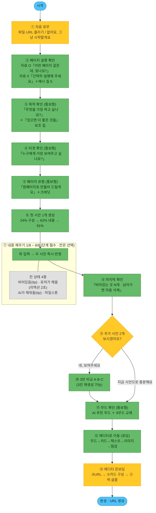

# AI 유저 플로우 (제품 설계도)

> **이 문서 = 최종 제품에서 비디자이너 유저가 AI로 페이지를 만드는 흐름.**
> [[1-1. 워크플로우]](내부 제작자용 6단계)와 다름 — 그건 "우리가 템플릿을 만드는 법", 이건 "유저가 자기 페이지를 만드는 법".
>
> **한 줄 요약**: 자료 올리거나 한 단락 쓰면 → AI가 정리해 온 것을 **확인만**(설명·목적·타겟·유형) → **첫 시안 1개**를 보며 **8칸을 채우고** → 원하면 **2안 더** 보고 골라 → **무드 확인** → **에디터에서 마무리 + URL 생성**.
> **핵심 불변식(파이프라인 공통)**: 담을 **정보(WHAT)와 CdBd 규칙은 고정**, **색·폰트·카드 배치·무드(HOW)는 개방.** → 유저는 정보만 만지고, 짜임새·느낌은 AI가 설계.
>
> 📐 **정본 = 화면 확정판** [Figma 유저 플로우 · node 7024-7692](https://www.figma.com/design/24O01lprp5i2ufl7CbZXXx/AI-%EC%84%B9%EC%85%98-%ED%94%84%EB%A6%AC%EC%85%8B?node-id=7024-7692) **(2026-09-11 이선호 확정)** — 화면 문구가 곧 사양. 아래 [[#🗺 확정 플로우 (2026-09-11 · 피그마 확정판)]]는 그걸 옮긴 것.
> 🗄 **옛 도식(히스토리 · 수정 ❌)**: [Figma 보드 (node 32-3515)](https://www.figma.com/board/dA9nFFGnHhwjNuQYNVGR2B/AI-%ED%85%9C%ED%94%8C%EB%A6%BF-%EC%9B%8C%ED%81%AC%ED%94%8C%EB%A1%9C%EC%9A%B0?node-id=32-3515) — **7단계 흐름 확정판(2026-07-14 갱신 반영)**. 7단계 구조·4대분류·세부 16은 **보드가 정본**.
> 🔑 **단 ③ 추가 정보 필드는 이 문서(1-9)가 정본** (2026-07-14) — 16시나리오 검증([[3-2. 16 시나리오 테스트]])으로 세분화한 항목은 보드보다 앞선다. **보드가 아직 안 따라온 5건 = 보드를 이 문서에 맞춘다**(문서 되돌리기 ❌): ① 「일시·장소」→ 일시/장소 분리 · ② 「프로필·로고 이미지」→ 로고/사진 분리 · ③ B② `대표 실적`·`경력·자격·수상` · ④ B②-1 서비스 = `× N(제목+설명)` · ⑤ C3 상품 카테고리 = `대분류 > 소분류`. (여는/닫는 글은 반대로 **보드대로 매거진 채택**.)
> 🗄 **옛 도식(히스토리, 수정 ❌)**: node 19-1381 = 4구간·3문항+원/멀티 가중치 · node 2-981 = 4구간 개편 전. 보드에 남아 있으나 **폐기본** — 참조 금지.

---

## 🎯 이게 뭐고, 왜 필요한가

CdBd 자동화의 **최종 목표** = 서비스에 AI 에이전트를 붙여 **비디자이너가 스스로** 모바일 비즈니스 페이지를 만들게 하는 것. 그 첫 설계로 **유저에게 무엇을·어떤 순서로 물을지**를 확정한다.

이 플로우는 이후 **프리셋(재사용 섹션 조각) 제작·분류 기준**을 세우는 근거가 된다. 왜냐하면 **유저에게 묻는 각 항목이 곧 "프리셋을 어떻게 나눠야 하는지"를 규정**하기 때문 (아래 [[#🧩 프리셋 기준으로의 다리 (다음 단계)]] 섹션 참조).

---

## 🧭 핵심 원칙 7

1. **적게 묻는다** — 질문을 다 받고서야 결과를 보여주면 비디자이너는 지쳐 이탈. **카테고리 2번 + 내용 채우기**만 받고 빠르게 시안을 보여준다. (옛 '주제/목적'은 **카테고리 세분화로 흡수**(2026-07-09), 옛 '타겟·필수 기능'은 **③ 추가 정보 입력 답변으로 추론**(2026-07-10) → 별도 문항 삭제.)
2. **자료로 자동 채운다 (자료는 선택)** — 유저 자료(포스터·글·사진)엔 카테고리·기능·**브랜드 느낌(무드)**이 이미 들어 있음 → 있으면 자동 추출해 답을 채움. 단 **자료 업로드는 "맨 앞 강제"가 아니라 상시 선택 옵션** — 비전문가가 빈 화면에서 막히지 않게 **질문으로 바로 시작**하고, 자료는 원할 때 올려 답을 자동으로 채운다.
3. **정보는 유저, 짜임새·느낌은 AI** — 유저는 "담을 내용"만 정하고, 어떤 카드로·어떤 순서로·**어떤 무드로** 만들지는 AI가 판단(자유도·품질 보존). → **무드·타겟·필수기능은 따로 묻지 않는다**(내용으로 추론). 🆕 *단 **타겟은 추론한 결과를 ②-B에서 확인받는다**(2026-09-04) — 묻는 게 아니라 확인이라 원칙 7과 같은 결이다.*
4. **판단이 어려운 건 묻지 말고 보여준다** — 비디자이너는 "원페이지가 나을까 멀티가 나을까"를 말로 못 고른다. 무드도 마찬가지다. → **⑤ 3안**에서 보여주고 고르게 한다. (묻기 ❌ → 보여주기 ⭕)
   - 🔄 **2026-09-04 개정 — 「보여주기」에도 비용이 든다.** 옛 규칙은 *④에서 원페이지 안·멀티페이지 안을 1개씩 만들어 나란히 보여준다*였으나, **안을 두 벌 만드는 것 자체가 토큰·시간 낭비**이고 시안 뒤에 유형을 뒤집으면 낭비가 더 커진다(이선호). → **④는 「만들어 보여주기」가 아니라 「정해서 통보 + 바꾸기」**로 바꾼다(아래 원칙 7). **⑤ 3안은 그대로 보여주기** — 3안은 어차피 만들어야 하므로 추가 비용이 없다.
   - 📏 **가르는 기준 = 「어차피 만들 것인가」.** 만들 것이면 **보여주고 고르게**(⑤ 3안) · 비교용으로 더 만들어야 하면 **정해서 통보**(④ 원/멀티).
5. **3안은 진짜 다르게 — 구조뿐 아니라 무드까지** — 색만 다른 쌍둥이 ❌. 3안(A·B·C)은 **구조가 실제로 다르고, 무드(느낌)도 서로 다르게** 탐색. 차별화 = 핵심 셀링포인트.
6. **진짜 가치는 수정 — 두 갈래** — 3안 제시로 끝나면 안 됨. **① AI 수정(프롬프팅)** + **② 직접 수정(에디터)**. 이 다듬는 과정이 제품의 본체.

7. 🆕 **고르게 하지 말고, 정해서 보여주고 바꿀 수 있게** *(2026-09-04 신설 · 이선호)* — 원칙 1(적게 묻는다)의 실행 규칙. **저숙련 유저가 이탈하는 건 「단계가 많아서」가 아니라 「매 단계가 결정을 요구해서」**다([[3-5. 200 페르소나 플로우 검증]] — 숙련도 하 62명 평균 13.2점 · 20점 이상 **0명**). 그러면 답은 **단계를 빼는 게 아니라 결정을 확인으로 바꾸는 것**이다.

   | | ❌ 결정을 요구 | ✅ 확인만 요구 |
   |---|---|---|
   | 페이지 유형 | "어떤 유형으로 만들까요? [원] [멀티]" | **"한 장짜리로 만들어 드릴게요"** ＋`여러 장으로 바꾸기` |
   | 함께 담을 것 | "이것도 담고 싶나요? ☐☐☐" | **"이런 것도 같이 넣어드릴게요" ☑☑☐** ＋근거 한 줄 |
   | 추가 정보 | 빈칸에 타이핑 | **자료에서 뽑아 미리 채워두고 "맞나요?"** |

   - 🔑 **미리 켤 때는 「왜 켰는지」 한 줄을 같이** 보여준다 — 근거가 보이면 유저가 판단할 수 있고, 근거가 없으면 애초에 켜지 않는다.
   - 🔑 **바꾸는 길은 항상 열어둔다** — 통보는 강제가 아니다. 「바꾸기」가 없으면 그냥 강제다.
   - ⚠️ **이 원칙을 「단계를 줄여라」로 읽지 말 것** — 단계를 건너뛰면 **껍데기 페이지**가 나온다(③ 추가 정보 참조).

> 🟡 **선택 / 🟢 필수 개념** (보드 색 규칙): **건너뛰는 유저가 꽤 있으면** 🟡선택, **거의 모든 유저가 거치면** 🟢필수 — *엄밀한 강제가 아니라 **실질 발생 빈도** 기준.*
> · 🟡 선택 = **자료 업로드**(없으면 직접 답변) · **추가 정보 입력 문항**(전부 건너뛰기 가능) · **프롬프팅 수정**(3안이 만족스러우면 건너뜀)
> · 🟢 필수 = **카테고리·세부 카테고리** · **페이지 유형 선택** · **3안 선택** · **에디터 최종 수정 + URL 생성**

> 🔓 **③ 추가 정보에 "입력하지 않으면 못 넘어가는 주제"은 없다 (2026-07-10 확정 · 2026-09-04 보완).**
> 유저는 **쓸 수 있는 것만 쓰고, 전부 건너뛰어도 된다.** 빈칸은 AI가 예시 문구·기본값으로 채우고, 유저는 ⑥⑦에서 **고치기만** 하면 된다.
> 🆕 **단, ③ 단계 자체는 건너뛸 수 없다 (2026-09-04 이선호).** *문항은 선택이지만 단계는 필수* — 여기가 통째로 빠지면 **껍데기만 그럴듯한 페이지**가 나온다.
> 🆕 **「이건 없어요」 버튼 신설** — 지금은 안 채운 것이 **「아직 안 채움」인지 「원래 없음」인지 구분이 안 돼** 빈 섹션이 남는다. 명시적으로 누르면 AI가 **그 섹션을 아예 뺀다**. → 빈 자리 처리 규칙 = [[1-12. 조립 레시피]] §1.
> → 그래서 아래 문항표의 🟢/🟡는 **강제 여부가 아니라 "이걸 채우면 결과가 확 좋아지는 정도"**(중요도)다. 진행을 막는 문항은 **하나도 없다.**
> 📐 **정본 등급표 = 아래 [[#🎚 필수 / 선택 등급 — 보드 32-3515 「파란색 = 필수」 (2026-07-21 확정)]]** (보드 32-3515의 파란 박스 = 필수 · 회색 = 선택).

---

## 🗺 확정 플로우 (2026-09-11 · 피그마 확정판)

> 📐 **정본 = [Figma 유저 플로우 · node 7024-7692](https://www.figma.com/design/24O01lprp5i2ufl7CbZXXx/AI-%EC%84%B9%EC%85%98-%ED%94%84%EB%A6%AC%EC%85%8B?node-id=7024-7692)** (이선호 확정) — 아래 표는 그 화면들을 그대로 옮긴 것. **화면 문구가 곧 사양**이다.
> 🗄 **옛 「7단계」(①카테고리 ②세부 카테고리 ③추가 정보 ④유형 ⑤3안 ⑥프롬프팅 ⑦에디터)는 폐기** — 아래 「달라진 것 3가지」 참조. 옛 보드 도식(32-3515)도 **히스토리**로 내린다.

| # | 화면 | 유저가 보는 말 | 유저가 하는 일 | 등급 |
|---|---|---|---|---|
| — | (시작) | — | 진입 | 🟦 |
| **1** | **자료 유무** | *"가지고 계신 자료가 있나요?"* | 파일 올리기(PDF·이미지·한글·워드·엑셀) · URL 붙여넣기 · `없어요, 그냥 시작할게요` | 🟡 선택 |
| **2** | **페이지 설명 확인** | 자료 O → *"이런 페이지 같은데, 맞나요?"*<br>자료 X → *"만들고 싶은 페이지를 간략히 설명해 주세요"* | AI가 정리한 설명을 **고치기** / 없으면 한 단락 직접 쓰기(예시 칩 5개) | 🟢 필수 |
| **3** | **목적 확인** | *"이 페이지로 무엇을 가장 하고 싶나요?"* | AI가 뽑은 **목적 문장 1개 확인** ＋ 「있으면 더 좋은 것들」 **보조 칩** 켜고 끄기 | 🟢 필수 (통보형) |
| **4** | **타겟 확인** | *"누구에게 가장 보여주고 싶나요?"* | AI가 채운 타겟 확인 · 추천 칩으로 교체 · 직접 입력 | 🟢 필수 (통보형) |
| **5** | **페이지 유형** | *"원페이지로 시안을 만들어 드릴게요"* ＋`AI 추천` 배지 | 확인, 원하면 유형 카드로 **바꾸기**(크레딧 표기 같이 봄) | 🟢 필수 (통보형) |
| **6** | **첫 시안 1개 생성** | *"준비 완료!✌️ 이제 첫 시안을 만들어 볼게요"* → 24% → 62% → 91% → *"첫 번째 시안을 먼저 보여드릴게요"* | 기다렸다가 `시작하기` | 🟢 자동 |
| **7** | **내용 채우기 (1/8 ~ 8/8)** | *"○○을 추가하면 좋아요"* / *"○○을 미리 채워뒀어요"* | 좌측에 한 칸씩 입력 — **우측 시안에 즉시 반영** | 🟢 **단계 필수** / 🟡 칸 선택 |
| **8** | **마지막 확인** | *"마지막으로 확인해 주세요 · 아직 비어있는 곳이 3개 있어요"* | 빈 섹션 `채우러 가기` 또는 `확인했어요`(→ **빈 곳은 자동 삭제**) | 🟢 필수 |
| **9** | **추가 2안 물어보기** | *"추가 시안 2개를 확인하시겠어요?"* | `네, 보여주세요` / `지금 시안으로 충분해요` | 🟡 선택 |
| **10** | **추가 2안 제작 → 3안 비교** | *"이제 두 가지 시안을 더 보여드릴게요 ✨"* → *"마음에 드는 시안을 골라주세요"* | A·B·C 비교 → 1개 선택 (`3안 재생성` 가능) | 🟢 필수 |
| **11** | **무드 확인** | *"이 무드, 마음에 드시나요?"* ＋`AI 추천 무드` | 확인 또는 **9개 무드 중 교체** | 🟢 필수 (통보형) |
| **12** | **에디터로 이동 (로딩)** | *"에디터에 카드 쌓는 중…"* | 기다림 — 무드 적용 → 카드 생성 → 텍스트 → 이미지 → 마무리 점검 | 🟢 자동 |
| **13** | **에디터 온보딩 (코치마크 3)** | ③URL 생성 → ①카드 구성 → ②색·글꼴 | 각 화면 `다음` 또는 `건너뛰기` → 이후 자유 편집·발행 | 🟡 선택 |
| — | (완성) | — | URL 생성·공유 | 🟦 |

### 🔄 옛 7단계에서 달라진 것 3가지 (2026-09-11)

| | 옛 설계 | **확정** | 뜻 |
|---|---|---|---|
| **시작 지점** | ①카테고리 → ②세부 카테고리를 **고르게** 함 | **카테고리 선택 화면이 없다.** 자료 올리기 / 설명 한 단락 → AI가 정리해 오고 유저는 **확인**(2·3·4) | **주제 25·목적 P1~P6은 완전히 내부 기준이 됐다** — 유저 화면에 분류가 한 번도 안 나온다([[1-11. 목적·주제별 분류]]의 「노출 ❌」가 화면으로 확정) |
| **시안 보여주는 시점** | ⑤에서 **3안을 한꺼번에** | **첫 1안 먼저 → 내용 채우며 실시간 반영 → 추가 2안** | 「검토 중」이던 **ⓐ C안이 채택**(D안 탭 방식은 폐기) — 보상이 빨라지고, 유저는 *자기 내용이 들어간* 시안을 보며 채운다 |
| **무드** | 안 묻고 3안에 섞어 보여줌 | **시안 선택 뒤 「무드 확인」 화면이 따로** (통보형 ＋ 바꾸기) | 무드가 **구조와 분리**됐다 — 3안은 구조(레이아웃 스타일) 비교, 무드는 그 뒤 한 번 더 |

> 🚩 **확정 플로우에 「⑥ 프롬프팅 수정」 화면이 없다.** 3안 선택 → 무드 → 곧장 에디터다. 대화로 다듬는 단계는 **이번 확정 범위 밖**(별도 기능이거나 보류) — 아래 상세의 `13` 다음 주석 참조.

## 📝 ③ 추가 정보 입력 — 콘텐츠(핵심 정보) 수집 질문

> ①② 카테고리는 "**어떤 페이지인가**"만 정한다. 그 페이지를 실제로 채우려면 **핵심 정보**(초대장=행사명·일시·장소 / 명함=이름·직책·연락처 / 카탈로그=아이템 목록 / 매거진=발행정보·글 목록)를 더 받아야 한다. 이 절은 그 **질문 설계 원칙**을 담는다 — 🚧 **주제별 필드 목록(문항표)은 재작성 대기**(아래 「③ 질문 세트」 참조).
>
> 🗄 **옛 항목표(보드 [node 32-3515](https://www.figma.com/board/dA9nFFGnHhwjNuQYNVGR2B/AI-%ED%85%9C%ED%94%8C%EB%A6%BF-%EC%9B%8C%ED%81%AC%ED%94%8C%EB%A1%9C%EC%9A%B0?node-id=32-3515) 기준 · 4대분류×세부16)** 은 백업으로 분리 → [[백업/1-9 (구) 4대분류×세부16 · 질문 세트 3층]]. 보드 도식도 옛 체계라 함께 갱신 필요.
>
> 🔓 **전 문항 선택 — 강제 입력 없음.** 쓸 수 있는 것만 쓰고 건너뛴다. 빈칸은 AI가 채우고 유저는 고친다.
>
> **한 줄 요약**: 대분류 8~11 → 세부 1~3 → 값을 채운 기능만큼. 평균 11~15문항, **막는 문항 0개**.
>
> 🖼 **예약·유튜브 카드는 "빈 카드"로 나간다 (보드 확정)** — 시안 단계에선 **가상의 이미지**로 채워 보여주지만, 실제 에디터에는 **내용 없는 빈 카드**로 제공된다. 유저가 자기 일정·영상으로 직접 채워야 하는 카드이기 때문. → 시안의 예약 슬롯·유튜브 썸네일을 "실제 데이터"로 착각하지 말 것.

### 🎯 설계 원칙 5

1. **묻는 건 "내용"뿐, "디자인"은 안 묻는다** — 위 핵심 불변식(정보=고정 / 색·폰트·배치=개방). 색·폰트·레이아웃 질문을 여기에 넣지 말 것.
2. **빈칸이면 AI가 채운다 — 그래서 필수 주제가 없다** — 어느 문항도 진행을 막지 않는다. 비워두면 예시 문구·기본값으로 채우고 유저는 ⑥⑦에서 **고치기만** 한다. (백지 공포 차단 · 이탈 방지)
3. **자료를 올렸으면 대부분 이미 차 있다** — 자료 업로드(선택 옵션)를 거친 유저에게 이 화면은 **"확인·보정"** 화면이지 입력 화면이 아니다.
4. **✍️ 사실은 유저가, 카피는 AI가 (2026-07-10 확정)** — 유저에게는 **사실 정보(fact)** 만 묻는다. **읽는 글(copy)** 은 AI가 쓴다.
5. **🧩 반복 섹션은 2단 입력 (2026-07-10 확정)** — `카테고리` → `카테고리별 아이템`. 아이템을 평평한 목록으로 받지 않는다.

#### 4. ✍️ 사실은 유저가, 카피는 AI가

| | 누가 | 예 |
|---|---|---|
| **사실 (fact)** | **유저가 입력** | 행사명 · 일시·장소 · 가격 · 연락처 · 작품 캡션 · 영업시간 |
| **카피 (copy)** | **AI가 작성** | 히어로 한 문장 · 초대 인사말 · 브랜드 스토리 · 한 줄 소개 · 안내 문구 |

**그래서 질문에 「첫 화면에 크게 넣을 한 문장」·「인사말」·「브랜드 스토리」가 없다 — 누락이 아니라 설계다.**
AI는 카테고리 + 세부 카테고리 + 입력된 사실에서 **톤과 문구를 지어내고**, 유저는 ⑥ 프롬프팅·⑦ 에디터에서 고친다.
- ⭕ 「행사명: 『밤의 문장들』 출간 기념 북토크」 → AI가 히어로 카피 「작가와 함께, 문장 사이를 걷는 밤」 생성
- ❌ 유저에게 "히어로에 넣을 감성적인 한 문장을 적어주세요" 라고 묻기 — **비디자이너가 가장 막히는 주제**
- ⚠️ 예외: **개인 맞춤 초대장(A③)의 메시지**도 AI가 쓴다. 유저는 `{이름}·{소속}·{직급}` 같은 **치환 데이터**만 준다.

#### 5. 🧩 반복 섹션 = 2단 입력 (카테고리 → 아이템)

메뉴·상품·작업물·기사·작품처럼 **여러 개가 반복되는 섹션**은 **평평한 목록으로 받지 않는다.**

```
① 카테고리 입력       예) 안주 · 사케 · 하이볼
② 카테고리별 아이템 입력  예) [안주] 연어 사시미 18,000 / 닭꼬치 14,000 …
                          [사케] 쿠보타 센쥬 9,000 …
```

- **왜**: 아이템에 그룹이 없으면 **섹션을 나눌 수 없고**, 멀티페이지 **반복 내지**를 몇 장 만들지도 못 정한다.
- **카테고리가 1개면** 그룹 헤딩 없이 평탄하게 렌더한다(유저는 그대로 두면 됨).
- **카테고리 수 = 멀티페이지 반복 내지 수** → [[1-12. 조립 레시피]]
- 적용 대상: `C 상품 정보` · `B③ 작업물` · `D①②③④ 내용×N` 등 **모든 `× N` 문항**.
- 📊 **엑셀 업로드도 2단** — 첫 열이 `카테고리`, 나머지가 아이템 필드.

> 🧭 **질문 = 섹션 슬롯.** 모든 질문은 [[1-8. 섹션 프리셋 라이브러리]] 「콘텐츠 목적 13칸」 중 하나를 채운다. 어느 주제도 안 채우는 질문은 **삭제 대상**(= 안 물어도 되는 질문).

### 🎚 ③ 질문 세트 — **재작성 대기** (옛 16분류판은 백업)

> 🗄 **2026-09-08 이동.** 아래 내용 전부가 **4대분류 × 세부 16** 전제였다 → [[백업/1-9 (구) 4대분류×세부16 · 질문 세트 3층]] 2부에 전문 보존:
> 필수/선택 등급표(보드 32-3515 색 기준) · 3층 구조 · 1층 대분류별 질문(A1~A9·B·C·D) · 2층 세부16별 질문 · 3층 기능 애드온 · 분량 감각 · 답변이 흘러가는 곳.
>
> ✅ **현행 방향** — 묻는 방식 자체가 바뀌었다: [[1-12. 조립 레시피]] **§3-B 「유저에게 묻는 것 = 목적 질문 하나로 모인다」** · **§3-C 목적 문장 세트 25** · **§1 빈 자리 처리 규칙**(「이건 없어요」).
> 🚧 **남은 일** — **주제 25개용 필드 질문 세트**는 아직 없다. 백업 2부의 필드 목록(일시/장소 분리 · 로고/사진 분리 · 반복 아이템 2단 입력 · 필수/선택 등급)을 원재료로 **25주제 기준으로 다시 쓸 것.**
> ⚠️ 그때까지 옛 표를 정본으로 인용하지 말 것 — 칸이 서로 대응하지 않는다(이사표 = 1-11 §15 · 1-12 §5).

#### 🕳 재작성 때 반드시 메울 구멍 8개 (2026-09-03 조사)

옛 질문 세트는 **「공식 행사」 한 종류**에 맞춰져 있었다(`행사명·일시·장소·주최자·로고·메인이미지·연락처·프로그램·행사 설명`). 아래는 **받을 칸이 아예 없던** 정보다.

| 빠진 정보 묶음 | 필요로 하는 주제 | 제안 |
|---|---|---|
| **준비물·교통·비상연락처** | 워크숍 · 캠프 · 인센티브 투어 · 연수 | 「안내사항 × N」 필드 |
| **인물(연사·출연자) × N** | 컨퍼런스 · 세미나 · 공연 · 임직식 | 「인물 × N (사진·이름·소속·소개)」 |
| **좌석·티켓·QR** | 시상식 · 공연 · 박람회 · 시사회 | 예약 카드 QR 옵션(개발 대기) |
| **접속 링크 (온라인)** | 웨비나 · 온라인 설명회 | 「참여 방법」 필드 |
| **문서 첨부** (동의서·의안·위임장) | 캠프 · 주주총회 · 공청회 | 파일 첨부 |
| **신청 기간** (행사일과 별개) | 모집 · 공모 · 수강 신청 | 시작~마감 별도 필드 |
| **정원·잔여·마감임박** | 예약 · 모집 · 클래스 | 수량 필드 + 마감 후 문구 |
| **취소·환불 규정** | 예약 · 유료 행사 · 클래스 | 「안내 사항」 필수 승격 |

> 🗄 개인 경조사용 필드(혼주·계좌 등)는 **대상 범위 밖**이라 뺐다([[1-11. 목적·주제별 분류]] §0-C).

---

**기존 내부 파이프라인 매핑** — ①②③ = 기획 문서(Part B) 자동 초안·확정([[1-2. 기획 문서 템플릿]]) · ④⑤ = claude.ai/design 원/멀티 안 + 3안([[1-1. 워크플로우]] 2단계) · ⑥ = Figma 반입·혼합·수정(3단계) · ⑦ = CdBd 에디터([[1-6-1. CdBd 에디터]], 4단계).

---

## 🔷 플로우차트 (한눈에)



**색 = 선택/필수** — 🟦 시작·완성 · 🟡 선택(자료 업로드 · 추가 2안 보기 · 에디터 온보딩) · 🟢 필수 · ⬜ 세부.
**분류를 고르는 화면이 없다** — 주제 25·목적 P1~P6은 ②의 설명 글에서 AI가 추론하고, 유저는 ③④에서 **문장으로 확인**만 한다.
**시안은 1 → 3으로 늘어난다** — ⑥에서 1안을 먼저 띄우고, ⑦ 입력이 그 안에 실시간으로 꽂히며, ⑨에서 동의하면 2안을 더 만들어 3안 비교(⑩)로 간다.
**빈칸 처리 규칙은 ⑧에 있다** — 안 채운 자리는 *그대로 남지 않고* **삭제**된다(옛 「이건 없어요」 버튼의 역할을 마지막 확인 화면이 흡수).

---

## 📍 화면별 상세

### 1. 자료 유무 (🟡 선택) — `v2 · 1 자료 유무`
- *"가지고 계신 자료가 있나요? / 소개서·포스터·로고·홈페이지 주소 등 무엇이든 괜찮아요. 없다면 넘어가도 괜찮아요."*
- **파일 업로드**(클릭 또는 드래그 · PDF·이미지·한글·워드·엑셀) ＋ **URL 붙여넣기**(홈페이지·블로그·SNS 채널) — 여러 개 동시.
- **`없어요, 그냥 시작할게요`** 를 누르면 바로 2번으로. 안내 문구 = *"자료가 없어도 걱정하지 마세요. 간단히 설명해 주시면 나머지는 저희가 완성할게요."*
- 🔄 **옛 설계와의 차이** — 자료 업로드가 *③ 옆 선택 옵션*이 아니라 **맨 앞 화면**이 됐다. 단 **강제는 아니다**(건너뛰기 버튼이 같은 화면에 있음) → 원칙 2의 "자료 강요 ❌"는 그대로 지켜진다.

### 2. 페이지 설명 확인 (🟢 필수) — `v2 · 2 페이지 설명 확인`
- **자료를 올린 경우** — *"이런 페이지 같은데, 맞나요? / 올려주신 자료를 정리해 봤어요. 수정할 곳이 없는지 확인해 주세요."* → AI가 정리한 **한 덩어리 설명**(제목·일시·장소·참가비·문의까지 포함)이 **수정 가능한 텍스트**로 들어가 있다.
- **자료가 없는 경우** — *"만들고 싶은 페이지를 간략히 설명해 주세요 / 생각나는 대로 편하게 적어 주세요. 단어만 나열해도 괜찮아요."* ＋ 플레이스홀더 예시 한 줄.
- **막막한 유저용 예시 칩 5개** — `행사·모임을 열어요` `가게를 소개해요` `제품을 팔아요` `포트폴리오를 보여줘요` `공지를 알려요` → 누르면 그 방향의 예시 문장이 채워진다.
- 🔑 **이 화면이 옛 ①②(카테고리·세부 카테고리)를 대체한다.** 유저는 분류를 고르지 않고 **자기 말로 쓰거나 AI 정리본을 고친다.** 칩 5개는 분류가 아니라 **글쓰기 마중물**이다(6개 대분류와 1:1 아님).

### 3. 목적 확인 (🟢 필수 · 통보형) — `v2 · 3 목적 선택`
- *"이 페이지로 무엇을 가장 하고 싶나요? / 앞서 주신 내용에서 이렇게 파악했어요. 수정할 곳이 없는지 확인해 주세요."*
- **AI가 뽑은 목적 문장 1개**가 이미 채워져 있다 (예: *『밤의 문장들』 출간 기념 북토크에 초대하기*) — 수정 가능.
- 그 아래 **「있으면 더 좋은 것들」 보조 칩** — *"기본 내용은 이미 준비됐어요. 아래는 있으면 더 좋은 것들이에요."* (예: 참석 신청 받기 · 정원 안내하기 · 사인회 안내하기 · 현장 판매 안내하기 · 주차 안내하기)
- 🔑 **옛 「함께 담을 것 칩」(③ 안에 있던 것)이 이 화면으로 올라왔다.** 규칙은 그대로 — **보조 블록만** · 근거 없으면 안 켬 · 페이지 주인공을 안 바꾼다. 후보 사전 = [[1-12. 조립 레시피]] §3.
- 🔒 **주제 25 / 목적 분류 P1~P6은 화면에 안 나온다** — 이 문장 뒤에서 내부적으로 매칭된다([[1-11. 목적·주제별 분류]]).

### 4. 타겟 확인 (🟢 필수 · 통보형) — `v2 · 4 타겟 확인`
- *"누구에게 가장 보여주고 싶나요? / 보는 사람에 따라 세부 내용과 말투가 달라져요."*
- **AI 생성 타겟이 채워져 있고**(예: *저자를 아는 독자, 책방 오래 단골*), 추천 칩(동네 주민 · 아직 책을 안 읽은 사람 · 글을 쓰는 사람 · 북토크가 처음인 사람 · 혼자 오는 사람)으로 **더하거나 바꾸기**.
- 타겟이 정하는 것 / 안 정하는 것은 2026-09-04 규칙 그대로 — ✅ 무드·카피 톤·이미지·정보 밀도·보조 블록 우선순위 / 🚫 주제 분류·목적 분류·섹션 순서.

### 5. 페이지 유형 (🟢 필수 · 통보형) — `6 · 페이지 유형`
- *"원페이지로 시안을 만들어 드릴게요 / 지금까지 답변한 내용을 바탕으로 추천드리는 페이지 유형이에요."* — 추천 카드에 **`AI 추천` 배지**.
- 두 카드 모두 설명 ＋ **크레딧이 함께 보인다**:
  - **원페이지** — *한 화면을 상하 스크롤 · 짧고 간결한 페이지에 적합* · **URL 최소 120크레딧 / 1개월**
  - **멀티페이지** — *여러 장을 옆으로 넘겨보는 방식 · 심층적이고 양이 많은 페이지에 적합* · **4페이지 · URL 최소 400크레딧 / 2개월**
- 🆕 **크레딧 노출이 확정 사양이다** — 유형 선택이 **가격 선택이기도 하다**는 걸 이 화면에서 알린다.
- 판정 근거(분량·목적 분류·주제 3요인, 4관문)는 아래 [[#ⓒ 원 / 멀티 판정 임계값 — 「몇 섹션부터 멀티인가」]] 그대로.

### 6. 첫 시안 1개 생성 (🟢 자동) — `7 · 시안 생성 (과정)`
- *"준비 완료!✌️ 이제 첫 시안을 만들어 볼게요"* → 진행률과 함께 **무엇을 하는 중인지** 말로 알려준다:
  - **24%** *"북토크 초대장에 어울리는 구성을 고르고 있어요"* (＝ 프리셋 고르기)
  - **62%** *"내용을 채우고 있어요"* (히어로부터 화면에 쌓이기 시작)
  - **91%** *"거의 다 됐어요"* (섹션 대부분 채워진 상태)
- 끝나면 *"첫 번째 시안을 먼저 보여드릴게요 / 내용을 다듬어 보세요. 내용이 다 채워지면 시안 2개를 더 보여드릴게요."* → `시작하기`
- 🔑 **여기서 만드는 건 1안뿐이다.** 나머지 2안은 ⑨ 이후에 만든다 → 총 3벌(옛 C안의 "4벌이라 비싸다" 우려가 해소된 지점).

### 7. 내용 채우기 — 1/8 ~ 8/8 (🟢 단계 필수 / 🟡 칸 선택) — `v2 · 8 내용 채우기`
> 🧾 **문구 정본은 [[1-14. 입력 단계 안내 문구]]** — 주제 25개 × 각 단계의 제목·기대효과·팁·리액션·마일스톤이 거기 있다. 이 절은 **화면 구조만** 적는다.

- **좌 입력 / 우 미리보기** — 입력하는 즉시 오른쪽 시안(⑥에서 만든 1안)에 **그대로 꽂힌다.** 상단에 **진행 표시 `N/8`**.
- **한 화면 = 한 칸**(이미지·제목·본문·정보·반복 항목·연락처·SNS …). 예시 페이지의 8칸 = 메인 이미지 → 로고 → 제목·설명 → 초대의 말 → 행사 정보 → 프로그램 → 문의 → SNS.
- **칸마다 상태 4종** (피그마 행 라벨 그대로):

  | 상태 | 화면 | 문구 예 |
  |---|---|---|
  | **비어있음 (tip)** | 빈 입력 ＋ 팁 한 줄 | *"메인 이미지를 추가하면 좋아요 / 첫 화면에서 어떤 행사인지 바로 알 수 있어요."* |
  | **AI가 채워둠 (tip)** | 값이 채워진 채로 확인 요청 | *"메인 이미지를 미리 채워뒀어요 / 원하시면 다른 이미지로 변경할 수 있어요."* · *"행사 정보를 미리 채워뒀어요 / 수정할 곳이 없는지 확인해 주세요."* |
  | **유저가 채움 (리액션 · 2초)** | 채운 직후 짧은 반응이 뜨고 사라짐 | *"1:1 비율이면 더 잘 어울려요"* · *"두세 문장이면 충분해요"* |
  | **마일스톤** | 칸 위에 격려 배너 | 절반 *"벌써 절반이나 왔어요! 🙌"* · 2단계 남음 *"거의 다 왔어요! 💪"* · 마지막 |
- **팁은 그 칸에서만 성립하는 말**로 — *"가장 많이 확인하는 정보예요"*(행사 정보) · *"바로 답할 수 있는 채널이 좋아요"*(문의). 규칙 = [[1-14. 입력 단계 안내 문구]] · `.data/tips/_SPEC.md`.
- 🖼 **이미지 칸엔 `AI 이미지 생성` 버튼** — 누르면 *"메인 이미지 생성 중… / 입력하신 행사 설명과 어울리는 이미지를 만들고 있어요"* 로 진행률 표시.
- 🔴 **사실 정보는 AI가 지어내지 않는다** — 일시·가격·계좌·연락처·스펙은 자료에 있을 때만 채우고, 없으면 **비운 채로 묻는다**([[1-14. 입력 단계 안내 문구]] 「채움」 열).

### 8. 마지막 확인 (🟢 필수) — `7 · 시안 채택`
- *"마지막으로 확인해 주세요 / 내용은 에디터로 이동한 뒤에도 얼마든지 수정할 수 있어요."*
- **비어 있는 자리를 세어 경고한다** — *"아직 비어있는 곳이 3개 있어요 / 이 단계를 넘어가면 채우지 않은 내용은 자동으로 삭제돼요."* ＋ 섹션 목록(메인 이미지·로고 이미지 / 행사 제목·초대의 말·행사 정보·프로그램 / 찾아오시는 길·SNS)에 **`채우러 가기`**.
- 🔑 **옛 「이건 없어요」 버튼의 역할을 이 화면이 흡수했다** — 안 채운 자리는 **남지 않고 삭제**되므로 빈 섹션이 생기지 않는다. (칸마다 버튼을 누르게 하지 않고 **마지막에 한 번에** 처리하는 쪽으로 확정.)

### 9. 추가 2안 물어보기 (🟡 선택) — `7 · 시안 채택`
- *"추가 시안 2개를 확인하시겠어요? / 내용을 다듬어 보세요. 내용이 다 채워지면 시안 2개를 더 보여드릴게요."* → `네, 보여주세요` / `지금 시안으로 충분해요`
- **충분하다고 하면 3안 비교를 건너뛰고 바로 무드 확인(⑪)으로** — 빨리 끝내려는 유저의 **짧은 길**이 여기서 열린다.

### 10. 추가 2안 제작 → 3안 비교 (🟢 필수) — `7 · 시안 생성(과정)` → `7 · 시안 생성(완료)`
- *"이제 두 가지 시안을 더 보여드릴게요 ✨"* → **시안 A 완료(100%) / 시안 B 62% / 시안 C 13%** 처럼 **세 안을 나란히 두고 나머지 둘만 채운다.**
- 완료 화면 = *"마음에 드는 시안을 골라주세요"* ＋ 탭 `시안 A` `시안 B` `시안 C` ＋ **`3안 재생성`**.
  - 원페이지 안내 = *"아래로 스크롤해 각 시안을 살펴 보세요."* · 멀티페이지 안내 = *"각 시안을 선택하면 페이지를 넘겨볼 수 있어요."*
- ✅ **3안 차별화 규칙은 그대로** — 변주 축 5개 중 최소 3개에서 실제로 다름 · **「거른 뒤 랜덤」**(비복원 · 팔레트 층화 · 얇은 서랍 면제) → [[1-8. 섹션 프리셋 라이브러리#🎲 프리셋 선택 로직 — 「서랍에서 랜덤으로 뽑는다」 (2026-09-07 이선호 확정 · 필수)]].
- 💳 **재생성은 과금**.

### 11. 무드 확인 (🟢 필수 · 통보형) — `7 · 시안 채택`
- *"이 무드, 마음에 드시나요? / 가장 잘 어울리는 무드를 미리 골라뒀어요. 얼마든지 다른 무드로 바꿔볼 수 있어요."* ＋ `AI 추천 무드` 배지 · `무드 바꾸기`.
- **9개 무드를 `Aa` 견본과 색 스와치로** 보여주고 고르면 **선택한 시안에 즉시 적용**(색·서체 동시 교체 — 무드 = 색＋폰트 한 벌이라 가능).
- 🔄 **원칙 3·4와의 관계** — *무드를 묻지 않는다*는 원칙은 유지된다. 여기서도 **AI가 골라 놓고 확인만 받는다**(통보형). 다만 옛 설계처럼 "3안에 무드를 섞어" 고르게 하지 않고, **구조 선택(⑩)과 무드 선택(⑪)을 분리**했다.
- 🗄 이로써 2026-08-10 시안이던 **「무드 직접 선택」 별도 화면 안은 이 형태로 흡수·확정**(플로우 앞이 아니라 **뒤**, 그리고 필수 아닌 확인).

### 12. 에디터로 이동 (🟢 자동) — `9 · 에디터로 이동 (로딩)`
- *"에디터에 카드 쌓는 중… / 완료 시 자동으로 에디터로 이동합니다. 조금만 기다려 주세요."*
- 진행 단계를 그대로 보여준다 — **무드 적용 → 카드 생성 → 텍스트 적용 → 이미지 적용 → 마무리 점검**.
- 🔑 이 5단계는 우리 내부 4단계 파이프라인(S1 테마 → S2 카드 → S3 텍스트 → S4 이미지 → F2 마무리)과 **같은 순서**다([[1-6-1. CdBd 에디터]]).

### 13. 에디터 온보딩 (🟡 선택) — `10 · 에디터 안내`
- 에디터 진입 직후 **코치마크 3개**를 띄운다. **순서 = ③ URL 생성 → ① 카드 구성 → ② 색·글꼴** *(2026-09-11 이선호 확정)*.

  | 순서 | 가리키는 곳 | 안내 문구 | 버튼 |
  |---|---|---|---|
  | **1번째** | 헤더 **`URL 생성하기`** | *"페이지가 완성됐다면 URL을 생성하고 페이지를 공유하세요."* | 다음 · 건너뛰기 |
  | **2번째** | **카드 구성 수정** | *"필요한 카드를 추가하거나 순서를 바꿔보세요."* | 다음 · 건너뛰기 |
  | **3번째** | **페이지 테마**(페이지 색상·서체·버튼 모양) | 색·글꼴 바꾸는 곳 안내 | 완료 · 건너뛰기 |
- 이후는 기존 에디터 그대로 — 카드 추가·텍스트·이미지·발행(URL 생성 · OG · 크레딧 모달) → [[1-6-1. CdBd 에디터]].

> 🚩 **옛 ⑥ 「프롬프팅 수정(대화로 다듬기)」 화면은 확정 플로우에 없다.** 시안 선택 → 무드 → 에디터로 바로 간다. 대화 수정은 **이번 확정 범위 밖**으로 본다(별도 기능·후속). 프리셋 교체("이 섹션 바꿔줘")를 제품 기능으로 살릴지는 **미결** — 살린다면 붙을 자리는 ⑩ 다음 또는 에디터 안이다.

---

## 🔗 왜 이 순서인가 (유저 초안 → 개선)

초안은 `카테고리 → 목적 → 필수 기능 → 무드 → 자료 첨부` 질문 후 3안. 물어보는 **정보 자체는 정확**하나(우리 기획서 항목과 1:1), 순서·방식을 아래처럼 바꿨다.

| 초안의 문제 | 왜 문제 | 이 설계의 처방 |
|---|---|---|
| 질문 여러 개 먼저 | 결과를 늦게 봐 이탈(설문 피로) | **카테고리 2번 + 내용 채우기**로 압축 · (자료 있으면) 자동 채움 → **확인만** |
| 자료 업로드가 진입 허들 | "자료부터 올리세요"는 빈 화면만큼 막막 | **질문으로 바로 시작** · 자료는 **③ 옆 선택 옵션**(올리면 답 자동 채움) |
| 주제/목적을 따로 물음 | 카테고리와 겹쳐 질문만 늘어남 | **카테고리를 목적까지 세분화** → 주제/목적 질문 삭제 |
| 무드를 따로 물음 | 질문↑ + 3안이 한 무드에 갇힘 | **안 물음** — 내용으로 추론, ⑤ 3안이 무드까지 다르게 |
| 타겟을 따로 물음 | 입력 내용에서 이미 드러남 | **안 묻고 「확인」받는다** — AI가 자료에서 추론해 채워두고 *"이 타겟을 위한 페이지가 맞나요?"*로 확인 *(2026-09-04 ②-B 신설 · 옛 「빈칸으로 묻기」는 2026-07-10 폐기 그대로)* |
| '필수 기능'을 유저가 선택 | 열어둔 카드 배치 자유도를 막음(품질↓) | **안 물음** — 세부 카테고리 기본값 + ③에서 값 채운 항목으로 자동 판정 *(2026-07-10 문항 폐기)* |
| 원/멀티를 유저가 결정 | 비전문가는 말로 판단 어려움 | **묻지 말고 정해서 통보한다** — ④에서 AI가 유형을 추천하고 근거 한 줄 + `바꾸기` *(2026-09-04 개정 · 옛 「두 안 나란히 제시」는 안을 두 벌 만드는 낭비라 폐기 · 그 전 '카테고리 가중치 자동 결정'도 폐기)* |
| '3안 제시'에서 끝 | 진짜 가치인 수정이 빠짐 | **프롬프팅 수정 + 에디터 직접 수정** 두 갈래 추가 |

---

## 🧪 검토 중인 안 (ⓐ는 2026-09-11 확정 · ⓑⓒ 미확정)

> 🚧 **ⓑ·ⓒ는 아직 확정 아님 — 논의만 하고 채택은 보류.** 정해지면 위 본문으로 올리고 이 섹션에서 뺀다.
> 셋 다 출발점은 같다 — **내용 입력이 길어서 저숙련 유저가 여기서 이탈한다**([[3-5. 200 페르소나 플로우 검증]] · 숙련도 하 62명 평균 13.2점 · 20점 이상 **0명**).

### ⓐ 단계 순서 — 시안을 언제 보여줄 것인가 ✅ **확정 = C안 변형 (2026-09-11)**

> ✅ **확정된 답 = 「첫 1안 먼저 → 내용 채우며 실시간 반영 → (동의하면) 2안 더 → 3안 비교」** = 아래 **C안**.
> 🗑 **D안(3안 탭)은 폐기.** 화면 확정판 = 위 [[#🗺 확정 플로우 (2026-09-11 · 피그마 확정판)]] ⑥~⑩.

*"보상(시안)을 먼저 주면 덜 이탈하지 않을까"*에서 출발했던 4가지 안 (히스토리):

| 안 | 순서 | 장점 | 문제 |
|---|---|---|---|
| **A** | 시안 3안 → 무드 → 내용 입력 | 보상이 가장 빠름 | 내용이 빈 상태라 **껍데기 시안** · 유저가 뭘 고르는지 모름 |
| **B** | 내용 입력 → 와이어프레임 미리보기 → 시안 3안 | 내용이 다 찬 뒤라 시안이 정확 | **보상이 가장 늦음** — 이탈 지점이 그대로 |
| **C** ✅**채택** | 시안 **1안** → 내용 입력(우측 미리보기) → 3안 | 보상 빠르고 첫 화면이 가벼움 | ①오래 본 1안에 정이 들어 비교가 편향 ②총 4벌이라 비쌈 |
| **D** 🗑폐기 | 3안을 **탭**으로 띄움 → 입력(보는 탭에 즉시 반영) → 확정 | 3안 노출이 균등 | 탭을 아무도 안 누르면 결국 C안과 같아짐 |

- 🔑 **C안의 걸림돌 2개가 확정 화면에서 어떻게 풀렸나**
  - **"총 4벌이라 비싸다"** → ⑩에서 **1안을 그대로 두고 2안만 추가**한다(*"시안 A 완료 100% / B 62% / C 13%"*). 총 **3벌**이라 D안과 비용이 같다.
  - **"오래 본 1안에 정이 든다"** → 이 편향은 **남는다.** 대신 ⑨에서 *"추가 시안 2개를 확인하시겠어요?"* 로 **명시적으로 묻고**, ⑩에 **`3안 재생성`** 을 둔다. → **A/B로 관찰할 지점**: ⑨에서 `지금 시안으로 충분해요` 를 고르는 비율.
- 🔑 **토큰이 3배가 아닌 이유(그대로 유효)** — 3안은 **콘텐츠를 공유**하고 **구조·무드만** 다르다(`.claude/agents/draft-d1-content.md` = *"3안 공통이라 1회만 실행"*). 유저 입력 반영은 **재생성이 아니라 「값 끼워넣기」**.
- ⚠️ **여전히 남는 개발 전제** — *"유저 입력이 시안에 반영될 때 「재생성」인가 「값 끼워넣기」인가?"* **재생성이면 ⑦의 실시간 반영이 성립하지 않는다.** (확정 플로우의 핵심 전제 = 값 끼워넣기)
- ⚠️ 남은 리스크 2: ①**3안의 슬롯이 서로 달라** ⑦의 8칸을 **3안의 합집합**으로 물어야 할 수 있음 ②**AI 생성 이미지를 3안이 다르게 쓰면 이미지 비용만 3배**(유저 업로드 사진이면 공유되어 무관).

### ⓑ 먼저 띄울 미리보기 시안은 어느 스타일인가

3안은 항상 **미니멀·에디토리얼·볼드**인데, 그중 하나를 먼저 보여준다면?

- 🔑 기준 = *"제일 예쁜 안"이 아니라* **"내용이 빈약해도 제일 안 깨지는 안"**.
- **기본값 = 에디토리얼** — ①실패 비용이 가장 낮다(좌우 여백 20 · 이미지가 없어도 성립) ②세 스타일의 **가운데**라 나중 비교의 기준점이 된다.
- **자료 빈약 → 미니멀** (여백 32라 내용이 적을수록 오히려 유리)
- **화보·전환형 ＋ 이미지 6장 이상 → 볼드**

### ⓒ 원 / 멀티 판정 임계값 — 「몇 섹션부터 멀티인가」

**실측 (어드민 등록 29개)**: 원 **24개**(카드 16~52장 · 중앙값 29) · 멀티 **5개**(17~54장 · 전부 4장 구성)
→ 🚨 **분량만으로는 안 갈린다** — 두 범위가 완전히 겹친다. **정보 구조가 먼저**다.

**4관문 (앞에서 걸리면 끝)**

| | 관문 | 판정 |
|---|---|---|
| **0** | 목적이 **P1 알림 · P2 초대 · P3 접수**인가 | ✅ → **원페이지 확정** *(실측 초대·예약 **11/11 전부 원페이지** · 페이지를 넘기면 전환이 샌다)* |
| **1** | **묶음(챕터)이 3개 이상**인가 | ❌ → 원페이지 *(챕터 2개는 그냥 스크롤이 낫다)* |
| **2** | **장면형**인가 *(룩북·포트폴리오처럼 한 장에 하나씩 몰입)* | ✅ → **멀티** *(실측 멀티 5개 중 4개 = 룩북2·포트폴리오·신제품 · **카드가 적어도** 멀티: 룩북은 장당 4~5장)* |
| **3** | **카드 35장 이상**인가 | ✅ → 멀티 / ❌ → 원페이지 |

- 🔑 **35장의 근거 = 멀티의 고정 비용 ≈ 6장** (표지·목차 2~3 ＋ 페이지마다 반복되는 로고·복귀 헤더 3~4). 원페이지 중앙값 **29 ＋ 6 = 35**가 손익분기.
- 🔑 **관문 2가 3보다 앞인 이유** — 룩북(17장)·포트폴리오(52장)처럼 **카드 수가 아니라 "한 장에 하나씩 봐야 하는가"**가 진짜 기준이기 때문. 카드로만 재면 룩북을 놓친다.
- ⚠️ 위 ④ 3요인(분량·목적·주제)의 **가중치는 아직 실측 전** — [[3-5. 200 페르소나 플로우 검증]] §8.

---

---

## 🧪 실증 백테스트 결과 반영 (2026-09-07) — 질문 세트·원/멀티 판정 결함

> **근거**: 실제 유료 고객 12건(`~/Desktop/CdBd/제작서비스 2026/`) + 유저 셀프 제작 라이브 12건 = **24건 전수 백테스트**. 가상 페르소나가 아니라 **실제 고객이 보낸 자료 ↔ 실제 납품물**을 대조했다. (옛 200 페르소나 검증은 가정 기반 모형으로 확인돼 인용 금지 → [[3-5. 200 페르소나 플로우 검증]] 최상단 경고)

### 🔴 ③ 질문 세트가 「받을 칸이 없는」 것 — 실측 목록

D3(자료 충족률)가 낮게 나온 주된 원인은 **자료 부족이 아니라 문항 부재**였다. 한섬(자료 100% 완성)·서초(충족률 94%)가 그 증거 — **자료가 넘치는데 담을 문항이 없었다.**

| 받을 칸이 없는 것 | 실측 규모 | 걸린 건 |
|---|---|---|
| **다지점 목록** (지점명·주소·전화 반복) | 20 / 26 / 12 / 18 / 2곳 | **5건** — `C2`가 「매장 위치」 **단수** 전제 |
| **가격 2~3층** (정상가 → 행사가 → 채널 특가) | — | 2건 — `C4` 가격 필드가 **1개** → ✅ **개정(2026-09-07)**: `정상가`(선택) · `판매가`(필수) · `채널·조건 단서`(선택, 예 *온라인 전용*·*쿠폰 적용가*) **3칸으로 분리**. 표기 스펙·프리셋 = [[1-12. 조립 레시피#💲 가격은 3층까지 온다 — 「정상가 → 행사가 (채널가)」 (2026-09-07 확정)]] |
| **일자·시각 단위 일정** (타임라인) | 5페이지 분량 | 1건 — `D④`에 시간 축 필드 통째 부재 |
| **SKU·품번** | 11~54종 | 2건 |
| **출시일(D-DAY)** | — | 1건 — C 대분류에 출시일 문항 없음 |
| **지정 색·서체** (고객이 확정해 옴) | 색 5종 + 폰트 1종 | 1건 — ⑤ 시안 전에 받을 자리가 **⑥ 유료 프롬프팅뿐** |
| **정원·관람연령·추천대상·곡목·회차 커리큘럼·인물 프로필** | 19×5 / 51곡 / 21회 / 50명 | 1건(서초) |
| **응답 마감일 / 정원** | — | **3/3건**(초대·행사 계열 전부 결손) |

### 🔴 ④ 원/멀티 4관문 — 결함 2건 (실측)

**① 관문 0이 100쪽 프로그램북을 원페이지로 판정한다**
`관문 0 = 목적이 P1·P2·P3면 원페이지 확정`인데, `3-① 소개 홈`의 기본 목적에 **P2가 포함**돼 서초 프로그램북(91페이지)이 여기서 빠진다.
근거였던 *「실측 초대·예약 11/11 전부 원페이지」*의 표본은 **행사 1건짜리 초대장**이었고, **행사가 19건 묶인 카탈로그**는 표본에 없었다.
→ **개정안**: `관문 0 = 목적이 P1·P2·P3 **이고 ★ 결정 블록이 1건**일 때`

**② 고정 비용 산식이 5배 과소하다**
문서: *「35장의 근거 = 멀티 고정 비용 ≈ **6장**」* / 실측(빙그레 13페이지): **30블록**.
원인 = *「페이지마다 반복되는 로고·복귀 헤더」*를 **상수 3~4장**으로 잡은 것. 실제로는 **페이지 수 × 2**로 늘어난다.
→ **개정안**: `고정 비용 = 6 + 2 × (페이지 수)`

**③ 35장을 넘긴 뒤 「몇 장으로 · 무엇 기준으로 쪼개나」에 답이 없다**
실측 답(빙그레): 분할 축 = **유저가 준 분류의 최상위 층** · 한 장 상한 ≈ **반복 아이템 6개(21블록)** · 초과 시 같은 헤더로 2장 분할.

**④ 🆕 「넘겨보기형 / 점프형」 모드 분기가 없다**
- **넘겨보기형**(순서대로 읽는 카탈로그·룩북·도록) → CdBd 뷰어가 **하단 진행바 + 썸네일 목차를 직접 그린다**(`is_page_turn_guide:true`) → **목차를 만들면 안 된다**(핏플랍 = 내비 블록 0개)
- **점프형**(원하는 항목으로 건너뜀 · 메뉴판·품목집·디렉토리) → 목차·앵커 필요 → **프리셋 재고 0장**(빙그레 47블록·서초 88장을 손으로 제작)
- ⚠️ **모드와 무관하게 드는 비용** = 페이지별 헤더·브랜드 반복(한섬 21블록 = 24.7%)

### 🆕 ⑦ 발행 전 검사 3항목 (신설 제안)

빈 자리 처리 규칙은 **입력 단계**를 겨냥하는데, 실측에서 나온 건 **발행 단계의 결손**이다 — 리겐의원은 **59블록 중 35블록(59.3%)이 작성돼 있는데 `disabled`(숨김)** 상태로 발행돼 있다. 병원 소개(★)·의료진·진료비용표·예약·Q&A·**주의문구 2장**이 전부 꺼져 있다.

- [ ] **★ 결정 블록이 숨김인가**
- [ ] **숨김 블록이 노출 블록보다 많은가**
- [ ] **규제 업종인데 고지 블록이 숨김인가**

### 🚑 규제 업종 — 가정이 아니라 실물로 확인됨

리겐의원 노출 24블록 전수 검색 결과 `심의`·`의료광고`·`부작용`·`사업자` **0건**. 동시에 **히어로 첫 컷이 시술 가격표 포스터**이고 **CTA 1번이 「흉터 시술 모델 지원하기」**다. 작성된 주의문구 2장은 **둘 다 숨김**.
→ [[3-5. 200 페르소나 플로우 검증]] §3 9순위의 **첫 실증 사례**.

---

## ⚠️ 현실 제약 (알고 갈 것)

- 지금은 시안 **생성 쪽(①~⑥)이 브라우저(claude.ai)에서 사람이 눌러야** 돌아감 — 코드가 자동 트리거 불가([[1-1. 워크플로우]] 2단계 한계).
- 반대로 **⑦ 에디터 최종 수정·URL 생성은 이미 지금도 되는 부분** — CdBd 에디터가 이미 존재·동작([[1-6-1. CdBd 에디터]]).
- ~~**④ 페이지 유형 선택은 시안을 2개 만들어야 해서 생성 비용이 늘어난다**~~ → **해소(2026-09-04)**: ④가 **통보형**으로 바뀌어 안을 두 벌 만들지 않는다. 생성은 **⑤ 3안뿐**.
- 따라서 이 플로우는 **최종 제품의 "목표 설계도"**이고, 당분간 내부는 **사람이 단계마다 실행**하는 형태로 운영.

---

## 🧩 프리셋 기준으로의 다리 (다음 단계)

> 이번 범위는 플로우 설계까지. 프리셋 제작·분류 기준 도출은 다음 단계이며, 그 **밑그림**만 여기 남긴다.

이 플로우의 각 항목이 곧 **프리셋을 나누거나 조립·채택하는 역할**을 규정한다 (정본 도식 = [Figma node 9-113](https://www.figma.com/board/dA9nFFGnHhwjNuQYNVGR2B/AI-%ED%85%9C%ED%94%8C%EB%A6%BF-%EC%9B%8C%ED%81%AC%ED%94%8C%EB%A1%9C%EC%9A%B0?node-id=9-113)):

| 유저 신호 | 역할 | 분류 서랍? |
|---|---|---|
| **① 카테고리** | **조립 레시피** 큰 틀 (+ 태그) | ❌ 태그 |
| **② 세부 카테고리** | 조립 세부 — 섹션 순서·핵심 섹션·**기능 섹션 기본값** | ❌ 조립 |
| **③ 추가 정보 입력** | 프리셋 **빈칸을 채움** + **기능 섹션 채택**(값을 채운 것만) | ❌ 채우기·채택 |
| **④ 페이지 유형** | 원페이지 스택 vs **페이지 분할 + 내비게이션** | ❌ 조립 |
| **타겟 · 무드(느낌)** | 안 물음(③ 내용에서 추론) · 색·폰트는 **마지막 테마 한 번** → *프리셋은 색·폰트 없이 제작* | ❌ 디자인 |
| **자료** | ③ 답을 자동으로 채움 | ❌ 채움 |

**결론**: 유저 신호 어느 것도 "분류 서랍"이 아니다 → 프리셋은 **섹션 "목적" 13개으로 분류**(히어로·소개·핵심정보·스토리·안내사항·나열·자료·예약·폼·구매·프로모션·위치안내·문의), **카테고리는 조립 레시피**, **색·폰트 무관**. → [[1-8. 섹션 프리셋 라이브러리]]에서 확정(2026-07-09).
